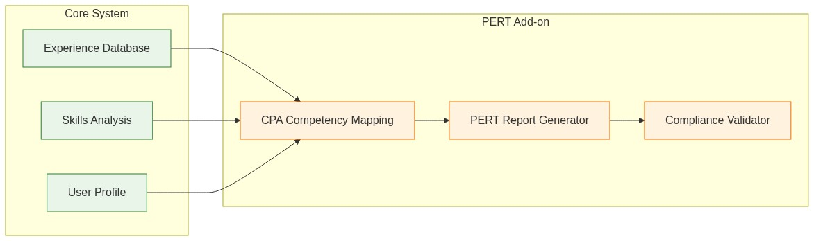

# CPA Canada PERT Report Writer Add-on

## Overview

The **CPA Canada PERT Report Writer** is a specialized add-on module for the Career Navigator system, designed specifically to assist CPA candidates in writing comprehensive and compliant Practical Experience Reporting Tool (PERT) reports.

## Module Name: `accounting-experience-reporter`

This add-on leverages the core experience management system to provide specialized functionality for:

- **PERT-compliant experience documentation**
- **CPA competency mapping and analysis**
- **Technical skill demonstration guidance**
- **Regulatory compliance checking**
- **Professional experience narrative generation**

## Key Features

### 🎯 PERT-Specific Functionality
- **Competency Mapping**: Automatic mapping of experiences to CPA competency framework
- **Technical Skills Analysis**: Identification and demonstration of technical competencies
- **Enabling Skills Integration**: Behavioral and professional skills assessment
- **Experience Level Validation**: Ensuring experiences meet depth and breadth requirements

### 📋 Report Generation
- **Structured Templates**: PERT-compliant report templates
- **Experience Narratives**: AI-assisted writing of detailed experience descriptions
- **Competency Demonstrations**: Guided examples of how experiences demonstrate specific competencies
- **Quality Assurance**: Built-in checks for completeness and compliance

### 🔍 Compliance Verification
- **Requirement Mapping**: Verification against current CPA requirements
- **Experience Duration**: Tracking and validation of required experience hours
- **Supervisor Validation**: Guidelines for supervisor sign-off requirements
- **Documentation Standards**: Ensuring reports meet professional documentation standards

## Integration with Core System

The PERT Writer integrates seamlessly with the main Career Navigator system:

[](../../assets/diagrams/cpa-pert-writer-integration.mmd)

## Directory Structure

```
addons/cpa-pert-writer/
├── README.md                           # This file
├── COPYRIGHT-DISCLAIMER.md             # Copyright and legal disclaimers
├── package.json                        # Module dependencies and metadata
├── src/
│   ├── competency-mapper.js           # CPA competency analysis engine
│   ├── pert-generator.js              # PERT report generation logic
│   ├── compliance-checker.js          # Regulatory compliance validation
│   └── templates/
│       ├── experience-templates.json   # PERT-specific experience templates
│       └── competency-examples.json    # Example competency demonstrations
├── resources/
│   ├── cpa-resource-links.json        # Links to official CPA documents
│   ├── competency-framework/          # CPA competency framework documents
│   │   ├── technical-competencies.pdf  # Official technical competency guide
│   │   ├── enabling-competencies.pdf   # Professional skills framework
│   │   └── pert-handbook.pdf          # Official PERT handbook
│   └── snapshots/                     # Webpage snapshots for offline access
│       ├── cpa-ontario-pert.html      # CPA Ontario PERT requirements
│       ├── cpa-alberta-pert.html      # CPA Alberta specific requirements
│       └── national-competencies.html  # National competency standards
├── docs/
│   ├── user-guide.md                  # How to use the PERT writer
│   ├── competency-mapping.md          # Understanding CPA competencies
│   ├── writing-guidelines.md          # Best practices for PERT writing
│   └── examples/                      # Sample PERT reports and experiences
│       ├── accounting-experience.md    # Accounting role PERT example
│       ├── audit-experience.md        # Audit experience PERT example
│       └── tax-experience.md          # Tax practice PERT example
└── tests/
    ├── competency-mapping.test.js     # Tests for competency analysis
    ├── compliance-validation.test.js   # Tests for compliance checking
    └── fixtures/                      # Test data and sample experiences
        ├── sample-experiences.json     # Test experience data
        └── expected-mappings.json      # Expected competency mappings
```

## Installation and Usage

### Prerequisites
- Career Navigator core system installed
- Node.js 18+ for development
- Access to user's experience database

### Installation
```bash
# Install from the main project root
npm install ./addons/cpa-pert-writer

# Or install as a separate module
cd addons/cpa-pert-writer
npm install
```

### Basic Usage
```javascript
const CPAPERTWriter = require('cpa-pert-writer');

// Initialize with user's experience data
const pertWriter = new CPAPERTWriter({
  userId: 'user-123',
  experienceDatabase: userExperienceDB
});

// Generate PERT report for specific experience
const pertReport = await pertWriter.generatePERTReport({
  experienceId: 'exp-456',
  targetCompetencies: ['1.1.1', '1.2.1', '2.3.2'], // CPA competency codes
  reportType: 'detailed' // or 'summary'
});
```

## API Integration

### REST Endpoints
```
POST /api/v1/addons/cpa-pert/analyze-experience
GET  /api/v1/addons/cpa-pert/competency-mapping/{experienceId}
POST /api/v1/addons/cpa-pert/generate-report
GET  /api/v1/addons/cpa-pert/compliance-check/{userId}
POST /api/v1/addons/cpa-pert/validate-requirements
```

### MCP Tools Integration
```javascript
// Additional MCP tools for CPA PERT functionality
const pertMCPTools = {
  analyze_cpa_competencies: async (experienceId) => {
    // Analyze experience against CPA competency framework
  },
  
  generate_pert_narrative: async (experienceId, competencyCode) => {
    // Generate PERT-compliant experience narrative
  },
  
  validate_pert_requirements: async (userId) => {
    // Check if user meets PERT submission requirements
  },
  
  suggest_experience_improvements: async (experienceId) => {
    // Suggest improvements to meet PERT standards
  }
};
```

## Target Users

This add-on is specifically designed for:

- **CPA Candidates**: Preparing PERT reports for practical experience requirements
- **CPA Students**: Learning to document professional experience effectively
- **Career Coaches**: Assisting clients with CPA designation requirements
- **HR Professionals**: Understanding CPA competency requirements for hiring

## Compliance and Legal

### Important Disclaimers

⚖️ **This tool is designed to assist CPA candidates in preparing their PERT reports. It does not guarantee acceptance by CPA regulatory bodies.**

📋 **Users are responsible for ensuring their reports meet current CPA requirements and should verify all information with official CPA sources.**

🔍 **All generated content should be reviewed and validated by qualified supervisors before submission.**

### Copyright Notice

All CPA Canada content, frameworks, and requirements referenced in this add-on remain the intellectual property of CPA Canada and respective provincial CPA bodies. This tool is created for educational and assistance purposes only.

## Support and Maintenance

### Regular Updates
- **Quarterly**: Review of CPA requirement changes
- **Annually**: Major competency framework updates
- **As-needed**: Bug fixes and performance improvements

### Community Support
- GitHub Issues for bug reports and feature requests
- Documentation wiki for user-contributed examples
- CPA candidate community forum integration

## Development Roadmap

### Phase 1: Core Functionality (Current)
- [x] Basic competency mapping
- [x] PERT report templates
- [x] Compliance checking framework

### Phase 2: Enhanced Features
- [ ] Provincial-specific requirements
- [ ] Supervisor collaboration tools
- [ ] Mobile app integration

### Phase 3: Advanced Analytics
- [ ] Success rate analytics
- [ ] Competency gap analysis
- [ ] Career progression tracking

---

*For detailed installation instructions, usage examples, and API documentation, see the `docs/` directory.*