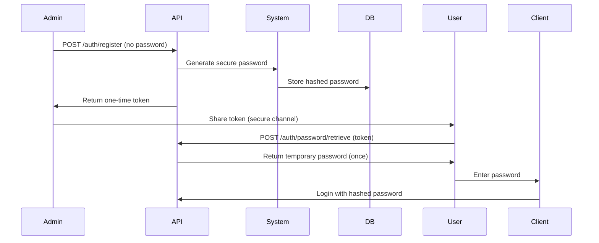
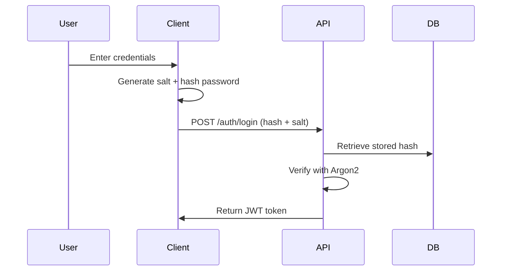

# Password Security Architecture

## Overview

The Pathfinder system implements a comprehensive password security architecture that ensures passwords are never transmitted or stored in plain text. All password operations use client-side hashing, server-side additional hashing, and secure token-based retrieval mechanisms.

## Core Security Principles

1. **No Plain Text Passwords**: System never receives, transmits, or stores plain text passwords
2. **Client-Side Hashing**: All passwords are hashed on the client before transmission
3. **Secure Token Exchange**: Temporary passwords are retrieved via one-time tokens
4. **Time-Limited Access**: All temporary passwords expire within 24 hours
5. **Mandatory Password Changes**: Users with temporary passwords must change them

## Password Lifecycle

### 1. User Creation

When an admin creates a new user:



**Process:**
1. Admin creates user without specifying password
2. System generates cryptographically secure temporary password
3. System returns one-time retrieval token to admin
4. Admin shares token with user through secure channel
5. User retrieves temporary password using token
6. Token becomes invalid after single use
7. User has 24 hours to change password

### 2. Password Storage

**Client-Side:**
```javascript
// Example client-side hashing
function hashPassword(password) {
    const salt = generateRandomSalt(32); // 32 bytes minimum
    const hash = sha256(password + salt);
    return { hash, salt };
}
```

**Server-Side:**
```javascript
// Server receives hashed password and applies additional security
function storePassword(passwordHash, clientSalt, userId) {
    const serverSalt = generateServerSalt();
    const finalHash = argon2(passwordHash + serverSalt);
    
    // Store in database
    db.store({
        user_id: userId,
        password_hash: finalHash,
        server_salt: serverSalt,
        client_salt: clientSalt, // For validation
        created_at: now(),
        expires_at: now() + 24h // For temporary passwords
    });
}
```

**Database Storage:**
```sql
CREATE TABLE pf_user_passwords (
    user_id UUID PRIMARY KEY,
    password_hash VARCHAR(255) NOT NULL, -- Argon2 hash
    server_salt VARCHAR(255) NOT NULL,
    client_salt VARCHAR(255) NOT NULL,
    created_at TIMESTAMP NOT NULL,
    expires_at TIMESTAMP, -- For temporary passwords
    must_change BOOLEAN DEFAULT false,
    last_changed TIMESTAMP,
    password_version INTEGER DEFAULT 1
);

-- Password history for preventing reuse
CREATE TABLE pf_password_history (
    id UUID PRIMARY KEY,
    user_id UUID REFERENCES pf_users(id),
    password_hash VARCHAR(255) NOT NULL,
    used_from TIMESTAMP NOT NULL,
    used_until TIMESTAMP NOT NULL
);
```

### 3. Authentication Flow



**Login Process:**
```json
// Client request
POST /auth/login
{
    "username": "john_doe",
    "password_hash": "a3f5c8d2...", // SHA256(password + client_salt)
    "client_salt": "xyz789..."
}

// Server validation
1. Retrieve user's stored password_hash and server_salt
2. Compute: argon2(received_hash + server_salt)
3. Compare with stored password_hash
4. Check password expiry
5. Generate JWT if valid
```

### 4. Password Change Flow

**Regular Password Change:**
```json
POST /auth/change-password
{
    "current_password_hash": "old_hash",
    "current_salt": "old_salt",
    "new_password_hash": "new_hash",
    "new_salt": "new_salt"
}
```

**Forced Password Reset:**
```json
// Step 1: Admin initiates reset
POST /auth/password/reset-request
{
    "user_id": "uuid",
    "reason": "Forgot password"
}
Response: { "reset_token": "token_abc" }

// Step 2: User uses token
POST /auth/password/reset
{
    "reset_token": "token_abc",
    "new_password_hash": "hash",
    "salt": "salt"
}
```

## Password Generation

### System-Generated Passwords

The system generates secure temporary passwords with:

```javascript
function generateTemporaryPassword() {
    const length = 16; // Minimum length
    const charset = {
        uppercase: 'ABCDEFGHIJKLMNOPQRSTUVWXYZ',
        lowercase: 'abcdefghijklmnopqrstuvwxyz',
        numbers: '0123456789',
        special: '!@#$%^&*()_+-=[]{}|;:,.<>?'
    };
    
    // Ensure at least 2 characters from each category
    let password = '';
    password += randomChars(charset.uppercase, 2);
    password += randomChars(charset.lowercase, 2);
    password += randomChars(charset.numbers, 2);
    password += randomChars(charset.special, 2);
    
    // Fill remaining with random mix
    const allChars = Object.values(charset).join('');
    password += randomChars(allChars, length - 8);
    
    // Shuffle for randomness
    return shuffle(password);
}
```

### Password Requirements by Role

| Role | Min Length | Uppercase | Lowercase | Numbers | Special | Expiry | History |
|------|------------|-----------|-----------|---------|---------|--------|---------|
| Site Admin | 16 | Required | Required | Required | Required | 30 days | 10 passwords |
| Admin | 12 | Required | Required | Required | Required | 60 days | 5 passwords |
| User | 8 | Required | Required | Required | Required | 90 days | 3 passwords |

## Token Management

### Password Retrieval Tokens

```sql
CREATE TABLE pf_password_tokens (
    token VARCHAR(255) PRIMARY KEY,
    user_id UUID REFERENCES pf_users(id),
    token_type VARCHAR(50), -- 'retrieval', 'reset'
    created_at TIMESTAMP NOT NULL,
    expires_at TIMESTAMP NOT NULL,
    used_at TIMESTAMP,
    created_by UUID REFERENCES pf_users(id),
    ip_address VARCHAR(45),
    user_agent TEXT
);
```

**Token Properties:**
- Single-use only
- Cryptographically random (256 bits)
- Short expiry (1 hour for retrieval, 3 hours for reset)
- Logged for audit trail

### Token Security

```javascript
function generateSecureToken() {
    // Generate 32 bytes of random data
    const randomBytes = crypto.randomBytes(32);
    
    // Convert to URL-safe base64
    const token = randomBytes.toString('base64url');
    
    // Hash for storage
    const tokenHash = sha256(token);
    
    // Store hash in database, return token to user
    return { token, tokenHash };
}

function validateToken(providedToken) {
    const tokenHash = sha256(providedToken);
    
    // Check database for hash
    const record = db.findToken(tokenHash);
    
    // Validate: exists, not used, not expired
    if (!record || record.used_at || record.expires_at < now()) {
        throw new Error('Invalid or expired token');
    }
    
    // Mark as used
    db.markTokenUsed(tokenHash);
    
    return record;
}
```

## Security Measures

### 1. Rate Limiting

```javascript
const rateLimits = {
    login: {
        attempts: 5,
        window: '15 minutes',
        lockout: '30 minutes'
    },
    passwordReset: {
        attempts: 3,
        window: '30 minutes',
        lockout: '1 hour'
    },
    tokenRetrieval: {
        attempts: 3,
        window: '10 minutes',
        lockout: '1 hour'
    }
};
```

### 2. Audit Logging

All password operations are logged:

```sql
CREATE TABLE pf_password_audit (
    id UUID PRIMARY KEY,
    user_id UUID REFERENCES pf_users(id),
    action VARCHAR(50), -- 'created', 'changed', 'reset', 'retrieved'
    performed_by UUID REFERENCES pf_users(id),
    ip_address VARCHAR(45),
    user_agent TEXT,
    success BOOLEAN,
    failure_reason TEXT,
    timestamp TIMESTAMP NOT NULL
);
```

### 3. Password Strength Validation

```javascript
function validatePasswordStrength(password, role) {
    const policy = getPasswordPolicy(role);
    const errors = [];
    
    if (password.length < policy.minLength) {
        errors.push(`Password must be at least ${policy.minLength} characters`);
    }
    
    if (policy.requireUppercase && !/[A-Z]/.test(password)) {
        errors.push('Password must contain uppercase letters');
    }
    
    if (policy.requireLowercase && !/[a-z]/.test(password)) {
        errors.push('Password must contain lowercase letters');
    }
    
    if (policy.requireNumbers && !/[0-9]/.test(password)) {
        errors.push('Password must contain numbers');
    }
    
    if (policy.requireSpecial && !/[!@#$%^&*()_+=\-[\]{}|;:,.<>?]/.test(password)) {
        errors.push('Password must contain special characters');
    }
    
    // Check against common passwords
    if (isCommonPassword(password)) {
        errors.push('Password is too common');
    }
    
    // Check against user information
    if (containsUserInfo(password, user)) {
        errors.push('Password cannot contain personal information');
    }
    
    return errors;
}
```

### 4. Session Management

After password changes:
- Invalidate all existing sessions
- Require re-authentication
- Send notification to user
- Log the event

```javascript
async function handlePasswordChange(userId) {
    // Invalidate all sessions
    await invalidateUserSessions(userId);
    
    // Send notification
    await sendPasswordChangeNotification(userId);
    
    // Audit log
    await logPasswordChange(userId);
    
    // Check for suspicious activity
    await checkSuspiciousActivity(userId);
}
```

## Implementation Guidelines

### Client-Side Implementation

```javascript
// Example React component for secure password handling
function LoginForm() {
    const [username, setUsername] = useState('');
    const [password, setPassword] = useState('');
    
    const handleSubmit = async (e) => {
        e.preventDefault();
        
        // Generate client salt
        const salt = generateSalt();
        
        // Hash password
        const passwordHash = await hashPassword(password, salt);
        
        // Clear password from memory
        setPassword('');
        
        // Send to API
        const response = await api.login({
            username,
            password_hash: passwordHash,
            client_salt: salt
        });
        
        // Store token, never store password
        localStorage.setItem('token', response.token);
    };
    
    return (
        <form onSubmit={handleSubmit}>
            <input 
                type="text" 
                value={username}
                onChange={(e) => setUsername(e.target.value)}
                autoComplete="username"
            />
            <input 
                type="password" 
                value={password}
                onChange={(e) => setPassword(e.target.value)}
                autoComplete="current-password"
            />
            <button type="submit">Login</button>
        </form>
    );
}
```

### Server-Side Implementation

```javascript
// Express.js route example
app.post('/api/auth/login', async (req, res) => {
    const { username, password_hash, client_salt } = req.body;
    
    try {
        // Get user
        const user = await db.getUserByUsername(username);
        if (!user) {
            return res.status(401).json({ error: 'Invalid credentials' });
        }
        
        // Check rate limiting
        await checkRateLimit(req.ip, 'login');
        
        // Verify password
        const isValid = await verifyPassword(
            password_hash,
            client_salt,
            user.password_hash,
            user.server_salt
        );
        
        if (!isValid) {
            await logFailedLogin(user.id, req.ip);
            return res.status(401).json({ error: 'Invalid credentials' });
        }
        
        // Check if password change required
        if (user.must_change_password) {
            return res.status(403).json({ 
                error: 'Password change required',
                must_change_password: true
            });
        }
        
        // Generate JWT
        const token = generateJWT(user);
        
        // Log successful login
        await logSuccessfulLogin(user.id, req.ip);
        
        res.json({ token });
        
    } catch (error) {
        console.error('Login error:', error);
        res.status(500).json({ error: 'Internal server error' });
    }
});
```

## Security Checklist

- [ ] Client-side password hashing implemented
- [ ] Server-side additional hashing with Argon2
- [ ] Password history tracking enabled
- [ ] Rate limiting configured
- [ ] Audit logging active
- [ ] Token expiry enforced
- [ ] Session invalidation on password change
- [ ] Password strength validation
- [ ] Common password checking
- [ ] Personal information checking
- [ ] Secure random generation for tokens
- [ ] HTTPS enforced for all password operations
- [ ] Password fields cleared from memory after use
- [ ] Browser autocomplete attributes set correctly
- [ ] Password expiry notifications sent