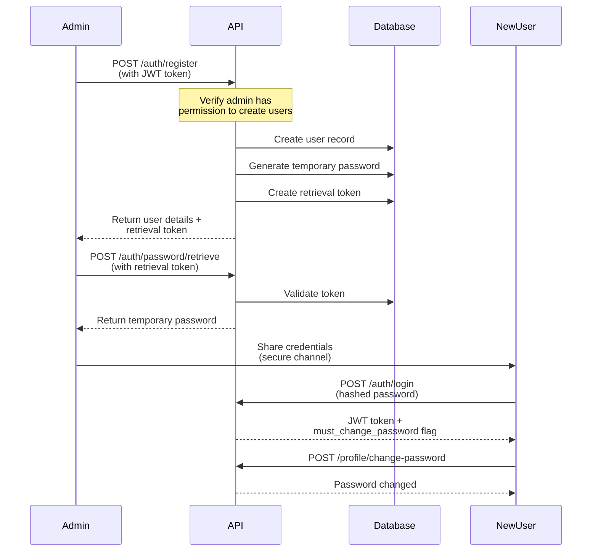
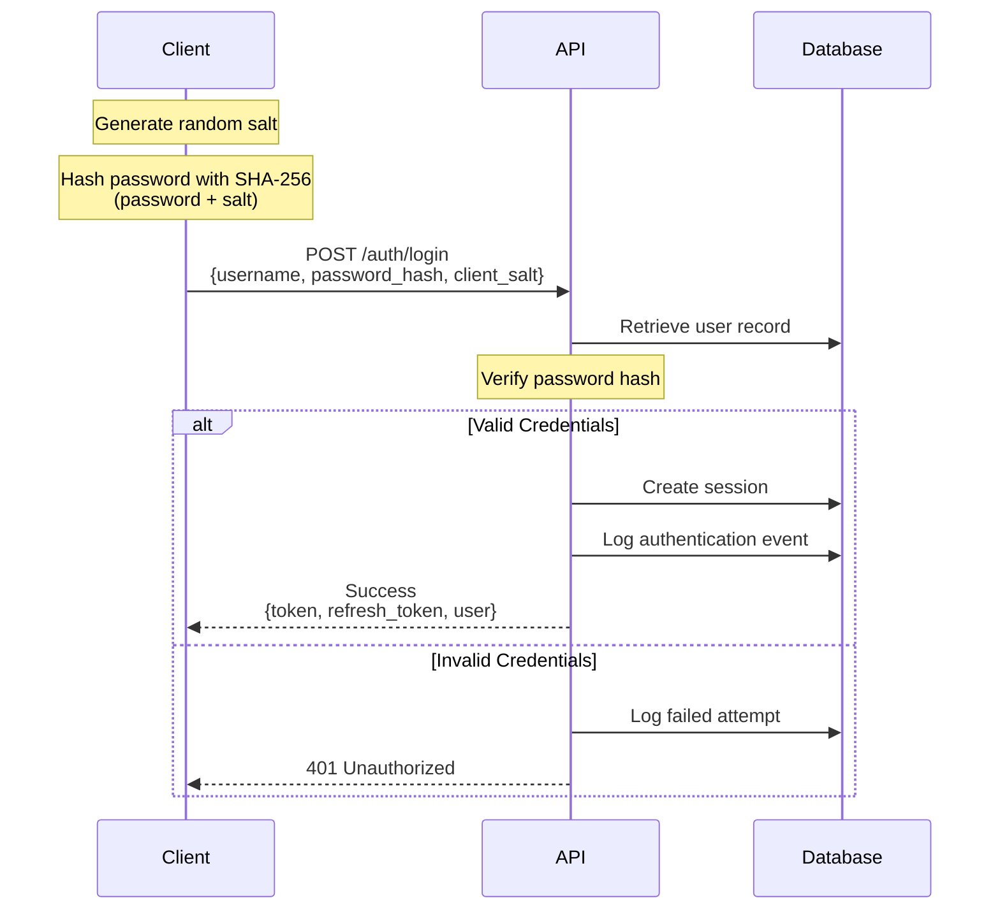
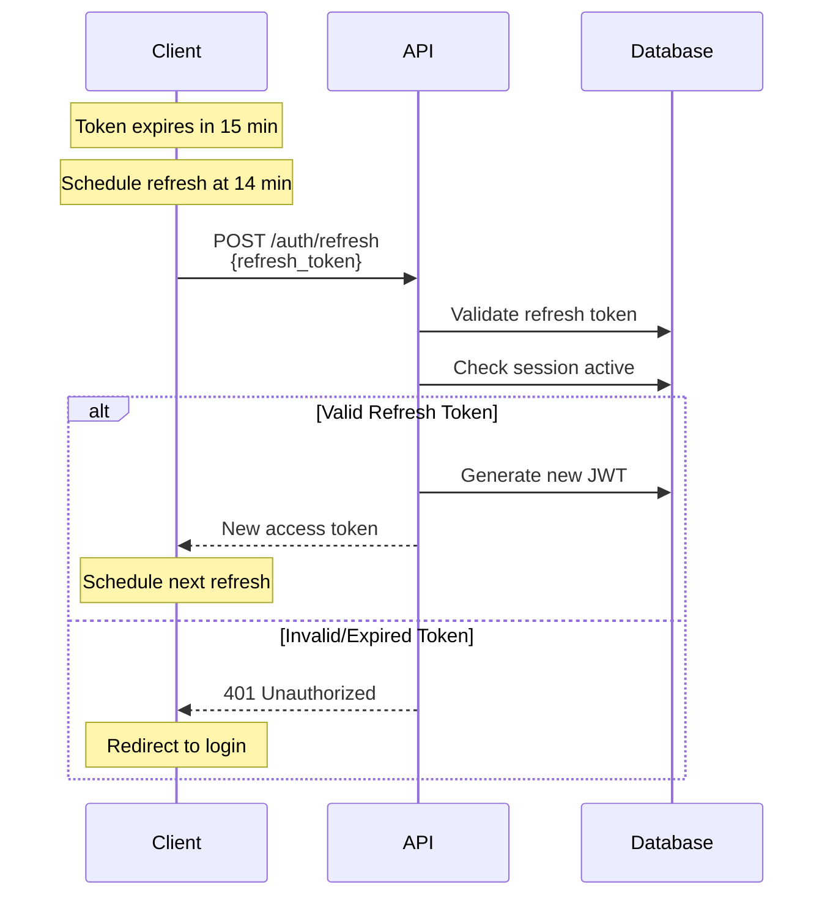
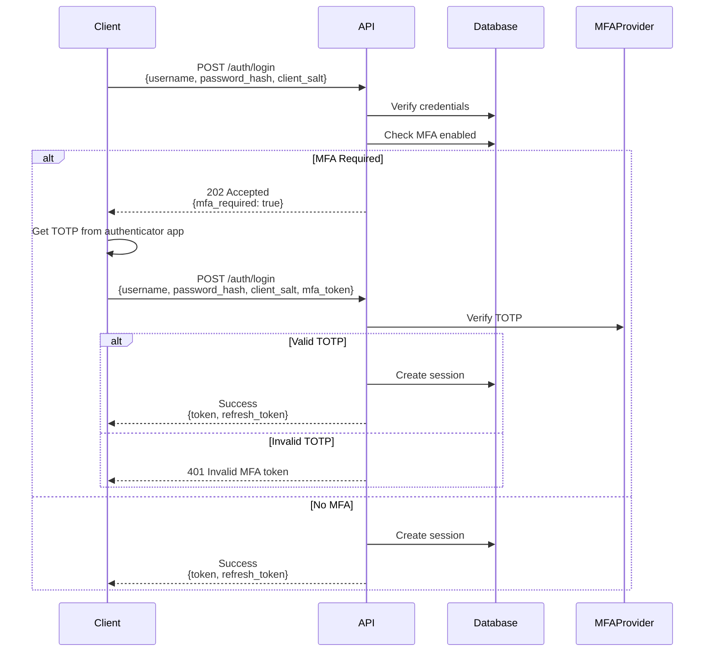

# Authentication Flow Documentation

## Overview

Pathfinder uses a secure multi-step authentication system with JWT tokens, client-side password hashing, and role-based access control (RBAC).

## Key Security Features

- **Client-side password hashing** (SHA-256) - passwords never sent in plain text
- **JWT tokens** with 15-minute expiry
- **Refresh tokens** for seamless session management  
- **Multi-factor authentication** (MFA) support
- **Role-based access control** (user, admin, site_admin)
- **Comprehensive audit logging**
- **Rate limiting** on authentication endpoints

## Authentication Flows

### 1. User Registration Flow (Admin-Initiated)



### 2. Standard Login Flow



### 3. Token Refresh Flow



### 4. MFA Login Flow



## Password Hashing Implementation

### JavaScript/TypeScript

```javascript
async function hashPassword(password, salt) {
  const encoder = new TextEncoder();
  const data = encoder.encode(password + salt);
  const hashBuffer = await crypto.subtle.digest('SHA-256', data);
  const hashArray = Array.from(new Uint8Array(hashBuffer));
  return hashArray.map(b => b.toString(16).padStart(2, '0')).join('');
}

async function login(username, password) {
  // Generate client salt
  const salt = crypto.getRandomValues(new Uint8Array(32));
  const saltHex = Array.from(salt)
    .map(b => b.toString(16).padStart(2, '0'))
    .join('');
  
  // Hash password
  const passwordHash = await hashPassword(password, saltHex);
  
  // Send to API
  const response = await fetch('/api/auth/login', {
    method: 'POST',
    headers: { 'Content-Type': 'application/json' },
    body: JSON.stringify({
      username,
      password_hash: passwordHash,
      client_salt: saltHex
    })
  });
  
  return response.json();
}
```

### Python

```python
import hashlib
import secrets

def hash_password(password: str, salt: str) -> str:
    """Hash password with salt using SHA-256."""
    return hashlib.sha256((password + salt).encode()).hexdigest()

def login(username: str, password: str) -> dict:
    """Authenticate with the API."""
    # Generate client salt
    salt = secrets.token_hex(32)
    
    # Hash password
    password_hash = hash_password(password, salt)
    
    # Send to API
    response = requests.post(
        'https://api.pathfinder.app/api/auth/login',
        json={
            'username': username,
            'password_hash': password_hash,
            'client_salt': salt
        }
    )
    
    return response.json()
```

## Token Management

### Automatic Token Refresh

```javascript
class TokenManager {
  constructor() {
    this.token = null;
    this.refreshToken = null;
    this.refreshTimer = null;
  }
  
  setTokens(token, refreshToken) {
    this.token = token;
    this.refreshToken = refreshToken;
    this.scheduleRefresh();
  }
  
  scheduleRefresh() {
    // Clear existing timer
    if (this.refreshTimer) {
      clearTimeout(this.refreshTimer);
    }
    
    // Refresh 1 minute before expiry (at 14 minutes)
    this.refreshTimer = setTimeout(() => {
      this.refreshAccessToken();
    }, 14 * 60 * 1000);
  }
  
  async refreshAccessToken() {
    try {
      const response = await fetch('/api/auth/refresh', {
        method: 'POST',
        headers: { 'Content-Type': 'application/json' },
        body: JSON.stringify({
          refresh_token: this.refreshToken
        })
      });
      
      if (!response.ok) {
        throw new Error('Refresh failed');
      }
      
      const data = await response.json();
      this.token = data.data.token;
      this.scheduleRefresh();
      
    } catch (error) {
      // Redirect to login
      window.location.href = '/login';
    }
  }
  
  getAuthHeader() {
    return this.token ? { 'Authorization': `Bearer ${this.token}` } : {};
  }
}
```

## Session Management

### Session Lifecycle

1. **Creation**: Session created on successful login
2. **Duration**: 15-minute access token, longer refresh token
3. **Renewal**: Automatic refresh before expiry
4. **Termination**: Explicit logout or token expiry

### Session Security

- Sessions stored server-side with unique IDs
- Tokens signed with strong secret (HS256)
- IP address and user agent validation
- Automatic cleanup of expired sessions
- Audit logging of all session events

## Error Handling

### Authentication Error Codes

| Code | HTTP Status | Description | Action |
|------|-------------|-------------|--------|
| `INVALID_CREDENTIALS` | 401 | Wrong username/password | Check credentials |
| `TOKEN_EXPIRED` | 401 | JWT token expired | Refresh token |
| `INVALID_TOKEN` | 401 | Malformed or invalid token | Re-authenticate |
| `SESSION_EXPIRED` | 401 | Session no longer valid | Login again |
| `MFA_REQUIRED` | 202 | MFA token needed | Provide TOTP |
| `ACCOUNT_LOCKED` | 403 | Too many failed attempts | Contact admin |
| `ACCOUNT_SUSPENDED` | 403 | Account suspended | Contact admin |
| `RATE_LIMIT_EXCEEDED` | 429 | Too many requests | Wait and retry |

### Error Response Format

```json
{
  "success": false,
  "error": "INVALID_CREDENTIALS",
  "message": "Invalid username or password",
  "details": {
    "attempts_remaining": 3
  }
}
```

## Security Best Practices

### For Developers

1. **Never send passwords in plain text**
   - Always hash on client before sending
   - Use SHA-256 with random salt

2. **Implement token refresh**
   - Schedule refresh before expiry
   - Handle refresh failures gracefully

3. **Store tokens securely**
   - Use httpOnly cookies or secure storage
   - Never store in localStorage for sensitive apps

4. **Handle errors properly**
   - Don't expose sensitive information
   - Log security events for monitoring

### For Administrators

1. **User Management**
   - Use strong temporary passwords
   - Share credentials through secure channels
   - Enforce password changes on first login

2. **Access Control**
   - Follow principle of least privilege
   - Regular audit of user roles
   - Remove access promptly when needed

3. **Monitoring**
   - Review audit logs regularly
   - Monitor failed login attempts
   - Track unusual access patterns

## Rate Limiting

### Limits by Endpoint

| Endpoint | Limit | Window | Skip Successful |
|----------|-------|---------|-----------------|
| `/auth/login` | 5 | 15 min | Yes |
| `/auth/register` | 5 | 15 min | No |
| `/auth/refresh` | 20 | 15 min | No |
| General API | 100 | 15 min | No |

### Rate Limit Headers

```http
X-RateLimit-Limit: 5
X-RateLimit-Remaining: 3
X-RateLimit-Reset: 2024-03-01T12:30:00Z
```

## Audit Logging

All authentication events are logged:

- Login attempts (success/failure)
- Password changes
- Token refreshes
- Session creation/termination
- Permission checks
- Account modifications

### Audit Log Entry Example

```json
{
  "timestamp": "2024-03-01T10:30:00Z",
  "event_type": "authentication",
  "event_name": "User Login",
  "action": "login",
  "action_result": "success",
  "actor_username": "john_doe",
  "ip_address": "192.168.1.1",
  "user_agent": "Mozilla/5.0...",
  "metadata": {
    "mfa_used": false,
    "session_id": "sess_abc123"
  }
}
```

## Testing Authentication

### cURL Examples

```bash
# 1. Login
PASSWORD="my_password"
SALT=$(openssl rand -hex 32)
HASH=$(echo -n "${PASSWORD}${SALT}" | sha256sum | awk '{print $1}')

curl -X POST http://localhost:3000/api/auth/login \
  -H "Content-Type: application/json" \
  -d "{
    \"username\": \"john_doe\",
    \"password_hash\": \"${HASH}\",
    \"client_salt\": \"${SALT}\"
  }"

# 2. Use token for authenticated request
TOKEN="eyJhbGciOiJIUzI1NiIsInR5cCI6IkpXVCJ9..."

curl -X GET http://localhost:3000/api/profile \
  -H "Authorization: Bearer ${TOKEN}"

# 3. Refresh token
REFRESH_TOKEN="refresh_token_here"

curl -X POST http://localhost:3000/api/auth/refresh \
  -H "Content-Type: application/json" \
  -d "{
    \"refresh_token\": \"${REFRESH_TOKEN}\"
  }"
```

## Troubleshooting

### Common Issues

1. **"Plain text password detected"**
   - Ensure you're hashing the password client-side
   - Include both password_hash and client_salt

2. **"Token expired" immediately after login**
   - Check server time synchronization
   - Verify token expiry configuration

3. **"Invalid token format"**
   - Ensure "Bearer " prefix in Authorization header
   - Check token hasn't been truncated

4. **Rate limiting on development**
   - Reduce request frequency
   - Clear rate limit cache if needed

## Related Documentation

- [API Reference](./openapi.yaml)
- [Security Best Practices](./security-best-practices.md)
- [Role Permissions](./role-permissions.md)
- [Error Codes](./error-codes.md)