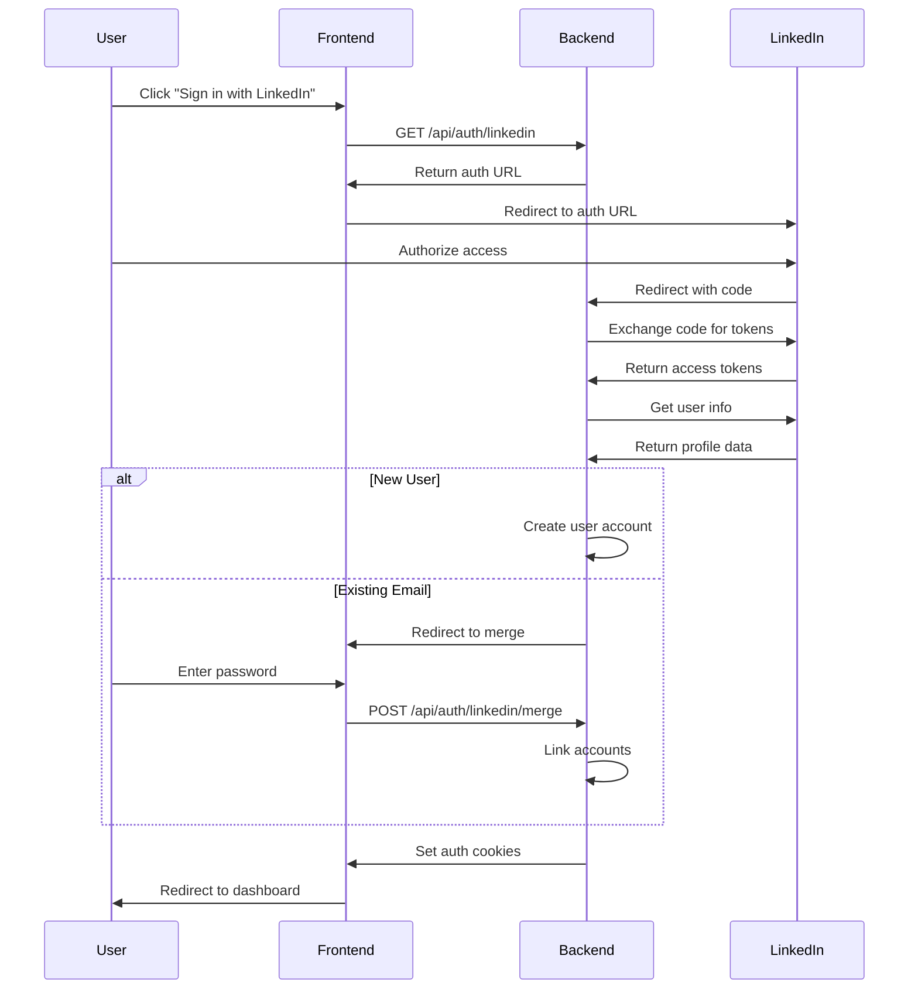

# LinkedIn OAuth API Endpoints

## Overview

The LinkedIn OAuth integration provides secure authentication and professional profile import capabilities. This document describes all LinkedIn OAuth-related API endpoints.

## Base URL

```
https://api.pathfinder.com/api/auth
```

## Authentication

Most LinkedIn OAuth endpoints require JWT authentication. Include the token in the Authorization header:

```
Authorization: Bearer <jwt_token>
```

## Endpoints

### 1. Generate LinkedIn OAuth URL

Initiates the LinkedIn OAuth flow by generating an authorization URL.

**Endpoint:** `GET /linkedin`

**Headers:**
- `Authorization: Bearer <token>` (optional - for linking to existing account)

**Query Parameters:**
- `returnUrl` (string, optional): URL to redirect after successful authentication. Default: `/`

**Response:**
```json
{
  "success": true,
  "data": {
    "authUrl": "https://www.linkedin.com/oauth/v2/authorization?response_type=code&client_id=..."
  },
  "message": "OAuth URL generated"
}
```

**Error Responses:**
- `403 Forbidden`: LinkedIn OAuth is not enabled
- `400 Bad Request`: Invalid return URL

**Rate Limiting:**
- 20 requests per 15 minutes per IP

### 2. LinkedIn OAuth Callback

Handles the OAuth callback from LinkedIn. This endpoint is typically accessed via redirect from LinkedIn.

**Endpoint:** `GET /linkedin/callback`

**Query Parameters:**
- `code` (string, required): Authorization code from LinkedIn
- `state` (string, required): State parameter for CSRF protection
- `error` (string, optional): Error code if authorization failed
- `error_description` (string, optional): Error description

**Response:**
- Redirects to dashboard or login page with authentication cookies set

**Error Handling:**
- Redirects to `/login?error=<message>` on failure
- Redirects to `/auth/merge?provider=linkedin` if account exists and requires merge

**Rate Limiting:**
- 50 callbacks per 15 minutes per IP

### 3. Merge LinkedIn Account

Links a LinkedIn account to an existing user account with password verification.

**Endpoint:** `POST /linkedin/merge`

**Headers:**
- `Authorization: Bearer <token>` (required)
- `Content-Type: application/json`

**Request Body:**
```json
{
  "password": "string",
  "linkedInAuthCode": "string"
}
```

**Response:**
```json
{
  "success": true,
  "data": {
    "success": true,
    "message": "LinkedIn account successfully linked"
  }
}
```

**Error Responses:**
- `401 Unauthorized`: Invalid password
- `400 Bad Request`: LinkedIn account already linked
- `409 Conflict`: Account conflict requiring resolution

**Rate Limiting:**
- 5 merge attempts per 15 minutes per user

### 4. Unlink LinkedIn Account

Removes LinkedIn OAuth connection from the user's account.

**Endpoint:** `DELETE /linkedin/unlink`

**Headers:**
- `Authorization: Bearer <token>` (required)

**Response:**
```json
{
  "success": true,
  "data": {
    "success": true,
    "message": "LinkedIn account unlinked"
  }
}
```

**Error Responses:**
- `400 Bad Request`: Cannot unlink - no other authentication method available
- `404 Not Found`: LinkedIn account not linked

**Rate Limiting:**
- 10 unlink requests per hour per user

### 5. Import LinkedIn Profile

Imports professional profile data from LinkedIn with selective import options.

**Endpoint:** `POST /linkedin/import`

**Headers:**
- `Authorization: Bearer <token>` (required)
- `Content-Type: application/json`

**Request Body:**
```json
{
  "importOptions": {
    "workExperience": true,
    "education": true,
    "skills": true,
    "certifications": true,
    "summary": true,
    "profilePhoto": true,
    "location": true,
    "industry": true
  },
  "preview": false
}
```

**Response (Import):**
```json
{
  "success": true,
  "data": {
    "profile": {
      "localizedFirstName": "John",
      "localizedLastName": "Doe",
      "headline": "Software Engineer",
      "summary": "Experienced developer..."
    },
    "imported": {
      "workExperience": {
        "imported": 3,
        "skipped": 1
      },
      "education": {
        "imported": 2,
        "skipped": 0
      },
      "skills": {
        "imported": 15,
        "skipped": 5
      },
      "certifications": {
        "imported": 2,
        "skipped": 0
      }
    }
  },
  "message": "Profile imported successfully"
}
```

**Response (Preview):**
```json
{
  "success": true,
  "data": {
    "preview": {
      "profile": { ... },
      "workExperience": [ ... ],
      "education": [ ... ],
      "skills": [ ... ],
      "certifications": [ ... ]
    }
  },
  "message": "Profile preview generated"
}
```

**Error Responses:**
- `400 Bad Request`: LinkedIn account not linked
- `401 Unauthorized`: LinkedIn token expired
- `429 Too Many Requests`: LinkedIn API rate limit exceeded

**Rate Limiting:**
- 10 imports per hour per user

### 6. Sync LinkedIn Profile

Synchronizes the user's profile with their LinkedIn account.

**Endpoint:** `POST /linkedin/sync`

**Headers:**
- `Authorization: Bearer <token>` (required)
- `Content-Type: application/json`

**Request Body:**
```json
{
  "force": false
}
```

**Parameters:**
- `force` (boolean): Force sync even if recently synced

**Response:**
```json
{
  "success": true,
  "data": {
    "synced": true,
    "profile": { ... },
    "lastSyncAt": "2024-01-15T10:30:00Z",
    "changes": {
      "workExperience": {
        "added": 1,
        "updated": 2,
        "removed": 0
      },
      "skills": {
        "added": 5,
        "updated": 0,
        "removed": 1
      }
    }
  },
  "message": "Profile sync completed"
}
```

**Response (Skip):**
```json
{
  "success": true,
  "data": {
    "synced": false,
    "message": "Profile recently synced"
  }
}
```

**Error Responses:**
- `400 Bad Request`: LinkedIn account not linked
- `401 Unauthorized`: LinkedIn token expired

**Rate Limiting:**
- 20 syncs per hour per user

### 7. Get Sync Status

Retrieves the current LinkedIn sync status and settings.

**Endpoint:** `GET /linkedin/sync/status`

**Headers:**
- `Authorization: Bearer <token>` (required)

**Response:**
```json
{
  "success": true,
  "data": {
    "lastSyncAt": "2024-01-15T10:30:00Z",
    "syncEnabled": true,
    "syncInterval": 86400000,
    "nextSyncAt": "2024-01-16T10:30:00Z",
    "syncHistory": [
      {
        "syncedAt": "2024-01-15T10:30:00Z",
        "status": "success",
        "changes": {
          "workExperience": 1,
          "skills": 3
        }
      }
    ]
  }
}
```

### 8. Update Sync Settings

Updates LinkedIn profile sync settings.

**Endpoint:** `PUT /linkedin/sync/settings`

**Headers:**
- `Authorization: Bearer <token>` (required)
- `Content-Type: application/json`

**Request Body:**
```json
{
  "syncEnabled": true,
  "syncInterval": 86400000
}
```

**Response:**
```json
{
  "success": true,
  "data": {
    "success": true
  },
  "message": "Sync settings updated"
}
```

## OAuth Flow Sequence



## Security Considerations

### PKCE (Proof Key for Code Exchange)
All OAuth flows implement PKCE for enhanced security:
- Code verifier generated client-side
- Code challenge sent with authorization request
- Code verifier validated during token exchange

### State Parameter
- Cryptographically secure random state
- Validated to prevent CSRF attacks
- Expires after 5 minutes

### Token Storage
- Access tokens encrypted with AES-256
- Refresh tokens stored encrypted
- User-specific encryption keys

### Rate Limiting
- Per-endpoint rate limits to prevent abuse
- Sliding window algorithm
- IP-based and user-based limits

## Error Handling

### OAuth Errors
- `invalid_request`: Malformed request
- `unauthorized_client`: Client not authorized
- `access_denied`: User denied access
- `unsupported_response_type`: Invalid response type
- `invalid_scope`: Invalid or malformed scope
- `server_error`: LinkedIn server error
- `temporarily_unavailable`: Service temporarily down

### Application Errors
- `ACCOUNT_EXISTS_REQUIRES_MERGE`: Email exists, manual merge required
- `LINKEDIN_OAUTH_NOT_ENABLED`: Feature flag disabled
- `NO_REFRESH_TOKEN`: Refresh token not available
- `SYNC_TOO_FREQUENT`: Sync attempted too soon

## Best Practices

1. **Token Refresh**: Implement automatic token refresh before expiration
2. **Error Recovery**: Provide clear user feedback and recovery options
3. **Data Validation**: Validate all imported data before storage
4. **Privacy**: Only import data explicitly authorized by user
5. **Rate Limiting**: Respect LinkedIn API rate limits
6. **Sync Strategy**: Implement intelligent sync intervals based on usage

## LinkedIn API Scopes

Required scopes for full functionality:
- `openid`: OpenID Connect authentication
- `profile`: Basic profile information
- `email`: Email address
- `w_member_social`: Write access for social features

## Mobile Considerations

### Deep Linking
Support for mobile app deep linking:
```
pathfinder://auth/linkedin/callback?code=...&state=...
```

### In-App Browser
- Support for SFSafariViewController (iOS)
- Support for Chrome Custom Tabs (Android)
- Fallback to system browser

### Responsive Design
- Mobile-optimized OAuth flow
- Touch-friendly UI components
- Simplified import preview for small screens