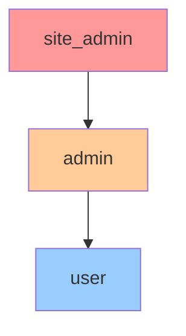
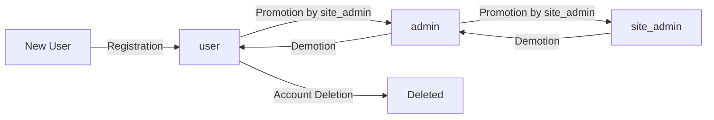

# Role-Based Access Control (RBAC) Documentation

## Overview

Pathfinder implements a three-tier Role-Based Access Control system to ensure secure and appropriate access to system resources. Each role has specific permissions that determine what actions users can perform.

## Role Hierarchy



### Role Descriptions

| Role | Description | Target Users |
|------|-------------|--------------|
| **user** | Standard user with access to own data | Regular platform users |
| **admin** | Administrator with user management capabilities | Department heads, team leads |
| **site_admin** | Full system access with all privileges | System administrators, DevOps |

## Permission Matrix

### Authentication & Session Management

| Operation | user | admin | site_admin | Notes |
|-----------|:----:|:-----:|:----------:|-------|
| Login | ✅ | ✅ | ✅ | All users can login |
| Logout | ✅ | ✅ | ✅ | All users can logout |
| Refresh token | ✅ | ✅ | ✅ | All users can refresh tokens |
| Change own password | ✅ | ✅ | ✅ | All users can change their password |
| Reset own password | ✅ | ✅ | ✅ | Via email verification |
| Enable/disable own MFA | ✅ | ✅ | ✅ | All users can manage their MFA |

### User Management

| Operation | user | admin | site_admin | Notes |
|-----------|:----:|:-----:|:----------:|-------|
| View own profile | ✅ | ✅ | ✅ | All users can view their profile |
| Update own profile | ✅ | ✅ | ✅ | All users can update their profile |
| Delete own account | ✅* | ✅* | ✅ | *Requires confirmation |
| List all users | ❌ | ✅ | ✅ | Admins see their scope only |
| View other user profiles | ❌ | ✅ | ✅ | Admins see limited info |
| Create new users | ❌ | ✅ | ✅ | Admins can create users only |
| Update other users | ❌ | ✅* | ✅ | *Limited fields for admins |
| Delete other users | ❌ | ✅** | ✅ | **Requires approval workflow |
| Suspend/activate users | ❌ | ✅ | ✅ | Temporary access control |

### Role Management

| Operation | user | admin | site_admin | Notes |
|-----------|:----:|:-----:|:----------:|-------|
| View own roles | ✅ | ✅ | ✅ | All users see their roles |
| View all roles | ❌ | ✅ | ✅ | See available roles |
| Assign 'user' role | ❌ | ✅ | ✅ | During user creation |
| Assign 'admin' role | ❌ | ❌ | ✅ | Only site_admin can promote |
| Assign 'site_admin' role | ❌ | ❌ | ✅* | *Requires multi-approval |
| Remove roles | ❌ | ❌ | ✅ | Only site_admin can demote |
| Create custom roles | ❌ | ❌ | ❌ | Not supported currently |

### Experience Management

| Operation | user | admin | site_admin | Notes |
|-----------|:----:|:-----:|:----------:|-------|
| Create own experiences | ✅ | ✅ | ✅ | All users can create |
| View own experiences | ✅ | ✅ | ✅ | All users can view their data |
| Update own experiences | ✅ | ✅ | ✅ | All users can edit |
| Delete own experiences | ✅ | ✅ | ✅ | All users can delete |
| View others' experiences | ❌ | ❌* | ✅ | *Unless explicitly shared |
| Update others' experiences | ❌ | ❌ | ❌ | Not permitted |
| Delete others' experiences | ❌ | ❌ | ✅* | *For compliance only |
| Bulk operations | ✅* | ✅* | ✅ | *Own data only |

### Chat & AI Features

| Operation | user | admin | site_admin | Notes |
|-----------|:----:|:-----:|:----------:|-------|
| Use chat assistant | ✅ | ✅ | ✅ | All users have access |
| View own chat history | ✅ | ✅ | ✅ | Privacy protected |
| Delete own chat history | ✅ | ✅ | ✅ | User data control |
| View others' chat history | ❌ | ❌ | ❌* | *Only with legal requirement |
| Access AI analytics | ✅* | ✅ | ✅ | *Own data only |
| Configure AI settings | ❌ | ❌ | ✅ | System-wide settings |

### CPA-PERT Features

| Operation | user | admin | site_admin | Notes |
|-----------|:----:|:-----:|:----------:|-------|
| Analyze own experiences | ✅ | ✅ | ✅ | Core feature access |
| Generate PERT responses | ✅ | ✅ | ✅ | For own experiences |
| View competency mappings | ✅ | ✅ | ✅ | Own data only |
| Export PERT reports | ✅ | ✅ | ✅ | Own reports only |
| Manage competency framework | ❌ | ❌ | ✅ | System configuration |
| View aggregated analytics | ❌ | ✅* | ✅ | *Department level only |

### Resume Management

| Operation | user | admin | site_admin | Notes |
|-----------|:----:|:-----:|:----------:|-------|
| Generate own resumes | ✅ | ✅ | ✅ | All users can generate |
| View own resumes | ✅ | ✅ | ✅ | Historical versions |
| Update own resumes | ✅ | ✅ | ✅ | Edit and customize |
| Delete own resumes | ✅ | ✅ | ✅ | Remove old versions |
| Share resume links | ✅ | ✅ | ✅ | Temporary share URLs |
| Access resume templates | ✅ | ✅ | ✅ | All templates available |
| Create resume templates | ❌ | ❌ | ✅ | System templates only |

### Analytics & Reporting

| Operation | user | admin | site_admin | Notes |
|-----------|:----:|:-----:|:----------:|-------|
| View own analytics | ✅ | ✅ | ✅ | Personal dashboards |
| View skills progression | ✅ | ✅ | ✅ | Own progression only |
| Generate personal reports | ✅ | ✅ | ✅ | PDF/Excel exports |
| View department analytics | ❌ | ✅ | ✅ | Aggregated data |
| View system analytics | ❌ | ❌ | ✅ | Usage, performance |
| Export system reports | ❌ | ✅* | ✅ | *Limited scope |
| Access audit logs | ❌ | ❌ | ✅ | Security monitoring |

### System Administration

| Operation | user | admin | site_admin | Notes |
|-----------|:----:|:-----:|:----------:|-------|
| View system health | ❌ | ❌ | ✅ | Monitoring access |
| Manage integrations | ❌ | ❌ | ✅ | API keys, webhooks |
| Configure security settings | ❌ | ❌ | ✅ | MFA, password policies |
| Manage rate limits | ❌ | ❌ | ✅ | API throttling |
| Access database directly | ❌ | ❌ | ❌* | *Via approved tools only |
| Perform system backup | ❌ | ❌ | ✅ | Scheduled/manual |
| Execute data retention | ❌ | ❌ | ✅ | GDPR compliance |
| View audit logs | ❌ | ❌ | ✅ | All system events |
| Manage encryption keys | ❌ | ❌ | ✅* | *With dual control |

## Special Permissions & Workflows

### Approval Workflows

Certain high-risk operations require approval:

| Operation | Initiator | Approver | Workflow |
|-----------|-----------|----------|----------|
| Delete admin user | admin | site_admin | Single approval |
| Delete site_admin | site_admin | Another site_admin | Dual approval |
| Bulk user deletion | admin | site_admin | Review + approval |
| System configuration change | site_admin | Another site_admin | Peer review |
| Data export (large) | admin | site_admin | Justification required |

### Temporary Permissions

Site admins can grant temporary elevated permissions:

```javascript
{
  "user_id": "user_123",
  "temporary_role": "admin",
  "valid_from": "2024-03-01T00:00:00Z",
  "valid_until": "2024-03-08T00:00:00Z",
  "reason": "Coverage during admin vacation",
  "granted_by": "site_admin_456"
}
```

## API Implementation

### Checking Permissions

#### Middleware Example

```javascript
// Check if user has required role
function requireRole(roles) {
  return (req, res, next) => {
    const userRoles = req.user.roles || [];
    const hasRole = roles.some(role => userRoles.includes(role));
    
    if (!hasRole) {
      return res.status(403).json({
        success: false,
        error: 'INSUFFICIENT_PRIVILEGES',
        message: 'You do not have permission to perform this action'
      });
    }
    
    next();
  };
}

// Usage
router.post('/admin/users', 
  requireRole(['admin', 'site_admin']), 
  createUser
);
```

#### Permission Check in Service

```javascript
class UserService {
  async deleteUser(requesterId, targetUserId) {
    const requester = await this.getUser(requesterId);
    const target = await this.getUser(targetUserId);
    
    // Check permissions based on roles
    if (requester.roles.includes('site_admin')) {
      // Site admin can delete anyone
      return this.performDelete(targetUserId);
    }
    
    if (requester.roles.includes('admin')) {
      // Admin can delete users but not other admins
      if (target.roles.includes('admin') || target.roles.includes('site_admin')) {
        throw new Error('Cannot delete user with equal or higher privileges');
      }
      
      // Requires approval workflow
      return this.createDeletionRequest(targetUserId, requesterId);
    }
    
    // Regular users can only delete themselves
    if (requesterId === targetUserId) {
      return this.performSelfDelete(targetUserId);
    }
    
    throw new Error('Insufficient privileges');
  }
}
```

## Role Assignment Rules

### Who Can Assign Which Roles

| Assigner Role | Can Assign | Cannot Assign | Notes |
|---------------|------------|---------------|-------|
| **user** | None | All roles | No role assignment privileges |
| **admin** | user | admin, site_admin | Can only assign basic role |
| **site_admin** | user, admin | site_admin* | *Requires additional approval |

### Role Transition Rules



## Security Considerations

### Principle of Least Privilege

- Users start with minimal permissions
- Additional permissions granted only when needed
- Regular audits to remove unnecessary permissions
- Temporary permissions auto-expire

### Segregation of Duties

Critical operations split between roles:

| Operation | Initiator | Approver | Executor |
|-----------|-----------|----------|----------|
| User deletion | admin | site_admin | System |
| Backup restoration | site_admin | Another site_admin | System |
| Security config change | site_admin | Security team | System |

### Audit Requirements

All permission-related actions are logged:

```json
{
  "event": "PERMISSION_CHECK",
  "user_id": "user_123",
  "required_role": "admin",
  "user_roles": ["user"],
  "result": "DENIED",
  "endpoint": "/admin/users",
  "timestamp": "2024-03-01T10:30:00Z"
}
```

## Testing Permissions

### Unit Test Example

```javascript
describe('Role Permissions', () => {
  test('Admin can create users', async () => {
    const admin = await createTestUser({ role: 'admin' });
    const response = await api
      .post('/admin/users')
      .set('Authorization', `Bearer ${admin.token}`)
      .send({ username: 'newuser', email: 'new@example.com' });
    
    expect(response.status).toBe(201);
  });
  
  test('User cannot create users', async () => {
    const user = await createTestUser({ role: 'user' });
    const response = await api
      .post('/admin/users')
      .set('Authorization', `Bearer ${user.token}`)
      .send({ username: 'newuser', email: 'new@example.com' });
    
    expect(response.status).toBe(403);
    expect(response.body.error).toBe('INSUFFICIENT_PRIVILEGES');
  });
});
```

### Manual Testing Checklist

- [ ] Verify user cannot access admin endpoints
- [ ] Verify admin cannot assign admin role
- [ ] Verify site_admin can perform all operations
- [ ] Test approval workflows for sensitive operations
- [ ] Verify audit logs capture permission denials
- [ ] Test temporary permission expiry

## Compliance & Regulations

### GDPR Compliance

- Users can view all their data (Right to Access)
- Users can update their information (Right to Rectification)
- Users can delete their account (Right to Erasure)
- Data portability via export features

### HIPAA Considerations

- Role-based access enforces minimum necessary standard
- Audit logs track all data access
- Encryption protects data at rest and in transit
- User authentication requires strong passwords

## Troubleshooting

### Common Permission Issues

| Issue | Cause | Solution |
|-------|-------|----------|
| "Insufficient privileges" | Missing required role | Check user's assigned roles |
| "Cannot assign role" | Trying to assign higher role | Only site_admin can promote to admin |
| "Approval required" | High-risk operation | Wait for approval or contact approver |
| "Permission denied" after role change | Token not refreshed | Logout and login again |

### Debug Mode

Enable permission debugging in development:

```javascript
// Set in environment
PERMISSION_DEBUG=true

// Logs will show:
[PERMISSION] User 'john_doe' (roles: ['user']) accessing '/admin/users'
[PERMISSION] Required roles: ['admin', 'site_admin']
[PERMISSION] Access DENIED
```

## Best Practices

### For Developers

1. Always check permissions at the API level
2. Don't rely solely on frontend hiding of features
3. Use middleware for consistent permission checks
4. Log all permission failures for security monitoring
5. Test permission boundaries thoroughly

### For Administrators

1. Follow principle of least privilege
2. Regular audit of user roles and permissions
3. Remove permissions when no longer needed
4. Use temporary permissions for short-term needs
5. Document reason for privilege escalations

### For Users

1. Protect your account credentials
2. Report any unexpected access or permissions
3. Use MFA when available
4. Regular password changes
5. Review your account activity

## Related Documentation

- [Authentication Flow](./authentication-flow.md)
- [API Reference](./openapi.yaml)
- [Security Best Practices](./security-best-practices.md)
- [Audit Logging](./audit-logging.md)