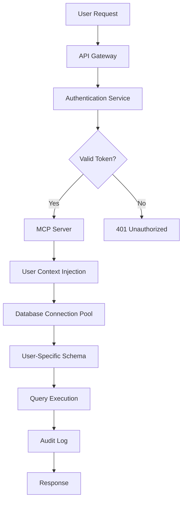

# Multi-User Architecture Design for Career Navigator

## Executive Summary

This document outlines the architectural changes required to transform Career Navigator from a single-user system to a secure, multi-tenant platform with HIPAA-level data protection standards for career and personal experience data.

## Current State Analysis

### Single-User Limitations
- Database schema has no user isolation
- Tables use singleton constraints (one record only)
- No authentication or authorization layer
- All data stored in shared tables
- No audit trails or access logging

### Security Gaps
- No data encryption at rest
- No row-level security
- Single database connection for all operations
- No user session management
- No compliance with privacy regulations

## SQL vs NoSQL Evaluation

### SQL (PostgreSQL) - Current Choice

**Advantages:**
1. **Strong ACID compliance** - Critical for financial and career data integrity
2. **Mature security features** - Row-level security, encryption, audit trails
3. **Complex relationships** - Career paths, skills mapping, role progressions
4. **JSON support** - Flexible schema with JSONB columns
5. **Proven scalability** - Can handle millions of users with proper design
6. **Compliance ready** - Built-in features for HIPAA/GDPR compliance

**Disadvantages:**
1. Schema migrations can be complex
2. Vertical scaling limitations
3. More complex multi-tenant design

### NoSQL Options Evaluation

#### MongoDB
**Pros:**
- Flexible schema evolution
- Easy horizontal scaling
- Native JSON document storage

**Cons:**
- Weaker consistency guarantees
- Limited transaction support across collections
- Complex aggregations for career analytics
- Harder to implement compliance features

#### DynamoDB
**Pros:**
- Serverless, auto-scaling
- Built-in encryption
- High availability

**Cons:**
- Limited query flexibility
- Expensive for complex queries
- No native relationship handling
- Difficult career path traversals

### Recommendation: Enhanced PostgreSQL with User Isolation

Given the requirements for:
- Strong data consistency (career progression tracking)
- Complex relationships (skills, roles, paths)
- Compliance requirements (HIPAA-like standards)
- Audit trails and access logging

**PostgreSQL remains the optimal choice** with enhanced multi-tenant architecture.

## Proposed Multi-User Architecture

### 1. User-Prefixed Table Strategy

Instead of shared tables with user_id columns, implement complete data isolation using user-prefixed schemas:

```sql
-- Each user gets their own schema
CREATE SCHEMA user_john_doe;
CREATE SCHEMA user_jane_smith;

-- Tables are created within user schemas
CREATE TABLE user_john_doe.experiences_detailed (...);
CREATE TABLE user_john_doe.profile_summaries (...);
CREATE TABLE user_john_doe.quick_summaries (...);
```

**Benefits:**
- Complete data isolation at database level
- No risk of cross-user data leakage
- Easy backup/restore per user
- Simple compliance with data deletion requests
- Performance isolation between users

### 2. Shared Reference Data

Maintain shared schemas for non-sensitive reference data:

```sql
-- Shared reference data schema
CREATE SCHEMA reference_data;

CREATE TABLE reference_data.skills_catalog (...);
CREATE TABLE reference_data.career_paths (...);
CREATE TABLE reference_data.role_templates (...);
CREATE TABLE reference_data.industry_standards (...);
```

### 3. Authentication & Authorization Architecture



### 4. Security Implementation

#### Database Level
```sql
-- User authentication table in system schema
CREATE SCHEMA system_auth;

CREATE TABLE system_auth.users (
    user_id UUID PRIMARY KEY DEFAULT gen_random_uuid(),
    username VARCHAR(255) UNIQUE NOT NULL,
    email VARCHAR(255) UNIQUE NOT NULL,
    password_hash VARCHAR(255) NOT NULL,
    mfa_secret VARCHAR(255),
    created_at TIMESTAMP DEFAULT NOW(),
    last_login TIMESTAMP,
    account_status VARCHAR(50) DEFAULT 'active',
    encryption_key_id UUID
);

-- Audit log table
CREATE TABLE system_auth.audit_log (
    log_id UUID PRIMARY KEY DEFAULT gen_random_uuid(),
    user_id UUID REFERENCES system_auth.users(user_id),
    action VARCHAR(100) NOT NULL,
    resource_type VARCHAR(100),
    resource_id VARCHAR(255),
    ip_address INET,
    user_agent TEXT,
    timestamp TIMESTAMP DEFAULT NOW(),
    success BOOLEAN DEFAULT true,
    error_message TEXT
);

-- API keys for programmatic access
CREATE TABLE system_auth.api_keys (
    key_id UUID PRIMARY KEY DEFAULT gen_random_uuid(),
    user_id UUID REFERENCES system_auth.users(user_id),
    key_hash VARCHAR(255) NOT NULL,
    name VARCHAR(255),
    permissions JSONB,
    last_used TIMESTAMP,
    expires_at TIMESTAMP,
    created_at TIMESTAMP DEFAULT NOW()
);
```

#### Application Level Security

1. **JWT Authentication**
   - Short-lived access tokens (15 minutes)
   - Refresh tokens with rotation
   - MFA support for sensitive operations

2. **Connection Pooling**
   - Separate connection pools per user
   - Connection string includes user schema
   - Automatic cleanup on logout

3. **Encryption**
   - AES-256 encryption for sensitive fields
   - User-specific encryption keys
   - Key rotation mechanism

### 5. MCP Server Authentication Flow

```javascript
// Pseudocode for authenticated MCP server
class AuthenticatedMCPServer {
    async handleRequest(request) {
        // 1. Extract and validate JWT token
        const token = this.extractToken(request);
        const user = await this.validateToken(token);
        
        // 2. Create user-specific database connection
        const dbConnection = await this.getConnectionForUser(user);
        
        // 3. Set search path to user schema
        await dbConnection.query(`SET search_path TO user_${user.username}, reference_data`);
        
        // 4. Execute MCP operation with user context
        const result = await this.executeMCPOperation(request, dbConnection);
        
        // 5. Audit log the operation
        await this.auditLog(user, request, result);
        
        return result;
    }
}
```

### 6. Data Migration Strategy

For existing single-user deployments:

1. **Export Phase**
   - Export all user data to backup
   - Generate migration scripts

2. **Schema Creation**
   - Create user-specific schema
   - Replicate table structure

3. **Data Import**
   - Import data into user schema
   - Verify data integrity

4. **Cutover**
   - Update connection strings
   - Enable authentication

### 7. Compliance & Privacy Features

#### HIPAA-like Standards Implementation

1. **Access Controls**
   - Role-based access control (RBAC)
   - Principle of least privilege
   - Regular access reviews

2. **Encryption**
   - Data at rest: AES-256
   - Data in transit: TLS 1.3
   - Key management service integration

3. **Audit Trails**
   - All data access logged
   - Immutable audit logs
   - 7-year retention policy

4. **Data Integrity**
   - Checksums for critical data
   - Regular integrity checks
   - Backup verification

5. **Business Associate Agreements**
   - Template for third-party integrations
   - Data processing agreements

### 8. Performance Considerations

#### Schema-Based Isolation Impact
- **Pros**: Better cache utilization per user
- **Cons**: More schemas to manage

#### Optimization Strategies
1. Connection pooling per user
2. Schema-level statistics
3. Automated vacuum per schema
4. Query plan caching

### 9. Backup & Recovery

```bash
# User-specific backup
pg_dump -n user_john_doe -f backup_john_doe.sql

# User-specific restore
psql -c "CREATE SCHEMA user_john_doe"
psql -f backup_john_doe.sql
```

### 10. Monitoring & Observability

```sql
-- Performance monitoring view
CREATE VIEW system_auth.user_metrics AS
SELECT 
    u.username,
    COUNT(DISTINCT e.experience_id) as total_experiences,
    MAX(e.updated_at) as last_activity,
    pg_schema_size(u.schema_name) as storage_used
FROM system_auth.users u
LEFT JOIN ... -- Join with user schemas
GROUP BY u.user_id;
```

## Implementation Roadmap

### Phase 1: Foundation (Weeks 1-2)
- [ ] Create authentication schema and tables
- [ ] Implement JWT authentication service
- [ ] Add audit logging infrastructure

### Phase 2: Schema Migration (Weeks 3-4)
- [ ] Develop schema creation automation
- [ ] Build data migration tools
- [ ] Test with sample users

### Phase 3: MCP Integration (Weeks 5-6)
- [ ] Update MCP server with authentication
- [ ] Implement user context passing
- [ ] Add connection pool management

### Phase 4: Security Hardening (Weeks 7-8)
- [ ] Implement encryption at rest
- [ ] Add rate limiting
- [ ] Security audit and penetration testing

### Phase 5: Compliance (Weeks 9-10)
- [ ] Document security procedures
- [ ] Implement data retention policies
- [ ] Create compliance reports

## Conclusion

The proposed architecture provides:
- **Complete data isolation** through user-specific schemas
- **HIPAA-level security** with encryption and audit trails
- **Scalability** to millions of users
- **Compliance readiness** for privacy regulations
- **Performance optimization** through schema isolation

This approach balances security, performance, and maintainability while providing a clear upgrade path from the current single-user system.