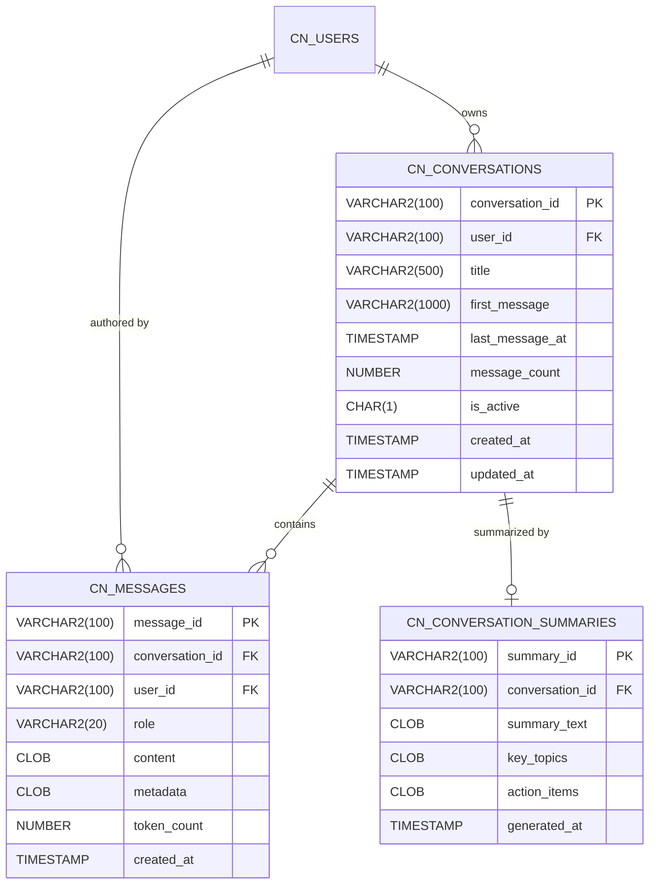
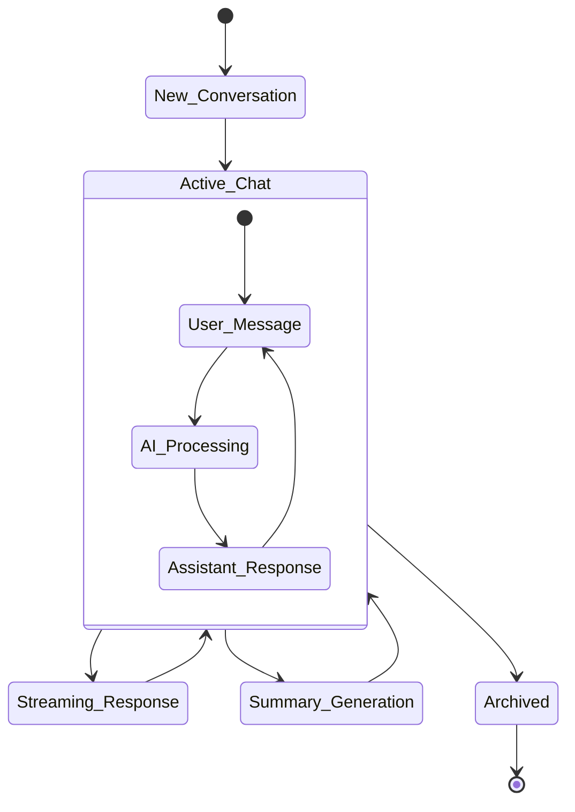

# Chat and Conversation Schema Relationships

## Overview

The chat schema powers Pathfinder's AI mentorship capabilities, storing conversations, messages, and AI-generated insights. It implements streaming support, conversation management, and intelligent summarization.

## Entity Relationship Diagram



## Detailed Table Specifications

### CN_CONVERSATIONS

**Purpose**: Manages chat conversation sessions
- **Primary Key**: `conversation_id` (VARCHAR2 - UUID format)
- **Foreign Key**: `user_id` references `CN_USERS`

**Key Features**:
- Auto-generated titles based on first message
- Message count tracking for performance
- Soft delete with `is_active` flag
- Automatic timestamp updates via trigger

**Title Generation Logic**:
```sql
-- Title derived from first user message
UPDATE pf_conversations 
SET title = SUBSTR(first_message, 1, 100) || 
    CASE WHEN LENGTH(first_message) > 100 THEN '...' ELSE '' END
WHERE title IS NULL;
```

### CN_MESSAGES

**Purpose**: Stores individual messages in conversations
- **Primary Key**: `message_id`
- **Foreign Keys**: 
  - `conversation_id` → `CN_CONVERSATIONS`
  - `user_id` → `CN_USERS`

**Role Types**:
```sql
CHECK (role IN ('user', 'assistant', 'system'))
```

**Metadata Structure** (JSON in CLOB):
```json
{
    "model": "claude-3-opus",
    "temperature": 0.7,
    "stream": true,
    "processing_time_ms": 1234,
    "error": null,
    "context_tokens": 500,
    "completion_tokens": 150,
    "total_tokens": 650
}
```

### CN_CONVERSATION_SUMMARIES

**Purpose**: AI-generated summaries of conversations
- **Primary Key**: `summary_id`
- **Foreign Key**: `conversation_id` (unique constraint ensures one summary per conversation)

**Key Topics Structure** (JSON array):
```json
[
    {
        "topic": "Resume Optimization",
        "relevance": 0.85,
        "message_refs": ["msg_123", "msg_125", "msg_130"]
    },
    {
        "topic": "Interview Preparation", 
        "relevance": 0.72,
        "message_refs": ["msg_145", "msg_147"]
    }
]
```

**Action Items Structure** (JSON array):
```json
[
    {
        "action": "Update skills section with Python expertise",
        "priority": "high",
        "mentioned_in": "msg_130"
    },
    {
        "action": "Research target company culture",
        "priority": "medium",
        "mentioned_in": "msg_147"
    }
]
```

## Conversation Flow and State Management



## Streaming Implementation

The chat system supports real-time streaming responses:

### Message Streaming States
1. **Message Created**: Initial message record with `role='assistant'` and empty content
2. **Streaming**: Content appended in chunks via updates
3. **Complete**: Final content saved with metadata

### Database Support for Streaming
```sql
-- Initial message creation for streaming
INSERT INTO pf_messages (
    message_id, conversation_id, user_id, role, content
) VALUES (
    :message_id, :conversation_id, :user_id, 'assistant', EMPTY_CLOB()
);

-- Streaming updates (append chunks)
UPDATE pf_messages 
SET content = content || :chunk
WHERE message_id = :message_id;

-- Final update with metadata
UPDATE pf_messages 
SET metadata = :metadata_json,
    token_count = :total_tokens
WHERE message_id = :message_id;
```

## Query Patterns

### Recent Conversations
```sql
SELECT 
    c.conversation_id,
    c.title,
    c.message_count,
    c.last_message_at,
    m.content as last_message_preview
FROM pf_conversations c
LEFT JOIN LATERAL (
    SELECT content 
    FROM pf_messages 
    WHERE conversation_id = c.conversation_id 
    ORDER BY created_at DESC 
    FETCH FIRST 1 ROW ONLY
) m ON 1=1
WHERE c.user_id = :user_id
  AND c.is_active = 'Y'
ORDER BY c.last_message_at DESC
FETCH FIRST 20 ROWS ONLY;
```

### Conversation Search
```sql
WITH message_search AS (
    SELECT DISTINCT conversation_id
    FROM pf_messages
    WHERE user_id = :user_id
      AND CONTAINS(content, :search_term) > 0
)
SELECT c.*, 
       SUBSTR(c.first_message, 1, 200) as preview
FROM pf_conversations c
JOIN message_search ms ON c.conversation_id = ms.conversation_id
WHERE c.is_active = 'Y'
ORDER BY c.last_message_at DESC;
```

### Token Usage Analytics
```sql
SELECT 
    DATE_TRUNC('day', created_at) as usage_date,
    COUNT(*) as message_count,
    SUM(CASE WHEN role = 'user' THEN token_count ELSE 0 END) as input_tokens,
    SUM(CASE WHEN role = 'assistant' THEN token_count ELSE 0 END) as output_tokens,
    SUM(token_count) as total_tokens
FROM pf_messages
WHERE user_id = :user_id
  AND created_at >= SYSDATE - 30
GROUP BY DATE_TRUNC('day', created_at)
ORDER BY usage_date DESC;
```

## Performance Optimization

### Indexes
```sql
-- Conversation lookups
CREATE INDEX idx_conv_user_active 
ON pf_conversations(user_id, is_active, last_message_at DESC);

-- Message retrieval
CREATE INDEX idx_msg_conv_created 
ON pf_messages(conversation_id, created_at);

-- Token analytics
CREATE INDEX idx_msg_user_tokens 
ON pf_messages(user_id, created_at, token_count);

-- Full-text search on content
CREATE INDEX idx_msg_content_text 
ON pf_messages(content) 
INDEXTYPE IS CTXSYS.CONTEXT;
```

### Partitioning Strategy
For high-volume deployments:
```sql
-- Partition messages by month
ALTER TABLE pf_messages 
PARTITION BY RANGE (created_at) (
    PARTITION p_2024_01 VALUES LESS THAN (DATE '2024-02-01'),
    PARTITION p_2024_02 VALUES LESS THAN (DATE '2024-03-01'),
    -- ... more partitions
);
```

## Data Retention and Archival

### Retention Policies
1. **Active Conversations**: No automatic deletion
2. **Inactive Conversations**: Archive after 1 year of inactivity
3. **System Messages**: Purge after 30 days
4. **Summaries**: Regenerate on demand, cache for 90 days

### Archival Process
```sql
-- Move old conversations to archive
INSERT INTO pf_conversations_archive
SELECT * FROM pf_conversations
WHERE last_message_at < ADD_MONTHS(SYSDATE, -12)
  AND is_active = 'Y';

-- Archive associated messages
INSERT INTO pf_messages_archive
SELECT m.* 
FROM pf_messages m
JOIN pf_conversations_archive c 
  ON m.conversation_id = c.conversation_id;
```

## Security and Privacy

### Message Encryption
- Content field eligible for encryption at rest
- User messages may contain sensitive career information
- AI responses may reference confidential details

### Access Control
```sql
-- User can only access their own conversations
CREATE OR REPLACE VIEW user_conversations AS
SELECT * FROM pf_conversations
WHERE user_id = SYS_CONTEXT('USERENV', 'CLIENT_IDENTIFIER');

-- Row-level security policy
BEGIN
    DBMS_RLS.ADD_POLICY(
        object_schema => 'CAREER_NAV',
        object_name => 'CN_MESSAGES',
        policy_name => 'messages_user_policy',
        function_schema => 'CAREER_NAV',
        policy_function => 'check_message_owner',
        statement_types => 'SELECT,UPDATE,DELETE'
    );
END;
```

### Audit Trail
All chat operations are logged in `CN_AUDIT_LOG`:
- Message creation/deletion
- Conversation archival
- Summary generation
- Search queries

## Integration Points

### MCP Server Integration
```javascript
// Message flow through MCP
{
    "action": "chat.sendMessage",
    "userId": "user_123",
    "conversationId": "conv_456",
    "message": "How do I improve my resume?",
    "context": {
        "includeProfile": true,
        "includeExperiences": true,
        "streamResponse": true
    }
}
```

### LLM Service Integration
- Supports multiple model providers
- Streaming and non-streaming modes
- Context window management
- Token counting and limits