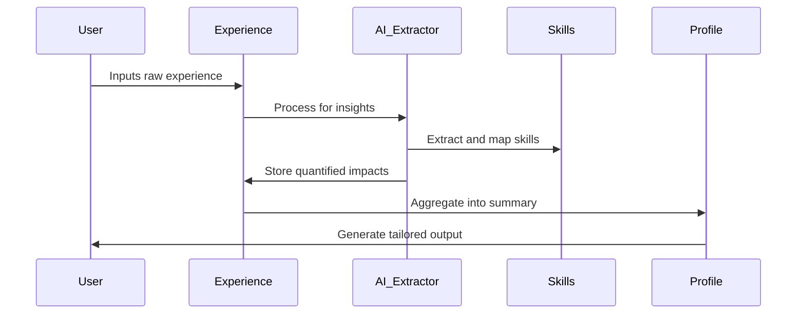

# User Experience Management Schema Relationships

## Overview

The experience management schema is the core of Pathfinder's value proposition. It stores detailed professional experiences with AI-enhanced skill extraction, achievement quantification, and career progression tracking. Each user has their own isolated set of experience tables.

## Entity Relationship Diagram

```mermaid
erDiagram
    USER_EXPERIENCES_DETAILED ||--o{ USER_SKILL_MAPPINGS : "extracts"
    USER_EXPERIENCES_DETAILED ||--o{ USER_ACHIEVEMENT_METRICS : "quantifies"
    USER_EXPERIENCES_DETAILED ||--|| USER_PROFILE_SUMMARIES : "aggregates into"
    USER_PROFILE_SUMMARIES ||--o{ USER_CAREER_OBJECTIVES : "guides"
    PF_REF_SKILLS_CATALOG ||--o{ USER_SKILL_MAPPINGS : "references"
    PF_REF_ROLE_TEMPLATES ||--o{ USER_EXPERIENCES_DETAILED : "matches"
    
    USER_EXPERIENCES_DETAILED {
        RAW(16) experience_id PK
        VARCHAR2(255) title
        VARCHAR2(255) organization
        VARCHAR2(255) department
        VARCHAR2(255) location
        CLOB description
        DATE start_date
        DATE end_date
        NUMBER(1) is_current
        VARCHAR2(50) experience_type
        VARCHAR2(50) employment_type
        CLOB raw_text
        JSON extracted_skills
        JSON key_highlights
        JSON quantified_impacts
        JSON technologies_used
        JSON role_progression
        JSON achievements
        JSON challenges_overcome
        JSON projects_led
        NUMBER team_size
        NUMBER budget_managed
        NUMBER revenue_impact
        NUMBER cost_savings
        JSON industry_tags
        JSON soft_skills_demonstrated
        JSON leadership_examples
        JSON metadata
        NUMBER(3,2) quality_score
        VARCHAR2(50) verification_status
        VARCHAR2(50) environment
        TIMESTAMP created_at
        TIMESTAMP updated_at
    }
    
    USER_PROFILE_SUMMARIES {
        RAW(16) profile_id PK
        VARCHAR2(100) profile_type
        VARCHAR2(500) headline
        CLOB executive_summary
        CLOB career_narrative
        JSON core_competencies
        JSON technical_skills
        JSON soft_skills
        JSON industry_expertise
        JSON notable_achievements
        NUMBER total_years_experience
        NUMBER years_management_experience
        NUMBER total_team_size_managed
        NUMBER total_budget_managed
        JSON career_progression
        JSON education_summary
        JSON certifications
        JSON target_roles
        JSON career_objectives
        VARCHAR2(500) unique_value_proposition
        DATE last_generated
        NUMBER(3,2) completeness_score
        VARCHAR2(50) environment
        TIMESTAMP created_at
        TIMESTAMP updated_at
    }
    
    USER_SKILL_MAPPINGS {
        RAW(16) mapping_id PK
        RAW(16) experience_id FK
        RAW(16) skill_id FK
        NUMBER(3,2) proficiency_level
        NUMBER(3,2) relevance_score
        VARCHAR2(50) evidence_type
        CLOB evidence_text
        NUMBER years_used
        DATE last_used
        VARCHAR2(50) validation_status
        TIMESTAMP created_at
    }
    
    USER_ACHIEVEMENT_METRICS {
        RAW(16) metric_id PK
        RAW(16) experience_id FK
        VARCHAR2(100) metric_type
        NUMBER metric_value
        VARCHAR2(50) metric_unit
        VARCHAR2(500) metric_description
        VARCHAR2(100) impact_area
        NUMBER(3,2) significance_score
        CLOB supporting_evidence
        TIMESTAMP created_at
    }
    
    USER_CAREER_OBJECTIVES {
        RAW(16) objective_id PK
        RAW(16) profile_id FK
        VARCHAR2(255) target_role
        VARCHAR2(100) target_industry
        VARCHAR2(50) timeline
        JSON required_skills
        JSON skill_gaps
        VARCHAR2(50) objective_status
        CLOB action_plan
        TIMESTAMP created_at
        TIMESTAMP updated_at
    }
```

## User-Specific Tables (Prefixed with username)

### {username}_EXPERIENCES_DETAILED

**Primary Table**: Stores comprehensive experience records
- **Primary Key**: `experience_id`
- **Prefix**: Unique per user (e.g., `user_john_doe_experiences_detailed`)

**Relationships**:
- **One-to-Many** with skill mappings
- **One-to-Many** with achievement metrics
- **Many-to-One** aggregation into profile summaries

**Key Features**:
- Multi-type experiences (work, education, certification, project, volunteer)
- AI-extracted insights stored as JSON
- Quantified impact metrics (revenue, cost savings, team size)
- Quality scoring for experience completeness
- Verification status for credibility

**Experience Types**:
```sql
CHECK (experience_type IN (
    'work', 
    'education', 
    'certification', 
    'project', 
    'volunteer', 
    'achievement', 
    'training'
))
```

### {username}_PROFILE_SUMMARIES

**Purpose**: Aggregated view of all experiences for different use cases
- **Primary Key**: `profile_id`
- **Aggregates**: Multiple experiences into cohesive narratives

**Profile Types**:
- `master` - Complete professional profile
- `resume` - Resume-focused summary
- `linkedin` - LinkedIn optimization
- `elevator` - 30-second pitch
- `executive` - C-suite targeted

**Key Calculations**:
```sql
-- Total experience calculation
total_years_experience = SUM(
    MONTHS_BETWEEN(
        NVL(end_date, SYSDATE), 
        start_date
    ) / 12
) FROM experiences WHERE experience_type = 'work'

-- Management experience
years_management_experience = SUM(
    CASE WHEN team_size > 0 THEN
        MONTHS_BETWEEN(NVL(end_date, SYSDATE), start_date) / 12
    ELSE 0 END
) FROM experiences
```

### {username}_SKILL_MAPPINGS

**Purpose**: Links experiences to skills with proficiency tracking
- **Primary Key**: `mapping_id`
- **Foreign Keys**: 
  - `experience_id` → user's experiences
  - `skill_id` → reference skills catalog

**Proficiency Levels**:
- 0.0-0.3: Beginner
- 0.3-0.6: Intermediate
- 0.6-0.8: Advanced
- 0.8-1.0: Expert

**Evidence Types**:
- `explicit` - Directly mentioned in experience
- `inferred` - AI-inferred from context
- `validated` - User or peer validated
- `certified` - Backed by certification

### {username}_ACHIEVEMENT_METRICS

**Purpose**: Quantifiable achievements and impacts
- **Primary Key**: `metric_id`
- **Foreign Key**: `experience_id`

**Metric Types**:
- `revenue` - Revenue generated/influenced
- `cost_savings` - Cost reductions achieved
- `efficiency` - Process improvements
- `growth` - Team/business growth metrics
- `quality` - Quality improvements
- `innovation` - New initiatives launched

## Reference Tables (Shared)

### PF_REF_SKILLS_CATALOG

**Purpose**: Master catalog of professional skills
- **Shared**: Read-only access for all users
- **Categories**: Technical, soft skills, certifications, languages

**Structure**:
```json
{
    "related_skills": ["skill_id_1", "skill_id_2"],
    "industry_relevance": {
        "technology": 0.9,
        "finance": 0.6,
        "healthcare": 0.3
    },
    "proficiency_levels": {
        "beginner": "Basic understanding",
        "intermediate": "Can work independently",
        "advanced": "Can lead projects",
        "expert": "Industry recognized expert"
    }
}
```

### PF_REF_ROLE_TEMPLATES

**Purpose**: Standard role definitions for matching
- **Hierarchical**: Entry → Mid → Senior → Executive
- **Industry-Specific**: Tailored by industry vertical

## Data Flow and Aggregation



## Key Queries and Patterns

### Experience Timeline
```sql
SELECT 
    title,
    organization,
    start_date,
    NVL(end_date, SYSDATE) as end_date,
    MONTHS_BETWEEN(NVL(end_date, SYSDATE), start_date) as duration_months
FROM {username}_experiences_detailed
WHERE experience_type = 'work'
ORDER BY start_date DESC;
```

### Skill Inventory
```sql
SELECT 
    s.skill_name,
    s.category,
    MAX(sm.proficiency_level) as max_proficiency,
    COUNT(DISTINCT sm.experience_id) as experience_count,
    MAX(sm.last_used) as last_used
FROM {username}_skill_mappings sm
JOIN pf_ref_skills_catalog s ON sm.skill_id = s.skill_id
GROUP BY s.skill_name, s.category
ORDER BY max_proficiency DESC, experience_count DESC;
```

### Achievement Impact Summary
```sql
SELECT 
    impact_area,
    metric_type,
    SUM(metric_value) as total_impact,
    COUNT(*) as instance_count,
    AVG(significance_score) as avg_significance
FROM {username}_achievement_metrics
GROUP BY impact_area, metric_type
ORDER BY total_impact DESC;
```

## Privacy and Security

### Data Isolation
- Each user's experience data is completely isolated
- No cross-user queries possible at database level
- User prefix ensures complete separation

### Sensitive Data Handling
- Descriptions and achievements may contain PII
- All CLOB fields are candidates for encryption
- Salary and compensation data specially protected

### Data Retention
- Active experiences: Retained indefinitely
- Deleted experiences: Soft delete for 90 days
- Aggregated profiles: Regenerated on demand

## Performance Optimization

### Indexing Strategy
```sql
-- Experience lookups
CREATE INDEX idx_{username}_exp_type_date 
ON {username}_experiences_detailed(experience_type, start_date DESC);

-- Current position
CREATE INDEX idx_{username}_exp_current 
ON {username}_experiences_detailed(is_current, end_date);

-- Skill mappings
CREATE INDEX idx_{username}_skills_prof 
ON {username}_skill_mappings(skill_id, proficiency_level DESC);

-- Achievement metrics
CREATE INDEX idx_{username}_metrics_impact 
ON {username}_achievement_metrics(impact_area, metric_value DESC);
```

### Materialized Views
For frequently accessed aggregations:
```sql
CREATE MATERIALIZED VIEW {username}_skill_summary AS
SELECT skill data aggregated across all experiences
REFRESH ON DEMAND;
```