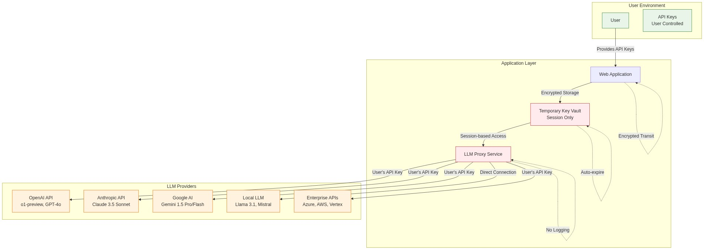

# BYOK (Bring Your Own Key) Implementation

## Overview

The BYOK implementation ensures users maintain complete control over their LLM API interactions by using their own API keys. This approach provides maximum privacy, cost control, and compliance with data residency requirements.

## Supported LLM Providers

### 1. OpenAI
- **o1-preview**: Advanced reasoning model for complex career planning
- **o1-mini**: Faster reasoning model for quick career insights
- **GPT-4o**: Latest multimodal model with enhanced reasoning
- **GPT-4o-mini**: Cost-effective variant with strong performance
- **GPT-4-turbo**: Optimal for complex career analysis
- **GPT-4**: Legacy model for balanced performance
- **GPT-3.5-turbo**: Legacy cost-effective option
- **text-embedding-3-large**: Advanced embeddings for semantic search
- **text-embedding-3-small**: Efficient embeddings for similarity matching

### 2. Anthropic
- **Claude 3.5 Sonnet**: Latest model with enhanced reasoning and coding capabilities
- **Claude 3.5 Haiku**: Fast responses with improved capabilities over Claude 3 Haiku
- **Claude 3 Opus**: Premium model for nuanced career guidance (legacy)
- **Claude 3 Sonnet**: Balanced performance and speed (legacy)
- **Claude 3 Haiku**: Fast responses for quick queries (legacy)

### 3. Local/Self-Hosted Models
- **Ollama**: Local deployment with privacy (Llama 3.1, Mistral 7B, CodeLlama)
- **LM Studio**: User-friendly local model hosting
- **vLLM**: High-performance inference server
- **Hugging Face Transformers**: Direct model loading
- **TensorRT-LLM**: NVIDIA-optimized inference
- **MLX**: Apple Silicon optimized inference

### 4. Enterprise Options
- **Azure OpenAI**: Enterprise-grade with compliance (GPT-4o, o1-preview)
- **AWS Bedrock**: Multi-model platform (Claude 3.5, Llama 3.1, Mistral)
- **Google Vertex AI**: Integrated ML platform (Gemini Pro, PaLM 2)
- **Google AI Studio**: Direct Gemini API access
- **Cohere**: Enterprise-grade language models
- **Mistral AI**: European AI models with GDPR compliance

## Security Architecture

[](../../assets/diagrams/byok-security-architecture.mmd)

## Key Management Security

### Session-Based Key Storage
```javascript
class SecureKeyManager {
  constructor() {
    this.sessionKeys = new Map(); // In-memory only
    this.keyExpiry = new Map();
  }
  
  // Store API key for session duration only
  storeSessionKey(sessionId, provider, apiKey) {
    const encryptedKey = this.encryptKey(apiKey, sessionId);
    const expiryTime = Date.now() + (15 * 60 * 1000); // 15 minutes
    
    this.sessionKeys.set(`${sessionId}:${provider}`, encryptedKey);
    this.keyExpiry.set(`${sessionId}:${provider}`, expiryTime);
    
    // Auto-cleanup expired keys
    this.scheduleCleanup(`${sessionId}:${provider}`, expiryTime);
  }
  
  // Retrieve and decrypt API key
  getSessionKey(sessionId, provider) {
    const keyId = `${sessionId}:${provider}`;
    
    if (!this.isKeyValid(keyId)) {
      throw new Error('API key expired or not found');
    }
    
    const encryptedKey = this.sessionKeys.get(keyId);
    return this.decryptKey(encryptedKey, sessionId);
  }
  
  // Secure key encryption using session-derived key
  encryptKey(apiKey, sessionId) {
    const sessionKey = crypto.scryptSync(sessionId, 'salt', 32);
    const cipher = crypto.createCipher('aes-256-gcm', sessionKey);
    
    let encrypted = cipher.update(apiKey, 'utf8', 'hex');
    encrypted += cipher.final('hex');
    
    return {
      data: encrypted,
      authTag: cipher.getAuthTag(),
      iv: cipher.getIV()
    };
  }
  
  // Immediate cleanup on session end
  clearSessionKeys(sessionId) {
    for (const [keyId] of this.sessionKeys) {
      if (keyId.startsWith(`${sessionId}:`)) {
        this.sessionKeys.delete(keyId);
        this.keyExpiry.delete(keyId);
      }
    }
  }
}
```

## API Key Configuration Interface

### User Configuration Dashboard
```html
<!-- API Key Management Interface -->
<div class="api-key-config">
  <h3>🔐 LLM Provider Configuration</h3>
  
  <div class="provider-section">
    <h4>OpenAI</h4>
    <input type="password" id="openai-key" placeholder="sk-...">
    <select id="openai-model">
      <option value="o1-preview">o1-preview ($15/$60 per 1M tokens)</option>
      <option value="o1-mini">o1-mini ($3/$12 per 1M tokens)</option>
      <option value="gpt-4o">GPT-4o ($2.50/$10.00 per 1M tokens)</option>
      <option value="gpt-4o-mini" selected>GPT-4o-mini ($0.15/$0.60 per 1M tokens)</option>
      <option value="gpt-4-turbo">GPT-4-turbo ($10/$30 per 1M tokens)</option>
    </select>
    <button onclick="testConnection('openai')">Test Connection</button>
  </div>
  
  <div class="provider-section">
    <h4>Anthropic</h4>
    <input type="password" id="anthropic-key" placeholder="sk-ant-...">
    <select id="anthropic-model">
      <option value="claude-3-5-sonnet-20241022" selected>Claude 3.5 Sonnet (Latest) ($3/$15 per 1M tokens)</option>
      <option value="claude-3-5-haiku-20241022">Claude 3.5 Haiku ($1/$5 per 1M tokens)</option>
      <option value="claude-3-opus-20240229">Claude 3 Opus (Legacy) ($15/$75 per 1M tokens)</option>
      <option value="claude-3-sonnet-20240229">Claude 3 Sonnet (Legacy) ($3/$15 per 1M tokens)</option>
    </select>
    <button onclick="testConnection('anthropic')">Test Connection</button>
  </div>
  
  <div class="provider-section">
    <h4>Google AI</h4>
    <input type="password" id="google-key" placeholder="AI...">
    <select id="google-model">
      <option value="gemini-1.5-pro">Gemini 1.5 Pro ($1.25/$5.00 per 1M tokens)</option>
      <option value="gemini-1.5-flash" selected>Gemini 1.5 Flash ($0.075/$0.30 per 1M tokens)</option>
      <option value="gemini-pro">Gemini Pro ($0.50/$1.50 per 1M tokens)</option>
    </select>
    <button onclick="testConnection('google')">Test Connection</button>
  </div>
  
  <div class="provider-section">
    <h4>Local/Self-Hosted</h4>
    <input type="url" id="local-endpoint" placeholder="http://localhost:11434">
    <select id="local-model">
      <option value="llama3.1:8b">Llama 3.1 8B (Recommended)</option>
      <option value="llama3.1:70b">Llama 3.1 70B (High Performance)</option>
      <option value="mistral:7b">Mistral 7B (Fast)</option>
      <option value="codellama:13b">CodeLlama 13B (Technical)</option>
      <option value="custom">Custom Model</option>
    </select>
    <input type="text" id="custom-model" placeholder="Enter custom model name" style="display:none;">
    <button onclick="testConnection('local')">Test Connection</button>
  </div>
  
  <div class="security-notice">
    <p>🔒 Your API keys are:</p>
    <ul>
      <li>Never stored permanently on our servers</li>
      <li>Encrypted in memory during your session</li>
      <li>Automatically deleted when you log out</li>
      <li>Only used to make API calls on your behalf</li>
    </ul>
  </div>
</div>
```

### JavaScript Configuration Handler
```javascript
class APIKeyConfig {
  constructor() {
    this.sessionManager = new SecureKeyManager();
    this.providers = new Map();
  }
  
  // Configure API key with validation
  async configureProvider(provider, config) {
    try {
      // Validate API key format
      this.validateAPIKey(provider, config.apiKey);
      
      // Test connection
      const isValid = await this.testConnection(provider, config);
      if (!isValid) {
        throw new Error('Invalid API key or connection failed');
      }
      
      // Store in session
      const sessionId = this.getSessionId();
      this.sessionManager.storeSessionKey(sessionId, provider, config.apiKey);
      
      // Store provider config (without key)
      this.providers.set(provider, {
        model: config.model,
        endpoint: config.endpoint,
        configured: true,
        lastTested: Date.now()
      });
      
      return { success: true, message: 'Provider configured successfully' };
      
    } catch (error) {
      return { success: false, error: error.message };
    }
  }
  
  // Validate API key format
  validateAPIKey(provider, apiKey) {
    const patterns = {
      openai: /^sk-[a-zA-Z0-9-_]{20,}$/,
      anthropic: /^sk-ant-[a-zA-Z0-9-_]{95,}$/,
      google: /^AI[a-zA-Z0-9-_]{35,}$/,
      azure: /^[a-f0-9]{32}$/,
      cohere: /^[a-zA-Z0-9-_]{40,}$/,
      mistral: /^[a-zA-Z0-9-_]{32,}$/
    };
    
    const pattern = patterns[provider];
    if (pattern && !pattern.test(apiKey)) {
      throw new Error(`Invalid ${provider} API key format`);
    }
  }
  
  // Test API connection
  async testConnection(provider, config) {
    const testPrompt = "Hello, this is a test message.";
    
    try {
      const response = await this.makeAPICall(provider, {
        model: config.model,
        messages: [{ role: "user", content: testPrompt }],
        max_tokens: 10
      }, config.apiKey);
      
      return response.choices && response.choices.length > 0;
      
    } catch (error) {
      console.error(`Connection test failed for ${provider}:`, error);
      return false;
    }
  }
}
```

## Secure API Call Proxy

### Request Proxy Implementation
```javascript
class LLMProxy {
  constructor() {
    this.rateLimiter = new RateLimiter();
    this.auditLogger = new AuditLogger();
  }
  
  async makeSecureAPICall(sessionId, provider, request) {
    try {
      // Rate limiting
      await this.rateLimiter.checkLimit(sessionId, provider);
      
      // Retrieve API key
      const apiKey = this.sessionManager.getSessionKey(sessionId, provider);
      
      // Sanitize request
      const sanitizedRequest = this.sanitizeRequest(request);
      
      // Make API call
      const response = await this.callProvider(provider, sanitizedRequest, apiKey);
      
      // Log for audit (without sensitive data)
      this.auditLogger.logAPICall(sessionId, provider, {
        tokens: response.usage?.total_tokens,
        cost: this.calculateCost(provider, response.usage),
        success: true
      });
      
      return response;
      
    } catch (error) {
      this.auditLogger.logAPICall(sessionId, provider, {
        error: error.message,
        success: false
      });
      throw error;
    }
  }
  
  // Sanitize request to prevent injection attacks
  sanitizeRequest(request) {
    return {
      model: this.sanitizeString(request.model),
      messages: request.messages.map(msg => ({
        role: this.sanitizeString(msg.role),
        content: this.sanitizeString(msg.content)
      })),
      max_tokens: Math.min(request.max_tokens || 1000, 4000),
      temperature: Math.max(0, Math.min(request.temperature || 0.7, 2))
    };
  }
  
  // Provider-specific API implementations
  async callProvider(provider, request, apiKey) {
    const providers = {
      openai: () => this.callOpenAI(request, apiKey),
      anthropic: () => this.callAnthropic(request, apiKey),
      local: () => this.callLocal(request, apiKey)
    };
    
    const providerFunction = providers[provider];
    if (!providerFunction) {
      throw new Error(`Unsupported provider: ${provider}`);
    }
    
    return await providerFunction();
  }
}
```

## Cost Tracking & Monitoring

### Usage Tracking
```javascript
class UsageTracker {
  constructor() {
    this.dailyUsage = new Map();
    this.monthlyUsage = new Map();
  }
  
  // Track API usage with cost calculation
  trackUsage(sessionId, provider, usage) {
    const cost = this.calculateCost(provider, usage);
    const today = new Date().toISOString().split('T')[0];
    const month = today.substring(0, 7);
    
    // Update daily usage
    const dailyKey = `${sessionId}:${provider}:${today}`;
    const dailyStats = this.dailyUsage.get(dailyKey) || { tokens: 0, cost: 0, calls: 0 };
    dailyStats.tokens += usage.total_tokens;
    dailyStats.cost += cost;
    dailyStats.calls += 1;
    this.dailyUsage.set(dailyKey, dailyStats);
    
    // Update monthly usage
    const monthlyKey = `${sessionId}:${provider}:${month}`;
    const monthlyStats = this.monthlyUsage.get(monthlyKey) || { tokens: 0, cost: 0, calls: 0 };
    monthlyStats.tokens += usage.total_tokens;
    monthlyStats.cost += cost;
    monthlyStats.calls += 1;
    this.monthlyUsage.set(monthlyKey, monthlyStats);
  }
  
  // Calculate cost based on provider pricing (per 1M tokens)
  calculateCost(provider, usage) {
    const pricing = {
      openai: {
        'o1-preview': { input: 15, output: 60 },
        'o1-mini': { input: 3, output: 12 },
        'gpt-4o': { input: 2.50, output: 10.00 },
        'gpt-4o-mini': { input: 0.15, output: 0.60 },
        'gpt-4-turbo': { input: 10, output: 30 },
        'gpt-4': { input: 30, output: 60 },
        'gpt-3.5-turbo': { input: 0.50, output: 1.50 }
      },
      anthropic: {
        'claude-3-5-sonnet-20241022': { input: 3, output: 15 },
        'claude-3-5-haiku-20241022': { input: 1, output: 5 },
        'claude-3-opus-20240229': { input: 15, output: 75 },
        'claude-3-sonnet-20240229': { input: 3, output: 15 },
        'claude-3-haiku-20240301': { input: 0.25, output: 1.25 }
      },
      google: {
        'gemini-1.5-pro': { input: 1.25, output: 5.00 },
        'gemini-1.5-flash': { input: 0.075, output: 0.30 },
        'gemini-pro': { input: 0.50, output: 1.50 }
      },
      local: {
        // Local models have no API costs
        'default': { input: 0, output: 0 }
      }
    };
    
    const rates = pricing[provider]?.[usage.model];
    if (!rates) return 0;
    
    const inputCost = (usage.prompt_tokens / 1000000) * rates.input;
    const outputCost = (usage.completion_tokens / 1000000) * rates.output;
    
    return inputCost + outputCost;
  }
  
  // Generate usage report
  generateUsageReport(sessionId, period = 'month') {
    const usageMap = period === 'day' ? this.dailyUsage : this.monthlyUsage;
    const report = {
      period,
      total_cost: 0,
      total_tokens: 0,
      total_calls: 0,
      providers: {}
    };
    
    for (const [key, stats] of usageMap) {
      if (key.startsWith(sessionId)) {
        const [, provider] = key.split(':');
        
        if (!report.providers[provider]) {
          report.providers[provider] = { cost: 0, tokens: 0, calls: 0 };
        }
        
        report.providers[provider].cost += stats.cost;
        report.providers[provider].tokens += stats.tokens;
        report.providers[provider].calls += stats.calls;
        
        report.total_cost += stats.cost;
        report.total_tokens += stats.tokens;
        report.total_calls += stats.calls;
      }
    }
    
    return report;
  }
}
```

## Security Best Practices

### 1. API Key Handling
```javascript
// ✅ Correct: Secure key handling
const apiKey = secureKeyManager.getSessionKey(sessionId, 'openai');
const response = await makeAPICall(apiKey);
secureKeyManager.clearKey(sessionId, 'openai'); // Clear after use

// ❌ Incorrect: Insecure key handling
const apiKey = localStorage.getItem('openai_key'); // Never store in localStorage
const response = await makeAPICall(apiKey);
console.log('API Key:', apiKey); // Never log API keys
```

### 2. Request Validation
```javascript
// ✅ Correct: Validate and sanitize all inputs
function sanitizeAPIRequest(request) {
  return {
    model: validator.escape(request.model),
    messages: request.messages.map(msg => ({
      role: validator.isIn(msg.role, ['user', 'assistant', 'system']) ? msg.role : 'user',
      content: validator.escape(msg.content).substring(0, 10000) // Limit content length
    })),
    max_tokens: Math.min(parseInt(request.max_tokens) || 1000, 4000)
  };
}

// ❌ Incorrect: Using raw user input
const response = await openai.chat.completions.create(request); // Unsafe
```

### 3. Error Handling
```javascript
// ✅ Correct: Secure error handling
try {
  const response = await makeAPICall(request);
  return response;
} catch (error) {
  logger.error('API call failed', { 
    provider: 'openai',
    error: error.message,
    // Never log API keys or sensitive data
    timestamp: new Date().toISOString()
  });
  throw new Error('API call failed'); // Generic error message
}

// ❌ Incorrect: Exposing sensitive information
catch (error) {
  console.log('Full error:', error); // May contain API keys
  throw error; // Exposes internal details
}
```

## Compliance & Audit

### Audit Logging
```javascript
class SecureAuditLogger {
  constructor() {
    this.auditLog = [];
  }
  
  logAPICall(sessionId, provider, metadata) {
    const logEntry = {
      timestamp: new Date().toISOString(),
      sessionId: this.hashSessionId(sessionId), // Hash for privacy
      provider,
      success: metadata.success,
      tokens: metadata.tokens,
      cost: metadata.cost,
      // Never log API keys, prompts, or responses
      error: metadata.error ? 'API call failed' : undefined
    };
    
    this.auditLog.push(logEntry);
    
    // Rotate logs to prevent memory issues
    if (this.auditLog.length > 10000) {
      this.auditLog = this.auditLog.slice(-5000);
    }
  }
  
  generateComplianceReport() {
    return {
      totalAPICalls: this.auditLog.length,
      successRate: this.calculateSuccessRate(),
      providerDistribution: this.getProviderDistribution(),
      errorTypes: this.getErrorTypes(),
      // No personally identifiable information
    };
  }
}
```

### Data Retention Policy
```yaml
API Key Retention:
  Session Duration: 15 minutes maximum
  Permanent Storage: Never
  Memory Clearing: Automatic on session end
  Server Restart: All keys cleared

Usage Logs:
  Retention Period: 30 days
  Personal Data: None stored
  Aggregated Analytics: 1 year
  Compliance Reports: 7 years

Error Logs:
  Retention Period: 90 days
  Sensitive Data: Redacted
  Debug Information: Development only
  Production Logs: Error messages only
```