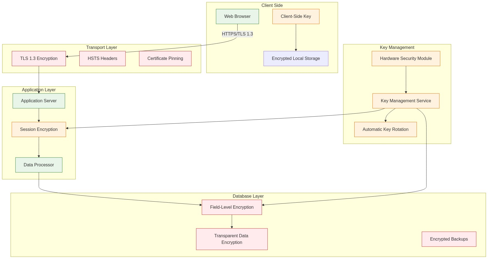

# End-to-End Encryption Specification

## Overview

This document defines the comprehensive encryption strategy for the Career Navigator system, ensuring that user data is protected at all stages: in transit, at rest, and during processing. The encryption strategy follows a defense-in-depth approach with multiple layers of protection.

## Encryption Architecture

[](../../assets/diagrams/encryption-architecture.mmd)

## Encryption Layers

### 1. Transport Layer Security (TLS)

#### TLS 1.3 Configuration
```nginx
# Nginx SSL Configuration
ssl_protocols TLSv1.3;
ssl_ciphers 'ECDHE-ECDSA-AES256-GCM-SHA384:ECDHE-RSA-AES256-GCM-SHA384';
ssl_prefer_server_ciphers off;
ssl_ecdh_curve secp384r1;
ssl_session_cache shared:SSL:10m;
ssl_session_timeout 10m;
ssl_stapling on;
ssl_stapling_verify on;

# HSTS Configuration
add_header Strict-Transport-Security "max-age=31536000; includeSubDomains; preload" always;
add_header X-Frame-Options DENY always;
add_header X-Content-Type-Options nosniff always;
add_header Referrer-Policy strict-origin-when-cross-origin always;
```

#### Certificate Pinning
```javascript
// Client-side certificate pinning
const expectedFingerprints = [
  'sha256/ABC123...', // Primary certificate
  'sha256/DEF456...', // Backup certificate
];

function validateCertificate(certificate) {
  const fingerprint = generateFingerprint(certificate);
  return expectedFingerprints.includes(fingerprint);
}
```

### 2. Client-Side Encryption

#### Client-Side Key Generation
```javascript
class ClientSideEncryption {
  constructor() {
    this.keyPair = null;
    this.symmetricKey = null;
  }
  
  // Generate client encryption keys
  async generateKeys() {
    // Generate RSA key pair for asymmetric encryption
    this.keyPair = await window.crypto.subtle.generateKey(
      {
        name: "RSA-OAEP",
        modulusLength: 4096,
        publicExponent: new Uint8Array([1, 0, 1]),
        hash: "SHA-256"
      },
      true,
      ["encrypt", "decrypt"]
    );
    
    // Generate AES key for symmetric encryption
    this.symmetricKey = await window.crypto.subtle.generateKey(
      {
        name: "AES-GCM",
        length: 256
      },
      true,
      ["encrypt", "decrypt"]
    );
  }
  
  // Encrypt data before sending to server
  async encryptData(data) {
    const encoder = new TextEncoder();
    const dataBuffer = encoder.encode(JSON.stringify(data));
    
    // Generate random IV
    const iv = window.crypto.getRandomValues(new Uint8Array(12));
    
    // Encrypt data with AES-GCM
    const encryptedData = await window.crypto.subtle.encrypt(
      {
        name: "AES-GCM",
        iv: iv
      },
      this.symmetricKey,
      dataBuffer
    );
    
    return {
      encryptedData: Array.from(new Uint8Array(encryptedData)),
      iv: Array.from(iv),
      timestamp: Date.now()
    };
  }
  
  // Decrypt data received from server
  async decryptData(encryptedPacket) {
    const { encryptedData, iv } = encryptedPacket;
    
    const decryptedBuffer = await window.crypto.subtle.decrypt(
      {
        name: "AES-GCM",
        iv: new Uint8Array(iv)
      },
      this.symmetricKey,
      new Uint8Array(encryptedData)
    );
    
    const decoder = new TextDecoder();
    const decryptedString = decoder.decode(decryptedBuffer);
    return JSON.parse(decryptedString);
  }
}
```

### 3. Application Layer Encryption

#### Session-Based Encryption
```javascript
class SessionEncryption {
  constructor() {
    this.sessionKeys = new Map();
    this.keyRotationInterval = 15 * 60 * 1000; // 15 minutes
  }
  
  // Generate session-specific encryption key
  async generateSessionKey(sessionId) {
    const key = await crypto.subtle.generateKey(
      {
        name: "AES-GCM",
        length: 256
      },
      true,
      ["encrypt", "decrypt"]
    );
    
    this.sessionKeys.set(sessionId, {
      key: key,
      createdAt: Date.now(),
      expiresAt: Date.now() + this.keyRotationInterval
    });
    
    // Schedule key rotation
    setTimeout(() => {
      this.rotateSessionKey(sessionId);
    }, this.keyRotationInterval);
    
    return key;
  }
  
  // Encrypt data for database storage
  async encryptForStorage(sessionId, data) {
    const session = this.sessionKeys.get(sessionId);
    if (!session || session.expiresAt < Date.now()) {
      throw new Error('Session expired or not found');
    }
    
    const encoder = new TextEncoder();
    const dataBuffer = encoder.encode(JSON.stringify(data));
    const iv = crypto.getRandomValues(new Uint8Array(12));
    
    const encryptedData = await crypto.subtle.encrypt(
      {
        name: "AES-GCM",
        iv: iv
      },
      session.key,
      dataBuffer
    );
    
    return {
      encryptedData: Buffer.from(encryptedData).toString('base64'),
      iv: Buffer.from(iv).toString('base64'),
      sessionId: sessionId,
      timestamp: Date.now()
    };
  }
}
```

### 4. Database Layer Encryption

#### Field-Level Encryption
```javascript
class DatabaseEncryption {
  constructor(masterKey) {
    this.masterKey = masterKey;
    this.fieldKeys = new Map();
  }
  
  // Generate field-specific encryption keys
  async generateFieldKey(fieldName, userId) {
    const keyMaterial = await crypto.subtle.importKey(
      "raw",
      new TextEncoder().encode(`${this.masterKey}:${fieldName}:${userId}`),
      { name: "PBKDF2" },
      false,
      ["deriveBits", "deriveKey"]
    );
    
    const key = await crypto.subtle.deriveKey(
      {
        name: "PBKDF2",
        salt: new TextEncoder().encode(`career-nav-${fieldName}`),
        iterations: 100000,
        hash: "SHA-256"
      },
      keyMaterial,
      { name: "AES-GCM", length: 256 },
      true,
      ["encrypt", "decrypt"]
    );
    
    this.fieldKeys.set(`${fieldName}:${userId}`, key);
    return key;
  }
  
  // Encrypt sensitive database fields
  async encryptField(fieldName, userId, value) {
    const key = await this.generateFieldKey(fieldName, userId);
    const encoder = new TextEncoder();
    const dataBuffer = encoder.encode(value);
    const iv = crypto.getRandomValues(new Uint8Array(12));
    
    const encryptedData = await crypto.subtle.encrypt(
      {
        name: "AES-GCM",
        iv: iv
      },
      key,
      dataBuffer
    );
    
    return {
      encrypted_value: Buffer.from(encryptedData).toString('base64'),
      iv: Buffer.from(iv).toString('base64'),
      algorithm: 'AES-GCM-256',
      key_version: 1
    };
  }
}
```

#### Database Schema with Encryption
```sql
-- Encrypted experience table
CREATE TABLE experiences_detailed_encrypted (
    id UUID PRIMARY KEY,
    user_id UUID NOT NULL,
    
    -- Encrypted fields
    title_encrypted JSONB NOT NULL, -- Contains encrypted_value, iv, algorithm
    description_encrypted JSONB NOT NULL,
    skills_encrypted JSONB NOT NULL,
    highlights_encrypted JSONB NOT NULL,
    
    -- Non-sensitive metadata (not encrypted)
    start_date DATE NOT NULL,
    end_date DATE,
    experience_type VARCHAR(50) NOT NULL,
    created_at TIMESTAMP DEFAULT NOW(),
    updated_at TIMESTAMP DEFAULT NOW(),
    
    -- Encryption metadata
    encryption_version INTEGER DEFAULT 1,
    last_key_rotation TIMESTAMP DEFAULT NOW()
);

-- Indexes on non-encrypted fields only
CREATE INDEX idx_experiences_user_date ON experiences_detailed_encrypted(user_id, start_date);
CREATE INDEX idx_experiences_type ON experiences_detailed_encrypted(experience_type);
```

### 5. Key Management System

#### Key Hierarchy
[Link to Key Hierarchy Diagram](../../assets/diagrams/key-hierarchy.mmd)

#### Key Rotation Implementation
```javascript
class KeyRotationService {
  constructor() {
    this.rotationSchedule = new Map();
    this.rotationPeriods = {
      session: 15 * 60 * 1000,      // 15 minutes
      field: 90 * 24 * 60 * 60 * 1000, // 90 days
      backup: 30 * 24 * 60 * 60 * 1000  // 30 days
    };
  }
  
  // Schedule automatic key rotation
  scheduleRotation(keyType, keyId, callback) {
    const period = this.rotationPeriods[keyType];
    if (!period) {
      throw new Error(`Unknown key type: ${keyType}`);
    }
    
    const rotationTimer = setInterval(() => {
      this.rotateKey(keyType, keyId, callback);
    }, period);
    
    this.rotationSchedule.set(`${keyType}:${keyId}`, rotationTimer);
  }
  
  // Perform key rotation
  async rotateKey(keyType, keyId, callback) {
    try {
      // Generate new key
      const newKey = await this.generateKey(keyType);
      
      // Re-encrypt data with new key
      await this.reEncryptData(keyType, keyId, newKey);
      
      // Update key in storage
      await this.updateKey(keyType, keyId, newKey);
      
      // Notify callback
      if (callback) {
        callback(null, { keyType, keyId, rotated: true });
      }
      
      console.log(`Key rotated successfully: ${keyType}:${keyId}`);
      
    } catch (error) {
      console.error(`Key rotation failed: ${keyType}:${keyId}`, error);
      if (callback) {
        callback(error);
      }
    }
  }
  
  // Re-encrypt data with new key
  async reEncryptData(keyType, keyId, newKey) {
    switch (keyType) {
      case 'field':
        await this.reEncryptDatabaseFields(keyId, newKey);
        break;
      case 'backup':
        await this.reEncryptBackups(keyId, newKey);
        break;
      case 'session':
        // Session keys don't need re-encryption (ephemeral)
        break;
      default:
        throw new Error(`Unknown key type for re-encryption: ${keyType}`);
    }
  }
}
```

## Encryption Standards and Algorithms

### Approved Algorithms
```yaml
Symmetric Encryption:
  Primary: AES-256-GCM
  Alternative: ChaCha20-Poly1305
  Deprecated: AES-CBC, AES-ECB (never use)

Asymmetric Encryption:
  Primary: RSA-4096 with OAEP padding
  Alternative: ECC P-384
  Deprecated: RSA-2048 (phase out by 2024)

Key Derivation:
  Primary: PBKDF2 with SHA-256 (100,000+ iterations)
  Alternative: Argon2id
  Deprecated: PBKDF2 with SHA-1

Hashing:
  Primary: SHA-256
  Alternative: SHA-3-256
  Deprecated: SHA-1, MD5

Digital Signatures:
  Primary: RSA-PSS with SHA-256
  Alternative: ECDSA with P-384
  Deprecated: RSA-PKCS1v15
```

### Key Sizes and Parameters
```javascript
const ENCRYPTION_PARAMS = {
  AES_GCM: {
    keyLength: 256,
    ivLength: 96,
    tagLength: 128
  },
  RSA_OAEP: {
    keyLength: 4096,
    hashAlgorithm: 'SHA-256',
    mgf: 'MGF1'
  },
  PBKDF2: {
    iterations: 100000,
    saltLength: 32,
    hashAlgorithm: 'SHA-256'
  },
  ECDH: {
    namedCurve: 'P-384'
  }
};
```

## Backup and Recovery Encryption

### Encrypted Backup Strategy
```bash
#!/bin/bash
# Encrypted backup script with key escrow

BACKUP_DATE=$(date +%Y%m%d_%H%M%S)
BACKUP_FILE="career_backup_${BACKUP_DATE}.sql"
ENCRYPTION_KEY=$(openssl rand -base64 32)
ESCROW_PUBLIC_KEY="/etc/ssl/certs/escrow_public.pem"

# Create database dump
pg_dump --host=$DB_HOST --username=$DB_USER --dbname=$DB_NAME > $BACKUP_FILE

# Encrypt backup with AES-256
openssl enc -aes-256-cbc -salt -in $BACKUP_FILE -out ${BACKUP_FILE}.enc -k $ENCRYPTION_KEY

# Encrypt the encryption key with escrow public key
echo $ENCRYPTION_KEY | openssl rsautl -encrypt -pubin -inkey $ESCROW_PUBLIC_KEY -out ${BACKUP_FILE}.key.enc

# Secure cleanup
shred -vfz -n 3 $BACKUP_FILE
unset ENCRYPTION_KEY

echo "Encrypted backup created: ${BACKUP_FILE}.enc"
echo "Encrypted key: ${BACKUP_FILE}.key.enc"
```

### Recovery Process
```bash
#!/bin/bash
# Encrypted backup recovery script

BACKUP_FILE=$1
ESCROW_PRIVATE_KEY="/secure/escrow_private.pem"

if [ -z "$BACKUP_FILE" ]; then
    echo "Usage: $0 <backup_file_without_extension>"
    exit 1
fi

# Decrypt the encryption key
ENCRYPTION_KEY=$(openssl rsautl -decrypt -inkey $ESCROW_PRIVATE_KEY -in ${BACKUP_FILE}.key.enc)

# Decrypt the backup
openssl enc -aes-256-cbc -d -in ${BACKUP_FILE}.enc -out ${BACKUP_FILE}.sql -k $ENCRYPTION_KEY

# Restore to database
psql --host=$DB_HOST --username=$DB_USER --dbname=$DB_NAME < ${BACKUP_FILE}.sql

# Secure cleanup
shred -vfz -n 3 ${BACKUP_FILE}.sql
unset ENCRYPTION_KEY

echo "Backup restored successfully"
```

## Compliance and Audit

### Encryption Audit Logging
```javascript
class EncryptionAuditLogger {
  constructor() {
    this.auditLog = [];
  }
  
  logEncryptionEvent(event) {
    const auditEntry = {
      timestamp: new Date().toISOString(),
      eventType: event.type, // 'encrypt', 'decrypt', 'key_rotation', 'access'
      keyId: this.hashKeyId(event.keyId), // Hash for privacy
      algorithm: event.algorithm,
      success: event.success,
      userId: this.hashUserId(event.userId),
      sessionId: this.hashSessionId(event.sessionId),
      errorCode: event.error?.code,
      // Never log actual keys or decrypted data
    };
    
    this.auditLog.push(auditEntry);
    
    // Rotate audit log
    if (this.auditLog.length > 100000) {
      this.auditLog = this.auditLog.slice(-50000);
    }
  }
  
  generateComplianceReport() {
    const report = {
      totalOperations: this.auditLog.length,
      encryptionSuccessRate: this.calculateSuccessRate('encrypt'),
      decryptionSuccessRate: this.calculateSuccessRate('decrypt'),
      keyRotationEvents: this.countEventType('key_rotation'),
      algorithmUsage: this.getAlgorithmDistribution(),
      complianceStatus: this.checkCompliance()
    };
    
    return report;
  }
  
  checkCompliance() {
    const checks = {
      approvedAlgorithms: this.verifyApprovedAlgorithms(),
      keyRotationCompliance: this.verifyKeyRotation(),
      auditLogRetention: this.verifyLogRetention(),
      encryptionCoverage: this.verifyEncryptionCoverage()
    };
    
    return {
      overallCompliance: Object.values(checks).every(Boolean),
      details: checks
    };
  }
}
```

### Regulatory Compliance Matrix
```yaml
GDPR Compliance:
  - Right to be forgotten: Cryptographic erasure via key deletion
  - Data minimization: Field-level encryption allows selective access
  - Data portability: Encrypted export with user-controlled keys
  - Consent management: Granular encryption based on consent levels

CCPA Compliance:
  - Data transparency: Encryption metadata available to users
  - Right to delete: Secure key deletion and data shredding
  - Right to know: Audit logs of data access and encryption

SOC 2 Type II:
  - Access controls: Encryption key access logging
  - Data integrity: Cryptographic hashes and digital signatures
  - Confidentiality: End-to-end encryption implementation
  - Availability: Encrypted backup and recovery procedures

HIPAA (if applicable):
  - Encryption at rest: Database-level and field-level encryption
  - Encryption in transit: TLS 1.3 for all communications
  - Access controls: Encryption key management and audit
  - Breach notification: Encrypted data reduces breach impact
```

## Performance Considerations

### Encryption Performance Optimization
```javascript
class PerformanceOptimizedEncryption {
  constructor() {
    this.encryptionCache = new Map();
    this.batchSize = 1000;
  }
  
  // Batch encryption for better performance
  async batchEncrypt(data, key) {
    const batches = this.chunkArray(data, this.batchSize);
    const encryptedBatches = await Promise.all(
      batches.map(batch => this.encryptBatch(batch, key))
    );
    
    return encryptedBatches.flat();
  }
  
  // Use WebCrypto API for hardware acceleration
  async encryptBatch(batch, key) {
    const promises = batch.map(async (item) => {
      const encoder = new TextEncoder();
      const data = encoder.encode(JSON.stringify(item));
      const iv = crypto.getRandomValues(new Uint8Array(12));
      
      const encrypted = await crypto.subtle.encrypt(
        { name: 'AES-GCM', iv: iv },
        key,
        data
      );
      
      return {
        id: item.id,
        encrypted: Array.from(new Uint8Array(encrypted)),
        iv: Array.from(iv)
      };
    });
    
    return Promise.all(promises);
  }
  
  // Lazy decryption for better UI performance
  async lazyDecrypt(encryptedData, key) {
    return new Proxy(encryptedData, {
      get: async (target, property) => {
        if (property in target) {
          return target[property];
        }
        
        // Decrypt on first access
        const decrypted = await this.decryptField(property, key);
        target[property] = decrypted;
        return decrypted;
      }
    });
  }
}
```

## Security Testing

### Encryption Testing Suite
```javascript
// Comprehensive encryption testing
describe('Encryption Security Tests', () => {
  test('Key generation produces cryptographically secure keys', () => {
    const key1 = generateKey();
    const key2 = generateKey();
    
    expect(key1).not.toEqual(key2);
    expect(key1.length).toBe(32); // 256 bits
    expect(isEntropySecure(key1)).toBe(true);
  });
  
  test('Encryption produces different output for same input', () => {
    const data = 'sensitive career information';
    const key = generateKey();
    
    const encrypted1 = encrypt(data, key);
    const encrypted2 = encrypt(data, key);
    
    expect(encrypted1).not.toEqual(encrypted2); // Different IVs
    expect(decrypt(encrypted1, key)).toBe(data);
    expect(decrypt(encrypted2, key)).toBe(data);
  });
  
  test('Key rotation maintains data integrity', async () => {
    const originalData = 'test experience data';
    const oldKey = generateKey();
    const newKey = generateKey();
    
    const encrypted = encrypt(originalData, oldKey);
    const reEncrypted = await rotateKey(encrypted, oldKey, newKey);
    const decrypted = decrypt(reEncrypted, newKey);
    
    expect(decrypted).toBe(originalData);
  });
  
  test('Encryption withstands common attacks', () => {
    // Test against known attack vectors
    expect(() => paddingOracleAttack()).toThrow();
    expect(() => timingAttack()).toThrow();
    expect(() => bitFlippingAttack()).toThrow();
  });
});
```

This comprehensive encryption specification ensures that user career data is protected with military-grade security while maintaining usability and performance. The multi-layered approach provides defense in depth, and the detailed implementation guides ensure consistent security across all components of the system.

<function_calls>
<invoke name="TodoWrite">
<parameter name="todos">[{"id": "security-arch", "content": "Design privacy-first security architecture with user-controlled storage", "status": "completed", "priority": "high"}, {"id": "database-options", "content": "Document OCI free tier and Cloudflare database solutions", "status": "completed", "priority": "high"}, {"id": "byok-design", "content": "Create BYOK (Bring Your Own Key) implementation for LLM APIs", "status": "completed", "priority": "high"}, {"id": "mcp-self-host", "content": "Create user guide for self-hosted MCP with personal AI subscriptions", "status": "completed", "priority": "medium"}, {"id": "encryption-spec", "content": "Design end-to-end encryption specification", "status": "completed", "priority": "high"}]