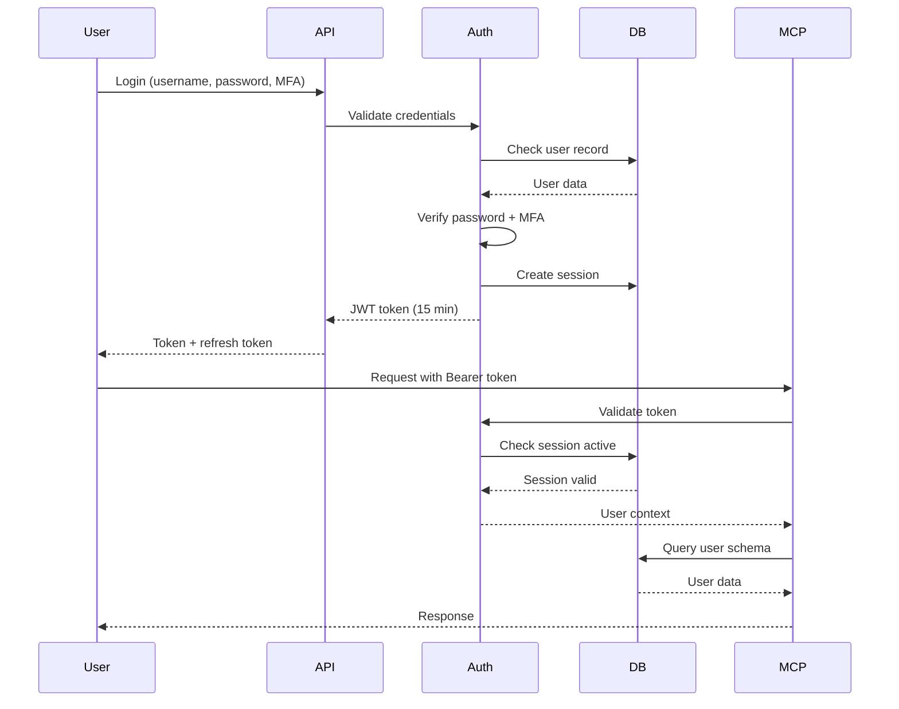
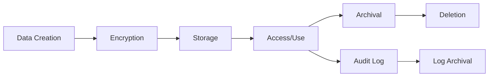

# Security & Compliance Documentation

## Overview

Career Navigator implements enterprise-grade security measures to protect sensitive career and personal experience data. This document outlines the security architecture, compliance standards, and operational procedures for maintaining HIPAA-level data protection.

## Security Architecture

### 1. Data Isolation Architecture

Career Navigator uses a **schema-based multi-tenancy** approach for complete data isolation:

```
┌─────────────────────────────────────────────────────────────┐
│                    Oracle Autonomous Database                │
├─────────────────────────────────────────────────────────────┤
│  ┌─────────────────┐  ┌─────────────────┐  ┌────────────┐  │
│  │ System Schema   │  │ Reference Data  │  │ User Schemas│  │
│  ├─────────────────┤  ├─────────────────┤  ├────────────┤  │
│  │ • users         │  │ • skills_catalog│  │ user_john: │  │
│  │ • audit_log     │  │ • career_paths  │  │ • experiences│
│  │ • api_keys      │  │ • role_templates│  │ • profile   │  │
│  │ • sessions      │  │ • industries    │  │ • summary   │  │
│  │ • encryption    │  └─────────────────┘  ├────────────┤  │
│  └─────────────────┘                       │ user_jane: │  │
│                                            │ • experiences│
│                                            │ • profile   │  │
│                                            │ • summary   │  │
│                                            └────────────┘  │
└─────────────────────────────────────────────────────────────┘
```

**Key Benefits:**
- Complete isolation at database level
- No cross-user query possibility
- Independent backup/restore per user
- Performance isolation
- Simple compliance with deletion requests

### 2. Authentication & Authorization

#### JWT Token Flow


#### Token Management
- **Access Token**: 15-minute expiry, contains user ID and schema
- **Refresh Token**: 7-day expiry, single-use with rotation
- **API Keys**: Long-lived for programmatic access, scoped permissions

### 3. Encryption Standards

#### Encryption at Rest
```javascript
// Field-level encryption for sensitive data
{
  "description": "AES-256-CBC encrypted",
  "format": "iv:ciphertext",
  "example": "a1b2c3d4e5f6:7h8i9j0k1l2m3n4o5p6q7r8s9t0u"
}
```

#### Key Management
- User-specific encryption keys
- Key rotation every 90 days
- Previous key retention for decryption
- Hardware Security Module (HSM) integration ready

#### Encryption Scope
Encrypted fields include:
- Experience descriptions
- Personal goals and interests
- Salary information
- Contact details
- Custom sensitive fields

### 4. Audit Logging

All operations are logged with the following information:

```sql
CREATE TABLE audit_log (
    log_id         UUID PRIMARY KEY,
    user_id        UUID,
    action         VARCHAR(100),    -- LOGIN, READ_EXPERIENCE, UPDATE_PROFILE, etc.
    resource_type  VARCHAR(100),    -- EXPERIENCE, PROFILE, SUMMARY, etc.
    resource_id    VARCHAR(255),    -- Specific record ID
    ip_address     INET,
    user_agent     TEXT,
    request_body   JSONB,           -- Sanitized request data
    response_code  INTEGER,
    execution_ms   INTEGER,
    timestamp      TIMESTAMP,
    success        BOOLEAN,
    error_message  TEXT
);
```

#### Audit Retention
- **Standard Logs**: 90 days
- **Security Events**: 1 year
- **Compliance Logs**: 7 years
- **Automated archival** to cold storage

## Compliance Standards

### HIPAA Compliance Mapping

While Career Navigator handles career data rather than health data, we implement HIPAA-equivalent standards:

| HIPAA Requirement | Implementation |
|-------------------|----------------|
| **Administrative Safeguards** | |
| Security Officer | Designated security admin role |
| Workforce Training | Security awareness documentation |
| Access Management | RBAC with least privilege |
| Audit Controls | Comprehensive audit logging |
| **Physical Safeguards** | |
| Facility Access | Cloud provider compliance (OCI) |
| Workstation Security | Not applicable (SaaS) |
| Device Controls | API key management |
| **Technical Safeguards** | |
| Access Control | JWT + MFA authentication |
| Audit Logs | Immutable audit trail |
| Integrity | Checksums and validation |
| Transmission Security | TLS 1.3 minimum |

### GDPR Compliance

| GDPR Article | Implementation |
|--------------|----------------|
| **Right to Access** | User data export API |
| **Right to Rectification** | Update APIs for all data |
| **Right to Erasure** | Complete schema deletion |
| **Right to Portability** | JSON/CSV export formats |
| **Privacy by Design** | Schema isolation, encryption |
| **Consent Management** | Explicit consent tracking |
| **Breach Notification** | Automated alerting system |

### SOC 2 Type II Controls

| Control Domain | Implementation |
|----------------|----------------|
| **Security** | Multi-layer security architecture |
| **Availability** | 99.9% uptime SLA, auto-scaling |
| **Processing Integrity** | Input validation, checksums |
| **Confidentiality** | Encryption, access controls |
| **Privacy** | Data minimization, user control |

## Security Operations

### 1. Incident Response Plan

#### Severity Levels
- **P0 (Critical)**: Data breach, system compromise
- **P1 (High)**: Authentication bypass, encryption failure  
- **P2 (Medium)**: Failed login spikes, API abuse
- **P3 (Low)**: Policy violations, minor vulnerabilities

#### Response Procedure
1. **Detect**: Automated monitoring alerts
2. **Assess**: Security team evaluation
3. **Contain**: Isolate affected components
4. **Eradicate**: Remove threat
5. **Recover**: Restore normal operations
6. **Lessons**: Post-incident review

### 2. Vulnerability Management

#### Scanning Schedule
- **Daily**: Dependency vulnerability scan
- **Weekly**: SAST code analysis
- **Monthly**: DAST application testing
- **Quarterly**: Penetration testing

#### Patch Management
- **Critical**: Within 24 hours
- **High**: Within 72 hours
- **Medium**: Within 1 week
- **Low**: Next release cycle

### 3. Access Control

#### User Roles
```yaml
roles:
  - name: user
    permissions:
      - read:own_data
      - write:own_data
      - delete:own_data
      
  - name: admin
    permissions:
      - read:all_users
      - write:reference_data
      - manage:users
      
  - name: security_admin
    permissions:
      - read:audit_logs
      - manage:encryption_keys
      - configure:security_settings
```

#### Authentication Requirements
- **Password Policy**: 
  - Minimum 12 characters
  - Complexity requirements
  - No password reuse (last 12)
  - 90-day rotation

- **MFA Requirements**:
  - TOTP (Google Authenticator compatible)
  - SMS backup (optional)
  - Recovery codes

### 4. Security Monitoring

#### Real-time Alerts
```javascript
// Alert conditions
alerts: {
  failed_logins: {
    threshold: 5,
    window: '5 minutes',
    action: 'block_ip'
  },
  
  data_export: {
    threshold: 1000,
    window: '1 hour',
    action: 'notify_admin'
  },
  
  api_rate_limit: {
    threshold: 1000,
    window: '1 minute',
    action: 'throttle'
  }
}
```

#### Security Metrics Dashboard
- Failed authentication attempts
- Unusual access patterns
- Data export volumes
- API usage by user
- Encryption key age
- Session duration distribution

## Data Privacy

### 1. Data Classification

| Classification | Description | Examples | Controls |
|----------------|-------------|----------|----------|
| **Public** | Reference data | Skills catalog, industries | Read-only access |
| **Internal** | Aggregated data | Career paths, templates | Authenticated access |
| **Confidential** | User data | Experiences, profiles | User-isolated access |
| **Restricted** | Sensitive PII | SSN, salary, medical | Encrypted, audit logged |

### 2. Data Lifecycle



### 3. Data Retention

| Data Type | Active Retention | Archive Period | Total |
|-----------|------------------|----------------|-------|
| User experiences | Lifetime | N/A | Lifetime |
| Audit logs | 90 days | 7 years | 7 years |
| Sessions | 7 days | N/A | 7 days |
| Deleted user data | 30 days | N/A | 30 days |

## Operational Security

### 1. Development Security

#### Secure Coding Practices
- Input validation on all endpoints
- Parameterized queries only
- Output encoding for XSS prevention
- CSRF tokens for state changes
- Security headers (CSP, HSTS, etc.)

#### Code Review Requirements
- All PRs require security review
- Automated SAST scanning
- Dependency vulnerability checks
- Security test coverage

### 2. Deployment Security

#### Environment Segregation
```
Production: Fully isolated, encrypted, monitored
Staging: Production-like, sanitized data
Development: Local only, synthetic data
```

#### Secrets Management
- Environment variables for configuration
- Encrypted secrets in deployment
- Regular rotation schedule
- No secrets in code repository

### 3. Network Security

#### API Security
- Rate limiting per user/IP
- Request size limits
- Timeout configurations
- Geographic restrictions (optional)

#### Infrastructure Security
- VPC isolation
- Private subnets for database
- WAF for API protection
- DDoS mitigation

## Compliance Checklist

### Daily Operations
- [ ] Review security alerts
- [ ] Check failed authentication logs
- [ ] Monitor API usage patterns
- [ ] Verify backup completion

### Weekly Tasks
- [ ] Review user access reports
- [ ] Check vulnerability scan results
- [ ] Update security metrics
- [ ] Test incident response

### Monthly Reviews
- [ ] Security posture assessment
- [ ] Compliance audit preparation
- [ ] Key rotation check
- [ ] Training compliance

### Quarterly Activities
- [ ] Penetration test
- [ ] Disaster recovery drill
- [ ] Policy review and update
- [ ] Vendor security assessment

## Security Contacts

| Role | Responsibility | Contact |
|------|----------------|---------|
| Security Officer | Overall security posture | security@career-navigator.com |
| Privacy Officer | Data privacy compliance | privacy@career-navigator.com |
| Incident Response | Security incidents | incident@career-navigator.com |
| Compliance Team | Audit and compliance | compliance@career-navigator.com |

## Appendix

### A. Security Configuration Template

```env
# Security Configuration
JWT_SECRET=<64-char-hex>
JWT_EXPIRY=15m
REFRESH_TOKEN_EXPIRY=7d

# Encryption
ENABLE_FIELD_ENCRYPTION=true
ENCRYPTION_ALGORITHM=AES-256-CBC
KEY_ROTATION_DAYS=90

# Session Management
SESSION_TIMEOUT=30m
MAX_SESSIONS_PER_USER=5
SESSION_EXTENSION=true

# Rate Limiting
API_RATE_LIMIT_PER_MINUTE=60
API_RATE_LIMIT_PER_HOUR=1000
LOGIN_ATTEMPTS_MAX=5
LOGIN_LOCKOUT_MINUTES=30

# Audit Configuration
AUDIT_LOG_LEVEL=INFO
AUDIT_RETENTION_DAYS=90
AUDIT_ARCHIVE_ENABLED=true
```

### B. Security Testing Commands

```bash
# Run security scan
npm run security:scan

# Check dependencies
npm audit

# SAST analysis
npm run security:sast

# Generate security report
npm run security:report

# Test authentication
npm run test:auth

# Validate encryption
npm run test:encryption
```

### C. Emergency Response

In case of security incident:

1. **Immediate Actions**
   - Isolate affected systems
   - Preserve evidence
   - Notify security team

2. **Communication**
   - Internal stakeholders
   - Affected users (if required)
   - Regulatory bodies (if required)

3. **Recovery**
   - Patch vulnerabilities
   - Restore from backups
   - Reset affected credentials

4. **Documentation**
   - Incident timeline
   - Actions taken
   - Lessons learned