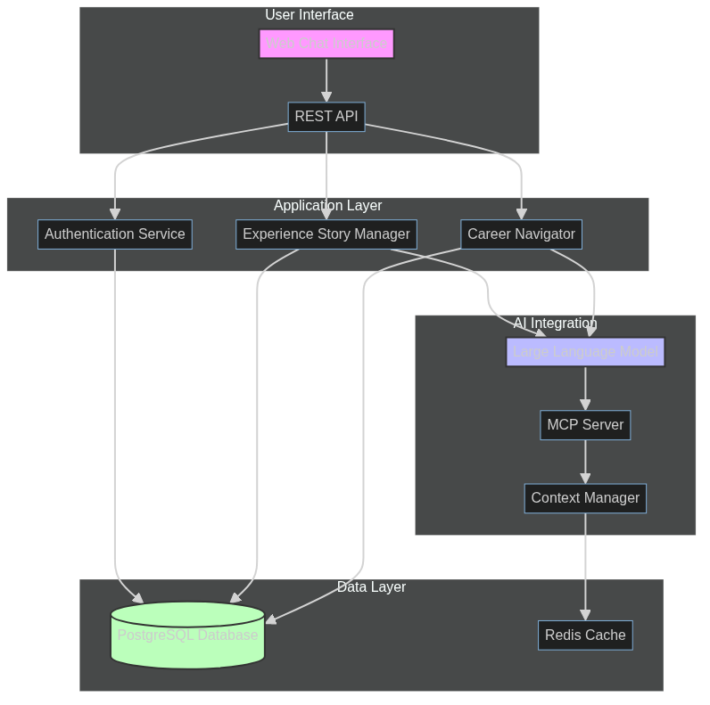
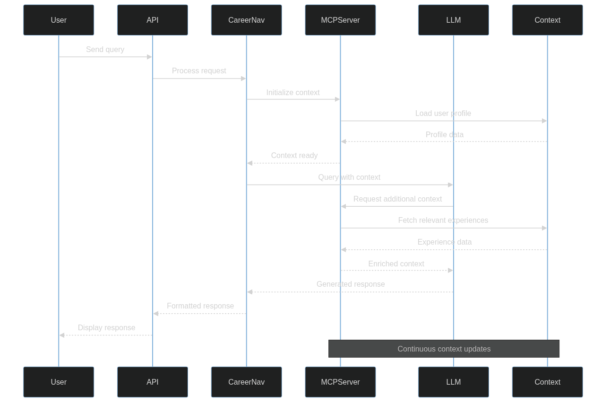

# System Architecture

## Overview
The career navigation and experience management system consists of three main components:
1. Career Navigator (Interactive LLM Chat)
2. Experience Management System (3-tier data structure)
3. MCP Server Integration

## Architecture Diagram

## Data Structure Flow

## MCP Integration Flow

