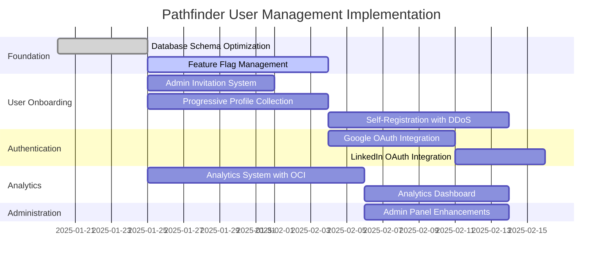

# Pathfinder GitHub Issues - User Management & Analytics Suite

## Overview

This directory contains comprehensive GitHub issues for implementing advanced user management, analytics, and security features for the Pathfinder platform. These issues build upon the existing multi-user architecture and HIPAA-level security standards.

## Issue Summary

### Phase 1: Foundation (Database & Core Systems)

#### Issue #21: Database Schema Optimization for User Management
- **Effort**: Large (L) - 3-5 days
- **Priority**: High
- **Description**: Redesign and optimize database schema for enhanced user management, including tables for invitations, SSO, feature flags, and analytics
- **Dependencies**: None (pre-deployment)

#### Issue #24: Feature Flag Management System
- **Effort**: Extra Large (XL) - 8-10 days
- **Priority**: High
- **Description**: Comprehensive feature flag system with admin controls, system and group-level flags, and DDoS protection for self-registration toggle
- **Dependencies**: Issue #21

### Phase 2: User Onboarding & Management

#### Issue #22: Admin Invitation System Implementation
- **Effort**: Large (L) - 5-7 days
- **Priority**: High
- **Description**: Secure email-based invitation system with 7-day expiration tokens and self-registration workflow
- **Dependencies**: Issue #21

#### Issue #23: Progressive Profile Data Collection System
- **Effort**: Extra Large (XL) - 7-10 days
- **Priority**: High
- **Description**: Dynamic profile data collection based on feature requirements with lazy loading and validation framework
- **Dependencies**: Issue #21

#### Issue #30: Self-Registration System with DDoS Protection
- **Effort**: Extra Large (XL) - 8-10 days
- **Priority**: High
- **Description**: Public registration with comprehensive DDoS protection, rate limiting, CAPTCHA, and quick disable capability
- **Dependencies**: Issue #24

### Phase 3: Authentication Enhancement

#### Issue #25: Google OAuth Integration with Local Provisioning
- **Effort**: Large (L) - 5-7 days
- **Priority**: Medium
- **Description**: Google OAuth 2.0 integration with automatic local account provisioning and manual merge workflow
- **Dependencies**: Issues #21, #24

#### Issue #26: LinkedIn OAuth Integration with Local Provisioning
- **Effort**: Medium (M) - 3-5 days
- **Priority**: Medium
- **Description**: LinkedIn OAuth with professional data import, leveraging shared SSO service architecture
- **Dependencies**: Issues #21, #24, #25

### Phase 4: Analytics & Monitoring

#### Issue #27: User Analytics System with OCI Object Storage
- **Effort**: Extra Large (XL) - 10-12 days
- **Priority**: Medium
- **Description**: Comprehensive analytics with hot/cold data tiering using OCI Object Storage (90-day hot, 1-year cold, then archive)
- **Dependencies**: Issue #21

#### Issue #28: Analytics Dashboard for User Metrics
- **Effort**: Large (L) - 7-8 days
- **Priority**: Medium
- **Description**: Performance-optimized dashboard with real-time metrics, retention cohorts, and engagement funnels
- **Dependencies**: Issue #27

### Phase 5: Administration

#### Issue #29: Site Admin Management Panel Enhancements
- **Effort**: Large (L) - 6-8 days
- **Priority**: High
- **Description**: Unified admin panel with feature flags, system configuration, security settings, and user management
- **Dependencies**: Issues #22, #24, #27

## Implementation Roadmap



## Technical Architecture

### System Components

1. **Database Layer**
   - Oracle Autonomous Database with user-prefixed schemas
   - Partitioned tables for analytics data
   - OCI Object Storage for cold/archive data

2. **Authentication & Security**
   - JWT-based authentication with 15-minute tokens
   - OAuth 2.0 integration (Google, LinkedIn)
   - Multi-layer DDoS protection
   - Feature flag controlled access

3. **Analytics Pipeline**
   - Real-time event ingestion
   - Batch aggregation processing
   - Tiered storage (hot/cold/archive)
   - Cross-tier query capabilities

4. **Admin Interface**
   - Unified management panel
   - Real-time monitoring
   - Feature flag controls
   - User management tools

## Key Features by Issue

### Security Features
- **Issue #22**: Secure invitation tokens, email verification
- **Issue #24**: Feature flag security, quick disable mechanisms
- **Issue #25/26**: OAuth security with PKCE, token encryption
- **Issue #30**: Comprehensive DDoS protection, CAPTCHA, rate limiting

### Performance Optimizations
- **Issue #21**: Optimized indexes, partitioning, materialized views
- **Issue #27**: Tiered storage strategy, data compression
- **Issue #28**: Query optimization, caching, progressive loading
- **Issue #24**: Redis caching for flag evaluation

### User Experience
- **Issue #23**: Progressive disclosure, smart field collection
- **Issue #25/26**: Social login convenience
- **Issue #28**: Intuitive analytics visualizations
- **Issue #29**: Unified admin experience

## Total Effort Estimation

| Priority | Issues | Total Days |
|----------|--------|------------|
| High     | #21, #22, #24, #29, #30 | 32-42 days |
| Medium   | #23, #25, #26, #27, #28 | 32-42 days |
| **Total** | **10 issues** | **64-84 days** |

## Dependencies Graph

```
#21 (Database Schema)
├── #22 (Invitations)
├── #23 (Progressive Profile)
├── #24 (Feature Flags)
│   ├── #25 (Google OAuth)
│   ├── #26 (LinkedIn OAuth)
│   └── #30 (Self-Registration)
├── #27 (Analytics System)
│   └── #28 (Analytics Dashboard)
└── #29 (Admin Panel)
    ├── Depends on #22
    ├── Depends on #24
    └── Depends on #27
```

## Success Metrics

1. **User Onboarding**
   - Registration conversion rate > 60%
   - Profile completion rate > 40%
   - OAuth adoption rate > 30%

2. **System Performance**
   - Dashboard load time < 2 seconds
   - Analytics query response < 500ms
   - Feature flag evaluation < 5ms

3. **Security**
   - DDoS attack mitigation rate > 99%
   - Zero unauthorized access incidents
   - 100% audit trail coverage

4. **Storage Efficiency**
   - 70% reduction in hot storage costs
   - Successful tiering of 90% of eligible data
   - < 1 second cold data retrieval

## Risk Mitigation

| Risk | Mitigation Strategy |
|------|-------------------|
| DDoS attacks during registration | Multi-layer protection, quick disable feature flag |
| Storage costs for analytics | Tiered storage with OCI, data compression |
| OAuth provider outages | Fallback to password authentication |
| Performance degradation | Caching, query optimization, progressive loading |
| Security breaches | Encryption, audit logging, access controls |

## Notes for Developers

1. All database changes are pre-deployment (no migrations needed initially)
2. Use existing HIPAA-level security patterns from the platform
3. Leverage Redis for caching and rate limiting
4. Follow the established multi-user architecture patterns
5. Ensure all features are feature-flag controlled for gradual rollout

## Assumptions Used

As requested, these issues were created with the following assumptions:

1. **Invitation tokens**: 7-day expiration with user-set passwords (more secure)
2. **Essential fields**: email, name, password; Extended fields based on feature needs
3. **SSO linking**: Manual linking with password confirmation for security
4. **Analytics retention**: 90 days hot, 1 year cold, then archive (cost-effective)
5. **Feature flags**: System + user group level (good balance of flexibility)

These assumptions balance security, user experience, and cost-effectiveness while maintaining the platform's HIPAA-level security standards.