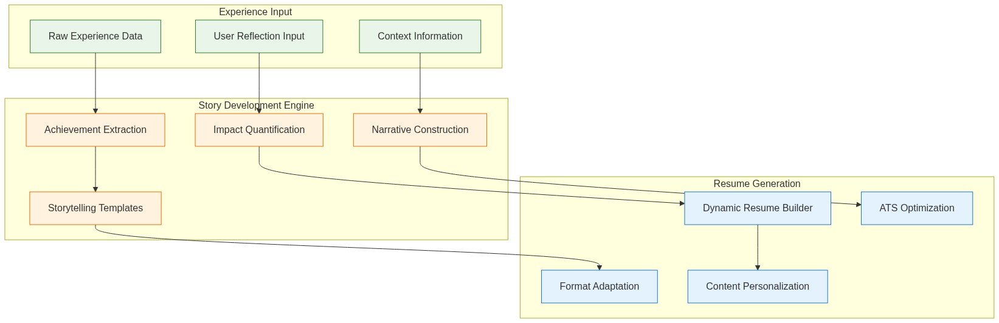

# Professional Story Development & Resume Builder

## Overview

The Story Development & Resume Builder transforms raw experience data into compelling professional narratives that demonstrate impact, growth, and value proposition. This system helps users craft stories that resonate in resumes, interviews, and networking conversations.

## Core Philosophy

### The IMPACT Framework
- **I**dentify the situation and context
- **M**ethod or approach you used
- **P**rocess you followed
- **A**ction you took personally
- **C**onsequences and measurable results
- **T**ransformation or learning gained

## Architecture Overview

[](../../assets/diagrams/story-development-architecture.mmd)

## Story Development Components

### 🔍 Achievement Extraction Engine

#### Intelligent Achievement Detection
```javascript
class AchievementExtractor {
  constructor() {
    this.achievementPatterns = [
      'increased.*by.*%',
      'reduced.*from.*to',
      'improved.*resulting in',
      'led.*team of.*',
      'managed.*budget of',
      'delivered.*ahead of schedule',
      'exceeded.*target by'
    ];
    
    this.impactIndicators = [
      'efficiency', 'cost_savings', 'revenue_growth',
      'customer_satisfaction', 'team_performance',
      'process_improvement', 'risk_reduction'
    ];
  }
  
  async extractAchievements(experienceText) {
    const achievements = [];
    
    // Pattern-based extraction
    const patternMatches = this.findPatternMatches(experienceText);
    
    // Semantic analysis for implicit achievements
    const semanticAchievements = await this.analyzeSemanticAchievements(experienceText);
    
    // Context-aware achievement scoring
    const scoredAchievements = this.scoreAchievements([...patternMatches, ...semanticAchievements]);
    
    return {
      quantified_achievements: scoredAchievements.filter(a => a.hasMetrics),
      qualitative_achievements: scoredAchievements.filter(a => !a.hasMetrics),
      potential_achievements: this.suggestPotentialAchievements(experienceText),
      improvement_suggestions: this.generateImprovementSuggestions(scoredAchievements)
    };
  }
  
  scoreAchievements(achievements) {
    return achievements.map(achievement => ({
      ...achievement,
      impact_score: this.calculateImpactScore(achievement),
      specificity_score: this.calculateSpecificityScore(achievement),
      relevance_score: this.calculateRelevanceScore(achievement),
      overall_score: this.calculateOverallScore(achievement)
    }));
  }
}
```

### 📊 Impact Quantification System

#### Metrics Enhancement Recommendations
```javascript
class ImpactQuantifier {
  async enhanceWithMetrics(achievement, experienceContext) {
    const suggestions = {
      time_metrics: this.suggestTimeMetrics(achievement),
      financial_metrics: this.suggestFinancialMetrics(achievement, experienceContext),
      scale_metrics: this.suggestScaleMetrics(achievement),
      efficiency_metrics: this.suggestEfficiencyMetrics(achievement),
      quality_metrics: this.suggestQualityMetrics(achievement)
    };
    
    return {
      original_statement: achievement.text,
      enhanced_versions: this.generateEnhancedVersions(achievement, suggestions),
      metric_suggestions: suggestions,
      impact_categories: this.categorizeImpact(achievement),
      questions_to_ask: this.generateClarifyingQuestions(achievement)
    };
  }
  
  generateClarifyingQuestions(achievement) {
    return {
      scale_questions: [
        "How many people/customers/projects were affected?",
        "What was the size of the budget/team/dataset you worked with?",
        "How does this compare to industry standards or previous performance?"
      ],
      
      time_questions: [
        "How long did this project/improvement take?",
        "What was the deadline and did you meet/exceed it?",
        "How much time did this save for you or others?"
      ],
      
      financial_questions: [
        "What was the monetary value of this achievement?",
        "How much money did this save or generate?",
        "What was the ROI or cost-benefit ratio?"
      ],
      
      outcome_questions: [
        "What happened as a direct result of your work?",
        "How was success measured in this situation?",
        "What feedback did you receive about this work?"
      ]
    };
  }
}
```

### ✍️ Narrative Construction Engine

#### Story Templates and Frameworks
```javascript
class NarrativeConstructor {
  constructor() {
    this.storyFrameworks = {
      STAR: {
        structure: ['Situation', 'Task', 'Action', 'Result'],
        best_for: ['interviews', 'behavioral_questions'],
        example_prompts: {
          situation: "Describe the context and background",
          task: "What needed to be accomplished?",
          action: "What specific actions did you take?",
          result: "What was the measurable outcome?"
        }
      },
      
      CAR: {
        structure: ['Challenge', 'Action', 'Result'],
        best_for: ['resume_bullets', 'cover_letters'],
        example_prompts: {
          challenge: "What problem or opportunity did you face?",
          action: "How did you address it?",
          result: "What positive outcome did you achieve?"
        }
      },
      
      SOAR: {
        structure: ['Situation', 'Obstacles', 'Actions', 'Results'],
        best_for: ['leadership_stories', 'complex_projects'],
        example_prompts: {
          situation: "Set the scene and context",
          obstacles: "What challenges or constraints existed?",
          actions: "How did you navigate these challenges?",
          results: "What was accomplished despite the obstacles?"
        }
      }
    };
  }
  
  async constructNarrative(achievement, framework = 'CAR', targetFormat = 'resume_bullet') {
    const storyElements = await this.extractStoryElements(achievement);
    const framework_template = this.storyFrameworks[framework];
    
    const narrative = await this.buildNarrative(storyElements, framework_template, targetFormat);
    
    return {
      primary_narrative: narrative.main,
      alternative_versions: narrative.alternatives,
      targeted_versions: {
        resume_bullet: this.formatForResume(narrative),
        interview_story: this.formatForInterview(narrative),
        cover_letter: this.formatForCoverLetter(narrative),
        networking_pitch: this.formatForNetworking(narrative)
      },
      improvement_suggestions: this.suggestImprovements(narrative)
    };
  }
  
  formatForResume(narrative) {
    return {
      concise_bullet: this.createConciseBullet(narrative),
      detailed_bullet: this.createDetailedBullet(narrative),
      achievement_focused: this.createAchievementFocused(narrative),
      skill_highlighted: this.createSkillHighlighted(narrative)
    };
  }
}
```

## Resume Building System

### 🎯 Dynamic Resume Generation

#### Intelligent Content Selection
```javascript
class ResumeBuilder {
  constructor() {
    this.resumeFormats = [
      'reverse_chronological',
      'functional_skills_based',
      'combination_hybrid',
      'targeted_role_specific'
    ];
    
    this.industryTemplates = {
      technology: 'tech_focused_template',
      finance: 'finance_professional_template',
      healthcare: 'healthcare_template',
      consulting: 'consulting_template',
      education: 'academic_template',
      creative: 'portfolio_template'
    };
  }
  
  async generateResume(userProfile, targetJob, preferences = {}) {
    const resumeStrategy = await this.determineOptimalStrategy(userProfile, targetJob);
    
    const content = {
      professional_summary: await this.createProfessionalSummary(userProfile, targetJob),
      core_competencies: await this.selectCoreCompetencies(userProfile, targetJob),
      experience_section: await this.buildExperienceSection(userProfile, targetJob, resumeStrategy),
      education_section: this.buildEducationSection(userProfile.education),
      additional_sections: await this.determineAdditionalSections(userProfile, targetJob)
    };
    
    return {
      resume_content: content,
      ats_optimization: await this.optimizeForATS(content, targetJob),
      visual_formatting: this.applyVisualFormatting(content, preferences),
      alternative_versions: await this.generateAlternativeVersions(content, targetJob)
    };
  }
  
  async optimizeForATS(content, targetJob) {
    const jobKeywords = await this.extractJobKeywords(targetJob.description);
    const contentKeywords = this.extractContentKeywords(content);
    
    return {
      keyword_matches: this.analyzeKeywordMatches(jobKeywords, contentKeywords),
      missing_keywords: this.identifyMissingKeywords(jobKeywords, contentKeywords),
      optimization_suggestions: this.generateATSSuggestions(jobKeywords, content),
      ats_score: this.calculateATSScore(jobKeywords, contentKeywords)
    };
  }
}
```

### 📋 Professional Summary Generator

#### Context-Aware Summary Creation
```javascript
class SummaryGenerator {
  async createProfessionalSummary(userProfile, targetRole) {
    const summaryComponents = {
      value_proposition: await this.craftValueProposition(userProfile, targetRole),
      key_strengths: this.identifyKeyStrengths(userProfile, targetRole),
      quantified_achievements: this.selectTopAchievements(userProfile, 2),
      relevant_experience: this.summarizeRelevantExperience(userProfile, targetRole),
      career_direction: this.articulateCareerDirection(userProfile, targetRole)
    };
    
    const summaryVariations = {
      executive_style: this.createExecutiveSummary(summaryComponents),
      achievement_focused: this.createAchievementFocused(summaryComponents),
      skills_based: this.createSkillsBased(summaryComponents),
      career_change: this.createCareerChangeSummary(summaryComponents)
    };
    
    return {
      recommended_summary: summaryVariations[this.recommendSummaryStyle(userProfile, targetRole)],
      all_variations: summaryVariations,
      customization_tips: this.generateCustomizationTips(summaryComponents),
      keyword_optimization: this.optimizeSummaryKeywords(summaryVariations, targetRole)
    };
  }
  
  craftValueProposition(userProfile, targetRole) {
    return {
      template: "{experience_level} {professional_title} with {unique_strength} and proven track record of {key_achievement_area}",
      variables: {
        experience_level: this.calculateExperienceLevel(userProfile),
        professional_title: this.determineProfessionalTitle(userProfile, targetRole),
        unique_strength: this.identifyUniqueStrength(userProfile),
        key_achievement_area: this.identifyKeyAchievementArea(userProfile, targetRole)
      }
    };
  }
}
```

## Story Development Workflow

### User-Guided Story Enhancement
[](../../assets/diagrams/story-development-workflow.mmd)

### Interactive Story Development
```javascript
class StoryDevelopmentWorkflow {
  async guideStoryDevelopment(experienceId, userId) {
    const experience = await this.getExperience(experienceId);
    
    // Step 1: Extract initial achievements
    const achievements = await this.achievementExtractor.extract(experience);
    
    // Step 2: Present findings and gather user input
    const userValidation = await this.presentForValidation(achievements);
    
    // Step 3: Enhance with user-provided context
    const enhancedAchievements = await this.enhanceWithUserInput(achievements, userValidation);
    
    // Step 4: Quantify impact with user guidance
    const quantifiedAchievements = await this.quantifyWithUserGuidance(enhancedAchievements);
    
    // Step 5: Construct narratives
    const narratives = await this.constructNarratives(quantifiedAchievements);
    
    // Step 6: Generate resume-ready content
    const resumeContent = await this.generateResumeContent(narratives);
    
    return {
      developed_stories: narratives,
      resume_bullets: resumeContent,
      interview_stories: this.formatForInterviews(narratives),
      improvement_opportunities: this.identifyImprovementOpportunities(experience)
    };
  }
  
  async presentForValidation(achievements) {
    return {
      validation_questions: [
        "Which of these achievements feel most significant to you?",
        "Are there important accomplishments we missed?",
        "What additional context would help explain the impact?",
        "How would you prioritize these achievements?"
      ],
      
      enhancement_prompts: [
        "What made this achievement challenging or noteworthy?",
        "How did this compare to what others typically accomplish?",
        "What skills or qualities enabled this success?",
        "What was the broader impact beyond the immediate results?"
      ]
    };
  }
}
```

## Resume Templates and Formats

### Industry-Specific Templates
```javascript
const ResumeTemplates = {
  technology: {
    sections: ['summary', 'technical_skills', 'experience', 'projects', 'education'],
    emphasis: 'technical_competencies',
    format: 'clean_modern',
    keywords_focus: 'programming_languages_frameworks'
  },
  
  finance: {
    sections: ['summary', 'core_competencies', 'experience', 'education', 'certifications'],
    emphasis: 'quantified_achievements',
    format: 'traditional_professional',
    keywords_focus: 'financial_analysis_regulations'
  },
  
  consulting: {
    sections: ['summary', 'core_competencies', 'experience', 'education', 'additional_info'],
    emphasis: 'problem_solving_leadership',
    format: 'executive_style',
    keywords_focus: 'strategy_transformation'
  },
  
  healthcare: {
    sections: ['summary', 'clinical_experience', 'education', 'certifications', 'research'],
    emphasis: 'clinical_outcomes_safety',
    format: 'academic_professional',
    keywords_focus: 'clinical_skills_patient_care'
  }
};
```

### ATS Optimization Engine
```javascript
class ATSOptimizer {
  async optimizeResume(resumeContent, jobDescription) {
    const jobAnalysis = await this.analyzeJobDescription(jobDescription);
    const resumeAnalysis = this.analyzeResumeContent(resumeContent);
    
    return {
      keyword_optimization: {
        missing_keywords: this.findMissingKeywords(jobAnalysis, resumeAnalysis),
        keyword_density: this.calculateKeywordDensity(resumeAnalysis),
        placement_suggestions: this.suggestKeywordPlacements(jobAnalysis, resumeContent)
      },
      
      formatting_optimization: {
        section_headers: this.optimizeSectionHeaders(resumeContent),
        bullet_structure: this.optimizeBulletStructure(resumeContent),
        file_format: this.recommendFileFormat(jobAnalysis)
      },
      
      content_optimization: {
        skills_alignment: this.alignSkillsWithJob(resumeAnalysis, jobAnalysis),
        experience_relevance: this.optimizeExperienceRelevance(resumeContent, jobAnalysis),
        achievement_emphasis: this.emphasizeRelevantAchievements(resumeContent, jobAnalysis)
      },
      
      ats_score: this.calculateATSScore(resumeContent, jobDescription)
    };
  }
}
```

## Future Enhancements

### Advanced Features Roadmap
- **Video Resume Generation**: AI-powered video resume creation from written content
- **Interactive Portfolio**: Dynamic portfolio websites generated from experience data
- **Real-time Optimization**: Live resume optimization as job descriptions are analyzed
- **Peer Benchmarking**: Compare resume effectiveness against similar professionals
- **Industry Trend Integration**: Automatic updates based on evolving industry requirements

### Integration Capabilities
- **Job Board Sync**: Direct integration with major job platforms
- **Application Tracking**: Monitor application success rates and optimize accordingly
- **Interview Preparation**: Convert resume content into interview-ready STAR stories
- **Network Leveraging**: Identify connections at target companies for referral opportunities

---

*The Story Development & Resume Builder transforms your professional experiences into compelling narratives that open doors and create opportunities throughout your career journey.*