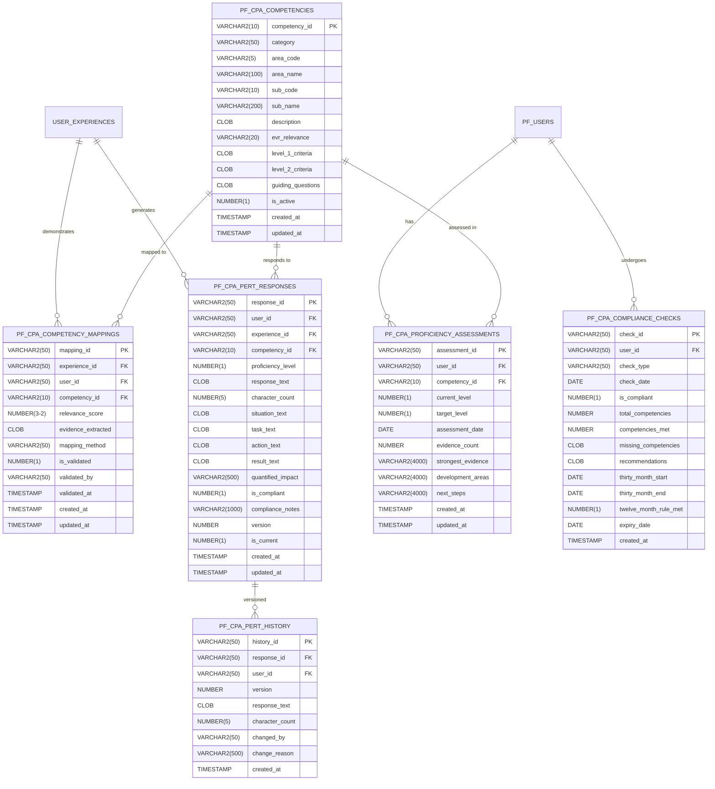

# CPA PERT Module Schema Relationships

## Overview

The CPA PERT (Professional Experience Reporting Tool) module is a specialized add-on for accounting professionals to map their experiences to CPA Canada's competency framework and generate compliant PERT reports. It implements the official competency matrix with proficiency level tracking for the EVR (Experience Verification Route).

## Entity Relationship Diagram



## CPA Competency Framework

### PF_CPA_COMPETENCIES

**Purpose**: Master table of CPA Canada competency requirements for EVR route
- **Primary Key**: `competency_id` (e.g., "FR1", "MA2")
- **Unique**: Composite of `area_code` + `sub_code`

**Competency Categories**:

**Technical Competencies**:
1. **Financial Reporting (FR)** - EVR Relevance: HIGH
2. **Management Accounting (MA)** - EVR Relevance: HIGH
3. **Audit and Assurance (AA)** - EVR Relevance: HIGH
4. **Taxation (TX)** - EVR Relevance: MEDIUM
5. **Finance (FN)** - EVR Relevance: HIGH
6. **Strategy and Governance (SG)** - EVR Relevance: MEDIUM

**Enabling Competencies**:
7. **Professional and Ethical Behaviour (PE)** - EVR Relevance: HIGH
8. **Problem-Solving and Decision-Making (PS)** - EVR Relevance: HIGH
9. **Communication (CM)** - EVR Relevance: HIGH
10. **Self-Management (SM)** - EVR Relevance: MEDIUM
11. **Teamwork and Leadership (TL)** - EVR Relevance: HIGH

**Proficiency Levels**:
- **Level 0**: No exposure or limited understanding
- **Level 1**: Basic proficiency - can perform routine tasks with supervision
- **Level 2**: Advanced proficiency - can handle complex tasks independently

**Level Criteria** (stored in CLOB fields):
- `level_1_criteria`: Specific requirements for demonstrating Level 1 proficiency
- `level_2_criteria`: Specific requirements for demonstrating Level 2 proficiency
- `guiding_questions`: Questions to help identify relevant experiences

### PF_CPA_COMPETENCY_MAPPINGS

**Purpose**: Links user experiences to CPA competencies
- **Composite Key**: Experience + Competency (unique constraint)
- **AI-Assisted**: Automatic mapping with validation

**Mapping Methods**:
- `AI_ASSISTED` - Initial AI extraction
- `USER_MAPPED` - Manual user mapping
- `MENTOR_VALIDATED` - Reviewed by mentor
- `AUTO_SUGGESTED` - System recommendations

**Evidence Extraction**:
- Direct quotes from experience descriptions
- Identified keywords matching competency criteria
- Relevance score (0.0-1.0) based on AI analysis
- Validation flag for manual review

## PERT Response Generation

### PF_CPA_PERT_RESPONSES

**Purpose**: Stores STAR-format responses for PERT reporting
- **Version Control**: Multiple versions per competency
- **Character Limits**: Enforced per CPA requirements

**STAR Format**:
- **Situation**: Context and background (25% of response)
- **Task**: Specific responsibilities (20% of response)
- **Action**: Steps taken (40% of response)
- **Result**: Outcomes and impact (15% of response)

**Compliance Rules**:
- Maximum 5000 characters per response (enforced by CHECK constraint)
- Proficiency level must be 0, 1, or 2
- STAR format required with all components
- Version tracking for multiple iterations
- Only one current version per experience-competency pair

### Response Versioning

```sql
-- Mark old version as non-current
UPDATE pf_cpa_pert_responses
SET is_current = 0
WHERE user_id = :user_id
  AND competency_id = :competency_id
  AND is_current = 1;

-- Insert new version
INSERT INTO pf_cpa_pert_responses (
    response_id, user_id, experience_id, competency_id,
    version, is_current, response_text, ...
) VALUES (
    :response_id, :user_id, :experience_id, :competency_id,
    (SELECT NVL(MAX(version), 0) + 1 FROM pf_cpa_pert_responses 
     WHERE user_id = :user_id AND competency_id = :competency_id),
    1, :response_text, ...
);

-- Archive to history
INSERT INTO pf_cpa_pert_history (
    history_id, response_id, user_id, version,
    response_text, character_count, changed_by, change_reason
) VALUES (
    :history_id, :response_id, :user_id, :old_version,
    :old_response_text, :old_character_count, :user_id, :reason
);
```

## Proficiency Assessment and Tracking

### PF_CPA_PROFICIENCY_ASSESSMENTS

**Purpose**: Tracks proficiency progression over time
- **Unique per**: User + Competency combination
- **Gap Analysis**: Current vs. target levels

**Assessment Logic**:
```sql
-- Calculate evidence strength
-- Count evidence from mappings and PERT responses
WITH evidence_summary AS (
    SELECT 
        COUNT(DISTINCT cm.experience_id) as mapped_experiences,
        COUNT(DISTINCT pr.experience_id) as pert_responses,
        MAX(pr.proficiency_level) as highest_level
    FROM pf_cpa_competency_mappings cm
    LEFT JOIN pf_cpa_pert_responses pr
        ON cm.competency_id = pr.competency_id
        AND cm.user_id = pr.user_id
        AND pr.is_current = 1
    WHERE cm.user_id = :user_id
      AND cm.competency_id = :competency_id
      AND cm.relevance_score >= 0.7
)
SELECT 
    mapped_experiences + pert_responses as evidence_count,
    COALESCE(highest_level, 0) as current_level
FROM evidence_summary;
```

### PF_CPA_COMPLIANCE_CHECKS

**Purpose**: EVR (Experience Verification Route) compliance validation
- **Check Types**: `INITIAL`, `ANNUAL`, `FINAL`
- **Pass Criteria**: Specific competencies at required levels

**EVR Compliance Requirements**:
- Minimum 8 competency areas demonstrated
- At least 2 competencies at Level 2
- Remaining competencies at Level 1 or higher
- 30-month experience requirement
- 12-month recency requirement
- Focus on HIGH and MEDIUM relevance competencies

## Query Patterns

### Competency Gap Analysis
```sql
SELECT 
    c.competency_code,
    c.competency_name,
    c.category,
    NVL(pa.current_level, 0) as current_level,
    CASE c.category
        WHEN 'Financial Reporting' THEN 2
        WHEN 'Audit and Assurance' THEN 2
        ELSE 1
    END as required_level,
    COUNT(DISTINCT cm.experience_id) as supporting_experiences
FROM pf_cpa_competencies c
LEFT JOIN pf_cpa_proficiency_assessments pa 
    ON c.competency_id = pa.competency_id 
    AND pa.user_id = :user_id
LEFT JOIN pf_cpa_competency_mappings cm
    ON c.competency_id = cm.competency_id
    AND cm.user_id = :user_id
    AND cm.relevance_score >= 0.7
WHERE c.is_active = 1
  AND c.evr_relevance IN ('HIGH', 'MEDIUM')
GROUP BY c.competency_id, c.area_code, c.sub_code, 
         c.area_name, c.sub_name, c.category, 
         c.evr_relevance, pa.current_level
ORDER BY 
    CASE c.evr_relevance 
        WHEN 'HIGH' THEN 1 
        WHEN 'MEDIUM' THEN 2 
        ELSE 3 
    END,
    c.category, c.area_code, c.sub_code;
```

### PERT Report Generation
```sql
SELECT 
    c.competency_code,
    c.competency_name,
    pr.proficiency_level,
    pr.response_text,
    pr.character_count,
    e.title as experience_title,
    e.organization
FROM pf_cpa_pert_responses pr
JOIN pf_cpa_competencies c ON pr.competency_id = c.competency_id
JOIN {username}_experiences_detailed e ON pr.experience_id = e.experience_id
WHERE pr.user_id = :user_id
  AND pr.is_current = 1
  AND pr.is_compliant = 1
ORDER BY c.category, c.competency_code;
```

### Progress Tracking
```sql
WITH competency_progress AS (
    SELECT 
        DATE_TRUNC('month', assessment_date) as month,
        AVG(current_level) as avg_level,
        COUNT(DISTINCT competency_id) as competencies_assessed
    FROM pf_cpa_proficiency_assessments
    WHERE user_id = :user_id
    GROUP BY DATE_TRUNC('month', assessment_date)
)
SELECT * FROM competency_progress
ORDER BY month DESC;
```

### PF_CPA_PERT_HISTORY

**Purpose**: Maintains version history of PERT responses
- Tracks all changes to PERT responses
- Records who made changes and why
- Enables audit trail for regulatory compliance

## Batch Processing

### Bulk Competency Mapping
```sql
-- Process multiple experiences in batch
INSERT INTO pf_cpa_competency_mappings (
    mapping_id, experience_id, user_id, competency_id, 
    relevance_score, evidence_extracted, mapping_method
)
SELECT 
    SYS_GUID(),
    e.experience_id,
    e.user_id,
    c.competency_id,
    ai_relevance_score(e.description, c.keywords),
    ai_extract_evidence(e.description, c.competency_id),
    'AI_ASSISTED'
FROM {username}_experiences_detailed e
CROSS JOIN pf_cpa_competencies c
WHERE e.user_id = :user_id
  AND ai_relevance_score(e.description, c.keywords) > 0.5;
```

### Batch PERT Generation
```sql
-- Generate responses for all mapped competencies
DECLARE
    CURSOR c_mappings IS
        SELECT DISTINCT cm.competency_id, cm.experience_id
        FROM pf_cpa_competency_mappings cm
        WHERE cm.user_id = :user_id
          AND NOT EXISTS (
              SELECT 1 FROM pf_cpa_pert_responses pr
              WHERE pr.user_id = cm.user_id
                AND pr.competency_id = cm.competency_id
                AND pr.is_current = 'Y'
          );
BEGIN
    FOR mapping IN c_mappings LOOP
        generate_pert_response(
            p_user_id => :user_id,
            p_experience_id => mapping.experience_id,
            p_competency_id => mapping.competency_id
        );
    END LOOP;
END;
```

## Performance Considerations

### Specialized Indexes
```sql
-- Competency lookup by area and sub-code
CREATE UNIQUE INDEX idx_cpa_comp_code 
ON pf_cpa_competencies(area_code, sub_code);

-- EVR relevance filtering
CREATE INDEX idx_cpa_comp_evr 
ON pf_cpa_competencies(evr_relevance, is_active);

-- User competency mappings
CREATE INDEX idx_cpa_map_user_comp 
ON pf_cpa_competency_mappings(user_id, competency_id, relevance_score DESC);

-- Current PERT responses
CREATE INDEX idx_cpa_pert_current 
ON pf_cpa_pert_responses(user_id, is_current, competency_id);

-- Compliance checks
CREATE INDEX idx_cpa_compliance_user 
ON pf_cpa_compliance_checks(user_id, check_date DESC);
```

### Materialized Views
```sql
-- User competency summary
CREATE MATERIALIZED VIEW mv_user_competency_summary AS
SELECT 
    user_id,
    COUNT(DISTINCT competency_id) as total_competencies,
    SUM(CASE WHEN current_level = 2 THEN 1 ELSE 0 END) as level_2_count,
    SUM(CASE WHEN current_level >= 1 THEN 1 ELSE 0 END) as level_1_plus_count,
    MAX(assessment_date) as last_assessment
FROM pf_cpa_proficiency_assessments
GROUP BY user_id;
```

## Data Quality and Validation

### Competency Mapping Validation
- Relevance score threshold (0.7 minimum for inclusion)
- AI-assisted mapping with manual validation option
- Evidence extraction requirements

### PERT Response Quality
- 5000 character maximum enforced by database
- STAR format validation
- Quantified impact requirements
- Professional language standards

### Compliance Monitoring
- EVR requirement validation (8 competencies, 2 at Level 2)
- 30-month experience tracking
- 12-month recency validation
- Progress tracking and gap analysis

## Integration Points

### With Experience Management
- Experiences link to competency mappings
- PERT responses reference specific experiences
- Experience dates used for compliance validation

### With User Management
- User-specific assessments and compliance checks
- Audit trail integration
- Progress tracking per user

### With MCP Server
- AI-assisted competency mapping
- PERT response generation
- Competency gap analysis