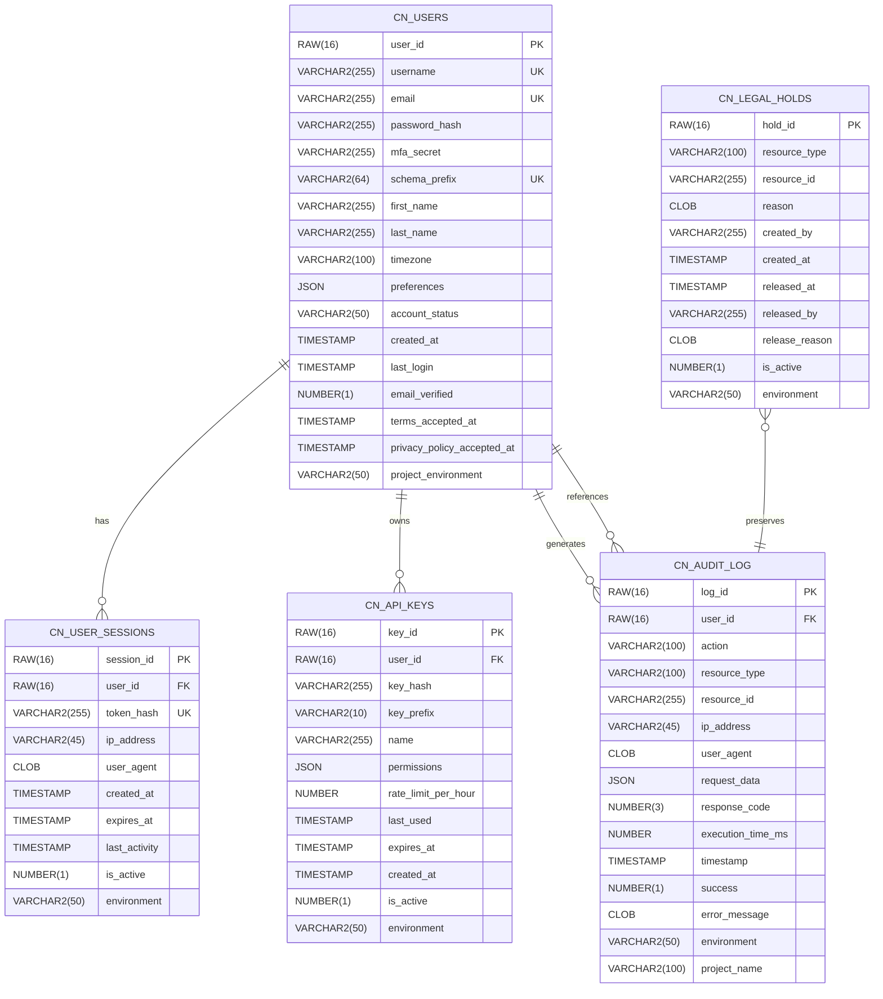

# System and Authentication Schema Relationships

## Overview

The system schema manages authentication, authorization, session management, and audit logging for the entire Pathfinder platform. It implements HIPAA-compliant security features with comprehensive audit trails.

## Entity Relationship Diagram



## Table Relationships

### CN_USERS (Core User Table)

**Primary Table**: Stores all user account information
- **Primary Key**: `user_id` (RAW 16 - GUID)
- **Unique Constraints**: 
  - `username` - Ensures unique usernames
  - `email` - Ensures unique email addresses
  - `schema_prefix` - Ensures unique user data schemas

**Relationships**:
- **One-to-Many** with `CN_USER_SESSIONS` - A user can have multiple active sessions
- **One-to-Many** with `CN_API_KEYS` - A user can create multiple API keys
- **One-to-Many** with `CN_AUDIT_LOG` - All user actions are logged

**Key Features**:
- MFA support with `mfa_secret` field
- Account status tracking (active, suspended, locked, deleted)
- Timezone and preferences storage
- Legal compliance timestamps

### CN_USER_SESSIONS (Authentication Sessions)

**Purpose**: Manages active user sessions and JWT tokens
- **Primary Key**: `session_id`
- **Foreign Key**: `user_id` references `CN_USERS`
- **Unique Constraint**: `token_hash` - Ensures token uniqueness

**Relationships**:
- **Many-to-One** with `CN_USERS` - Each session belongs to one user

**Key Features**:
- Session expiration management
- IP and user agent tracking for security
- Activity tracking for timeout handling
- Soft delete with `is_active` flag

### CN_API_KEYS (Programmatic Access)

**Purpose**: Manages API keys for programmatic access
- **Primary Key**: `key_id`
- **Foreign Key**: `user_id` references `CN_USERS`

**Relationships**:
- **Many-to-One** with `CN_USERS` - Each API key belongs to one user

**Key Features**:
- Scoped permissions with JSON storage
- Rate limiting per key
- Usage tracking with `last_used`
- Expiration support

### CN_AUDIT_LOG (Security Audit Trail)

**Purpose**: Immutable audit log for all system operations
- **Primary Key**: `log_id`
- **Foreign Key**: `user_id` references `CN_USERS` (nullable for system operations)

**Relationships**:
- **Many-to-One** with `CN_USERS` - Each log entry may reference a user
- **Referenced by** `CN_LEGAL_HOLDS` - Logs can be placed on legal hold

**Key Features**:
- Comprehensive operation logging
- Performance metrics (execution_time_ms)
- Request/response tracking
- Error capture for failed operations
- Environment and project tracking

### CN_LEGAL_HOLDS (Compliance Management)

**Purpose**: Prevents deletion of data under legal preservation requirements
- **Primary Key**: `hold_id`

**Relationships**:
- **References** various resources through `resource_type` and `resource_id`
- Can reference `CN_AUDIT_LOG` entries

**Key Features**:
- Flexible resource referencing
- Reason and release tracking
- Audit trail for hold lifecycle

## Security Considerations

### Access Control
1. **Row-Level Security**: Implemented through Oracle VPD policies
2. **User Isolation**: Sessions and API keys are strictly user-scoped
3. **Audit Immutability**: Audit logs cannot be modified or deleted

### Data Protection
1. **Password Security**: Only hashed passwords stored (bcrypt)
2. **Token Security**: Session tokens are hashed before storage
3. **API Key Security**: Keys are hashed, only prefix visible

### Compliance Features
1. **HIPAA Compliance**: Comprehensive audit logging
2. **GDPR Support**: User data isolation and deletion capabilities
3. **Legal Hold**: Prevents data deletion when required

## Index Strategy

```sql
-- User lookups
CREATE INDEX idx_pf_users_email ON pf_users(email);
CREATE INDEX idx_pf_users_username ON pf_users(username);

-- Session management
CREATE INDEX idx_pf_sessions_user_active ON pf_user_sessions(user_id, is_active, expires_at);
CREATE INDEX idx_pf_sessions_token ON pf_user_sessions(token_hash);

-- API key lookups
CREATE INDEX idx_pf_apikeys_user ON pf_api_keys(user_id, is_active);
CREATE INDEX idx_pf_apikeys_prefix ON pf_api_keys(key_prefix);

-- Audit log queries
CREATE INDEX idx_pf_audit_user_time ON pf_audit_log(user_id, timestamp DESC);
CREATE INDEX idx_pf_audit_action ON pf_audit_log(action, timestamp DESC);
CREATE INDEX idx_pf_audit_resource ON pf_audit_log(resource_type, resource_id);

-- Legal hold lookups
CREATE INDEX idx_pf_holds_resource ON pf_legal_holds(resource_type, resource_id, is_active);
```

## Common Queries

### User Authentication
```sql
-- Login verification
SELECT user_id, password_hash, account_status, mfa_secret
FROM pf_users
WHERE username = :username OR email = :username;

-- Session validation
SELECT s.*, u.account_status
FROM pf_user_sessions s
JOIN pf_users u ON s.user_id = u.user_id
WHERE s.token_hash = :token_hash
  AND s.is_active = 1
  AND s.expires_at > CURRENT_TIMESTAMP;
```

### Audit Queries
```sql
-- User activity audit
SELECT action, resource_type, resource_id, timestamp, success
FROM pf_audit_log
WHERE user_id = :user_id
  AND timestamp >= :start_date
ORDER BY timestamp DESC;

-- Security incident investigation
SELECT u.username, a.*
FROM pf_audit_log a
LEFT JOIN pf_users u ON a.user_id = u.user_id
WHERE a.action IN ('LOGIN_FAILED', 'UNAUTHORIZED_ACCESS')
  AND a.timestamp >= SYSDATE - 1
ORDER BY a.timestamp DESC;
```

## Data Retention Policies

1. **User Sessions**: Deleted after expiration + 7 days
2. **Audit Logs**: Retained for 7 years (HIPAA requirement)
3. **API Keys**: Soft deleted, retained for 1 year after expiration
4. **Legal Holds**: Permanent retention until explicitly released