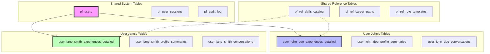

# Multi-User Architecture and Data Isolation

## Overview

Pathfinder implements a unique multi-user architecture that provides complete data isolation at the database level. This approach ensures HIPAA-level security compliance while maintaining scalability and performance for thousands of concurrent users.

## Architecture Principles

### 1. User-Prefixed Schema Design

Each user gets their own set of tables with a unique prefix derived from their username:

```
Username: john_doe
Schema Prefix: user_john_doe_
Tables Created:
  - user_john_doe_experiences_detailed
  - user_john_doe_profile_summaries
  - user_john_doe_conversations
  - user_john_doe_messages
  - user_john_doe_skill_mappings
  - user_john_doe_achievement_metrics
  - user_john_doe_career_objectives
```

### 2. Complete Data Isolation



## Implementation Details

### User Registration Flow

```sql
-- 1. Create user account in system table
INSERT INTO pf_users (
    user_id, 
    username, 
    email, 
    schema_prefix,
    account_status
) VALUES (
    SYS_GUID(),
    'john_doe',
    'john@example.com',
    'user_john_doe',
    'active'
);

-- 2. Create user-specific tables dynamically
BEGIN
    create_user_schema('user_john_doe');
END;
```

### Dynamic Schema Creation Procedure

```sql
CREATE OR REPLACE PROCEDURE create_user_schema(
    p_user_prefix IN VARCHAR2
) AS
    v_sql VARCHAR2(4000);
BEGIN
    -- Create experiences table
    v_sql := 'CREATE TABLE ' || p_user_prefix || '_experiences_detailed (
        experience_id RAW(16) DEFAULT SYS_GUID() PRIMARY KEY,
        title VARCHAR2(255) NOT NULL,
        organization VARCHAR2(255),
        description CLOB NOT NULL,
        start_date DATE NOT NULL,
        end_date DATE,
        -- ... other columns
    )';
    EXECUTE IMMEDIATE v_sql;
    
    -- Create profile summaries table
    v_sql := 'CREATE TABLE ' || p_user_prefix || '_profile_summaries (
        profile_id RAW(16) DEFAULT SYS_GUID() PRIMARY KEY,
        profile_type VARCHAR2(100),
        headline VARCHAR2(500),
        executive_summary CLOB,
        -- ... other columns
    )';
    EXECUTE IMMEDIATE v_sql;
    
    -- Create conversations table
    v_sql := 'CREATE TABLE ' || p_user_prefix || '_conversations (
        conversation_id VARCHAR2(100) PRIMARY KEY,
        title VARCHAR2(500),
        first_message VARCHAR2(1000),
        -- ... other columns
    )';
    EXECUTE IMMEDIATE v_sql;
    
    -- Create messages table
    v_sql := 'CREATE TABLE ' || p_user_prefix || '_messages (
        message_id VARCHAR2(100) PRIMARY KEY,
        conversation_id VARCHAR2(100) NOT NULL,
        role VARCHAR2(20) NOT NULL,
        content CLOB NOT NULL,
        -- ... other columns
    )';
    EXECUTE IMMEDIATE v_sql;
    
    -- Create indexes for each table
    create_user_indexes(p_user_prefix);
    
    -- Grant minimal required permissions
    grant_user_permissions(p_user_prefix);
    
    -- Log schema creation
    INSERT INTO pf_audit_log (
        action, resource_type, resource_id, success
    ) VALUES (
        'CREATE_USER_SCHEMA', 'USER_SCHEMA', p_user_prefix, 1
    );
    
    COMMIT;
EXCEPTION
    WHEN OTHERS THEN
        ROLLBACK;
        log_error('Failed to create schema for ' || p_user_prefix);
        RAISE;
END;
```

## Data Access Patterns

### Repository Pattern Implementation

```javascript
class ExperienceRepository {
    constructor(database, userContext) {
        this.db = database;
        this.userPrefix = userContext.schemaPrefix;
    }
    
    async create(experience) {
        const tableName = `${this.userPrefix}_experiences_detailed`;
        const query = `
            INSERT INTO ${tableName} (
                experience_id, title, organization, description,
                start_date, end_date, experience_type
            ) VALUES (
                :id, :title, :organization, :description,
                :startDate, :endDate, :type
            )
        `;
        
        return await this.db.execute(query, {
            id: generateId(),
            ...experience
        });
    }
    
    async findById(experienceId) {
        const tableName = `${this.userPrefix}_experiences_detailed`;
        const query = `
            SELECT * FROM ${tableName}
            WHERE experience_id = :id
        `;
        
        return await this.db.queryOne(query, { id: experienceId });
    }
    
    async findAll(filters = {}) {
        const tableName = `${this.userPrefix}_experiences_detailed`;
        let query = `SELECT * FROM ${tableName} WHERE 1=1`;
        const params = {};
        
        if (filters.type) {
            query += ` AND experience_type = :type`;
            params.type = filters.type;
        }
        
        if (filters.current) {
            query += ` AND is_current = :current`;
            params.current = filters.current ? 1 : 0;
        }
        
        query += ` ORDER BY start_date DESC`;
        
        return await this.db.query(query, params);
    }
}
```

### Service Layer with User Context

```javascript
class ExperienceService {
    constructor(container) {
        this.container = container;
    }
    
    async createExperience(userId, experienceData) {
        // Get user context
        const user = await this.container.userRepository.findById(userId);
        if (!user) throw new Error('User not found');
        
        // Create repository with user context
        const experienceRepo = new ExperienceRepository(
            this.container.database,
            { schemaPrefix: user.schemaPrefix }
        );
        
        // Validate and enhance experience data
        const enhanced = await this.enhanceExperience(experienceData);
        
        // Create experience
        const experience = await experienceRepo.create(enhanced);
        
        // Extract skills asynchronously
        this.extractSkillsAsync(userId, experience.id);
        
        // Log action
        await this.container.auditService.logAction({
            userId,
            action: 'CREATE_EXPERIENCE',
            resourceType: 'EXPERIENCE',
            resourceId: experience.id
        });
        
        return experience;
    }
}
```

## Security Considerations

### 1. SQL Injection Prevention

All table names are validated against a whitelist pattern:

```javascript
function validateTableName(tableName) {
    const pattern = /^user_[a-z0-9_]+_[a-z_]+$/;
    if (!pattern.test(tableName)) {
        throw new Error('Invalid table name format');
    }
    
    // Additional check against known table suffixes
    const validSuffixes = [
        'experiences_detailed',
        'profile_summaries',
        'conversations',
        'messages',
        'skill_mappings',
        'achievement_metrics',
        'career_objectives'
    ];
    
    const suffix = tableName.split('_').slice(2).join('_');
    if (!validSuffixes.includes(suffix)) {
        throw new Error('Invalid table suffix');
    }
    
    return true;
}
```

### 2. Cross-User Access Prevention

```sql
-- Row Level Security Policy
CREATE OR REPLACE FUNCTION check_user_access(
    p_schema_prefix VARCHAR2
) RETURN VARCHAR2 AS
    v_current_user_prefix VARCHAR2(64);
BEGIN
    -- Get current user's schema prefix from context
    SELECT schema_prefix INTO v_current_user_prefix
    FROM pf_users
    WHERE user_id = SYS_CONTEXT('APP_CONTEXT', 'USER_ID');
    
    -- Verify access
    IF v_current_user_prefix = p_schema_prefix THEN
        RETURN '1=1'; -- Allow access
    ELSE
        RETURN '1=0'; -- Deny access
    END IF;
END;
```

### 3. Audit Trail for All Operations

```javascript
class AuditMiddleware {
    async logDataAccess(req, operation) {
        const auditEntry = {
            userId: req.user.id,
            action: operation.action,
            resourceType: operation.resourceType,
            resourceId: operation.resourceId,
            tableName: operation.tableName,
            ipAddress: req.ip,
            userAgent: req.headers['user-agent'],
            timestamp: new Date(),
            success: operation.success,
            errorMessage: operation.error
        };
        
        await this.auditRepository.create(auditEntry);
    }
}
```

## Performance Optimization

### 1. Connection Pooling Per User Group

```javascript
class UserConnectionPool {
    constructor() {
        this.pools = new Map();
        this.maxPoolsPerGroup = 10;
    }
    
    getPool(userPrefix) {
        // Group users by first character of username
        const poolKey = userPrefix.charAt(5); // After 'user_'
        
        if (!this.pools.has(poolKey)) {
            this.pools.set(poolKey, this.createPool(poolKey));
        }
        
        return this.pools.get(poolKey);
    }
    
    createPool(poolKey) {
        return oracledb.createPool({
            user: process.env.DB_USER,
            password: process.env.DB_PASSWORD,
            connectString: process.env.DB_CONNECTION,
            poolMin: 2,
            poolMax: 10,
            poolIncrement: 2,
            poolAlias: `pool_${poolKey}`
        });
    }
}
```

### 2. Query Optimization Strategies

```sql
-- Partition large user tables by date
ALTER TABLE user_john_doe_experiences_detailed
PARTITION BY RANGE (created_at) (
    PARTITION p_2024_q1 VALUES LESS THAN (DATE '2024-04-01'),
    PARTITION p_2024_q2 VALUES LESS THAN (DATE '2024-07-01'),
    PARTITION p_2024_q3 VALUES LESS THAN (DATE '2024-10-01'),
    PARTITION p_2024_q4 VALUES LESS THAN (DATE '2025-01-01')
);

-- Create materialized views for complex aggregations
CREATE MATERIALIZED VIEW user_john_doe_skill_summary
BUILD IMMEDIATE
REFRESH ON DEMAND
AS
SELECT 
    s.skill_name,
    s.category,
    COUNT(*) as usage_count,
    MAX(sm.proficiency_level) as max_proficiency,
    MAX(sm.last_used) as last_used
FROM user_john_doe_skill_mappings sm
JOIN pf_ref_skills_catalog s ON sm.skill_id = s.skill_id
GROUP BY s.skill_name, s.category;
```

## Scalability Considerations

### 1. Horizontal Scaling Strategy

```yaml
# User Distribution by Database Instance
database_sharding:
  shard_1:
    range: "a-f"
    users: "Users with usernames starting with a-f"
    instance: "oracle-shard-1.region.oraclecloud.com"
    
  shard_2:
    range: "g-m"
    users: "Users with usernames starting with g-m"
    instance: "oracle-shard-2.region.oraclecloud.com"
    
  shard_3:
    range: "n-s"
    users: "Users with usernames starting with n-s"
    instance: "oracle-shard-3.region.oraclecloud.com"
    
  shard_4:
    range: "t-z"
    users: "Users with usernames starting with t-z"
    instance: "oracle-shard-4.region.oraclecloud.com"
```

### 2. Table Management at Scale

```sql
-- Automated table creation job
CREATE OR REPLACE PROCEDURE manage_user_tables AS
    CURSOR c_new_users IS
        SELECT user_id, schema_prefix
        FROM pf_users
        WHERE created_at >= SYSDATE - 1/24 -- Last hour
        AND NOT EXISTS (
            SELECT 1 FROM user_tables
            WHERE table_name = UPPER(schema_prefix || '_EXPERIENCES_DETAILED')
        );
BEGIN
    FOR user_rec IN c_new_users LOOP
        BEGIN
            create_user_schema(user_rec.schema_prefix);
            
            -- Update user record
            UPDATE pf_users
            SET schema_created = 'Y'
            WHERE user_id = user_rec.user_id;
            
            COMMIT;
        EXCEPTION
            WHEN OTHERS THEN
                log_error('Failed to create schema for user ' || user_rec.user_id);
                ROLLBACK;
        END;
    END LOOP;
END;

-- Schedule the job
BEGIN
    DBMS_SCHEDULER.CREATE_JOB(
        job_name => 'CREATE_USER_SCHEMAS_JOB',
        job_type => 'STORED_PROCEDURE',
        job_action => 'manage_user_tables',
        repeat_interval => 'FREQ=MINUTELY; INTERVAL=5',
        enabled => TRUE
    );
END;
```

## Monitoring and Maintenance

### 1. User Table Statistics

```sql
CREATE OR REPLACE VIEW v_user_table_stats AS
SELECT 
    u.username,
    u.schema_prefix,
    u.created_at as user_created,
    COUNT(DISTINCT ut.table_name) as table_count,
    SUM(ut.num_rows) as total_rows,
    SUM(ut.blocks * 8192) / 1024 / 1024 as space_used_mb
FROM pf_users u
LEFT JOIN user_tables ut ON ut.table_name LIKE UPPER(u.schema_prefix || '_%')
GROUP BY u.username, u.schema_prefix, u.created_at
ORDER BY space_used_mb DESC;
```

### 2. Automated Cleanup

```sql
-- Clean up inactive user schemas
CREATE OR REPLACE PROCEDURE cleanup_inactive_users AS
    CURSOR c_inactive_users IS
        SELECT user_id, schema_prefix
        FROM pf_users
        WHERE last_login < ADD_MONTHS(SYSDATE, -12) -- 1 year inactive
        AND account_status = 'inactive';
BEGIN
    FOR user_rec IN c_inactive_users LOOP
        -- Archive user data
        archive_user_data(user_rec.schema_prefix);
        
        -- Drop user tables
        drop_user_schema(user_rec.schema_prefix);
        
        -- Update user status
        UPDATE pf_users
        SET account_status = 'archived',
            schema_dropped_at = SYSDATE
        WHERE user_id = user_rec.user_id;
        
        COMMIT;
    END LOOP;
END;
```

## Best Practices

### 1. Naming Conventions
- Always use lowercase for schema prefixes
- Replace special characters with underscores
- Limit prefix length to 30 characters
- Validate against reserved words

### 2. Development Guidelines
- Always use parameterized queries
- Validate table names before dynamic SQL
- Log all schema operations
- Test with multiple concurrent users

### 3. Security Guidelines
- Never expose schema prefixes to users
- Implement rate limiting on schema operations
- Regular security audits of user tables
- Monitor for unusual access patterns

### 4. Performance Guidelines
- Index user tables appropriately
- Partition large tables by date
- Use materialized views for summaries
- Regular statistics gathering

## Troubleshooting

### Common Issues and Solutions

1. **Schema Creation Fails**
   ```sql
   -- Check for naming conflicts
   SELECT table_name 
   FROM all_tables 
   WHERE table_name LIKE 'USER_%'
   ORDER BY created DESC;
   ```

2. **Performance Degradation**
   ```sql
   -- Analyze user table statistics
   BEGIN
       DBMS_STATS.GATHER_SCHEMA_STATS(
           ownname => USER,
           options => 'GATHER AUTO'
       );
   END;
   ```

3. **Space Management**
   ```sql
   -- Find large user tables
   SELECT 
       segment_name,
       bytes/1024/1024 as size_mb
   FROM user_segments
   WHERE segment_type = 'TABLE'
   AND segment_name LIKE 'USER_%'
   ORDER BY bytes DESC;
   ```