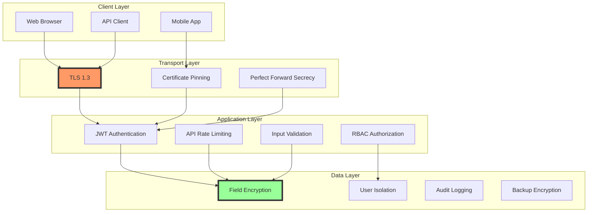

# Security and Encryption Model

## Overview

Pathfinder implements a defense-in-depth security model with multiple layers of protection for user data. The system meets HIPAA compliance requirements and implements industry best practices for data protection.

## Security Architecture



## Authentication System

### Multi-Factor Authentication (MFA)

```sql
-- MFA Setup
CREATE TABLE pf_user_mfa (
    user_id RAW(16) PRIMARY KEY,
    mfa_type VARCHAR2(20) NOT NULL,
    secret_encrypted VARCHAR2(500) NOT NULL,
    backup_codes_encrypted CLOB,
    recovery_email VARCHAR2(255),
    enabled_at TIMESTAMP,
    last_used TIMESTAMP,
    failed_attempts NUMBER DEFAULT 0,
    locked_until TIMESTAMP,
    CONSTRAINT fk_mfa_user FOREIGN KEY (user_id) 
        REFERENCES pf_users(user_id) ON DELETE CASCADE,
    CONSTRAINT chk_mfa_type CHECK (mfa_type IN ('TOTP', 'SMS', 'EMAIL', 'WEBAUTHN'))
);
```

### JWT Token Management

```javascript
class TokenService {
    constructor(config) {
        this.accessTokenExpiry = '15m';
        this.refreshTokenExpiry = '7d';
        this.algorithm = 'RS256'; // Asymmetric for better security
    }
    
    async generateTokenPair(user) {
        const tokenId = generateSecureId();
        
        // Access token with minimal claims
        const accessToken = jwt.sign(
            {
                sub: user.userId,
                jti: tokenId,
                type: 'access',
                schema: user.schemaPrefix
            },
            this.privateKey,
            {
                algorithm: this.algorithm,
                expiresIn: this.accessTokenExpiry,
                issuer: 'pathfinder',
                audience: 'api'
            }
        );
        
        // Refresh token with additional security
        const refreshToken = jwt.sign(
            {
                sub: user.userId,
                jti: `${tokenId}-refresh`,
                type: 'refresh',
                tokenFamily: generateTokenFamily()
            },
            this.privateKey,
            {
                algorithm: this.algorithm,
                expiresIn: this.refreshTokenExpiry
            }
        );
        
        // Store token metadata for revocation
        await this.storeTokenMetadata({
            tokenId,
            userId: user.userId,
            tokenFamily: tokenFamily,
            createdAt: new Date(),
            expiresAt: new Date(Date.now() + ms(this.accessTokenExpiry))
        });
        
        return { accessToken, refreshToken };
    }
    
    async validateToken(token, type = 'access') {
        try {
            const decoded = jwt.verify(token, this.publicKey, {
                algorithms: [this.algorithm],
                issuer: 'pathfinder',
                audience: type === 'access' ? 'api' : undefined
            });
            
            // Check if token is revoked
            if (await this.isTokenRevoked(decoded.jti)) {
                throw new Error('Token has been revoked');
            }
            
            // Check token type
            if (decoded.type !== type) {
                throw new Error('Invalid token type');
            }
            
            return decoded;
        } catch (error) {
            throw new UnauthorizedError('Invalid token');
        }
    }
}
```

## Field-Level Encryption

### Encryption Service Implementation

```javascript
class EncryptionService {
    constructor(config) {
        this.algorithm = 'aes-256-gcm';
        this.keyDerivationIterations = 100000;
        this.saltLength = 32;
        this.tagLength = 16;
        this.ivLength = 16;
    }
    
    async encryptField(plaintext, userId) {
        // Get user-specific encryption key
        const userKey = await this.getUserKey(userId);
        
        // Generate random IV for this encryption
        const iv = crypto.randomBytes(this.ivLength);
        
        // Create cipher
        const cipher = crypto.createCipheriv(this.algorithm, userKey, iv);
        
        // Encrypt data
        const encrypted = Buffer.concat([
            cipher.update(plaintext, 'utf8'),
            cipher.final()
        ]);
        
        // Get auth tag
        const tag = cipher.getAuthTag();
        
        // Combine IV + tag + encrypted data
        const combined = Buffer.concat([iv, tag, encrypted]);
        
        // Return base64 encoded
        return combined.toString('base64');
    }
    
    async decryptField(encryptedData, userId) {
        // Get user-specific encryption key
        const userKey = await this.getUserKey(userId);
        
        // Decode from base64
        const combined = Buffer.from(encryptedData, 'base64');
        
        // Extract components
        const iv = combined.slice(0, this.ivLength);
        const tag = combined.slice(this.ivLength, this.ivLength + this.tagLength);
        const encrypted = combined.slice(this.ivLength + this.tagLength);
        
        // Create decipher
        const decipher = crypto.createDecipheriv(this.algorithm, userKey, iv);
        decipher.setAuthTag(tag);
        
        // Decrypt data
        const decrypted = Buffer.concat([
            decipher.update(encrypted),
            decipher.final()
        ]);
        
        return decrypted.toString('utf8');
    }
    
    async getUserKey(userId) {
        // Check cache first
        const cached = await this.keyCache.get(userId);
        if (cached) return cached;
        
        // Fetch from secure storage
        const keyData = await this.keyRepository.findByUserId(userId);
        if (!keyData) {
            throw new Error('User encryption key not found');
        }
        
        // Decrypt master key with HSM
        const masterKey = await this.hsmDecrypt(keyData.encryptedKey);
        
        // Cache for performance
        await this.keyCache.set(userId, masterKey, '5m');
        
        return masterKey;
    }
}
```

### Database Schema for Encryption

```sql
-- Encryption keys table
CREATE TABLE pf_encryption_keys (
    key_id RAW(16) DEFAULT SYS_GUID() PRIMARY KEY,
    user_id RAW(16) NOT NULL,
    key_version NUMBER NOT NULL,
    encrypted_key VARCHAR2(500) NOT NULL,
    key_metadata JSON,
    created_at TIMESTAMP DEFAULT CURRENT_TIMESTAMP,
    rotated_at TIMESTAMP,
    expires_at TIMESTAMP,
    is_active NUMBER(1) DEFAULT 1,
    CONSTRAINT fk_enckey_user FOREIGN KEY (user_id) 
        REFERENCES pf_users(user_id) ON DELETE CASCADE,
    CONSTRAINT uk_user_version UNIQUE (user_id, key_version)
);

-- Fields marked for encryption
CREATE TABLE pf_encryption_fields (
    field_id RAW(16) DEFAULT SYS_GUID() PRIMARY KEY,
    table_pattern VARCHAR2(100) NOT NULL,
    column_name VARCHAR2(100) NOT NULL,
    encryption_type VARCHAR2(20) DEFAULT 'AES256GCM',
    is_searchable NUMBER(1) DEFAULT 0,
    search_index_type VARCHAR2(20),
    created_at TIMESTAMP DEFAULT CURRENT_TIMESTAMP
);

-- Insert encryption field definitions
INSERT INTO pf_encryption_fields (table_pattern, column_name, is_searchable) VALUES
    ('%_experiences_detailed', 'description', 1),
    ('%_experiences_detailed', 'raw_text', 0),
    ('%_messages', 'content', 1),
    ('%_profile_summaries', 'executive_summary', 0),
    ('%_achievement_metrics', 'supporting_evidence', 0);
```

## Access Control

### Role-Based Access Control (RBAC)

```sql
-- Roles definition
CREATE TABLE pf_roles (
    role_id RAW(16) DEFAULT SYS_GUID() PRIMARY KEY,
    role_name VARCHAR2(50) UNIQUE NOT NULL,
    description VARCHAR2(500),
    permissions JSON,
    is_system NUMBER(1) DEFAULT 0,
    created_at TIMESTAMP DEFAULT CURRENT_TIMESTAMP
);

-- User role assignments
CREATE TABLE pf_user_roles (
    user_id RAW(16) NOT NULL,
    role_id RAW(16) NOT NULL,
    granted_at TIMESTAMP DEFAULT CURRENT_TIMESTAMP,
    granted_by RAW(16),
    expires_at TIMESTAMP,
    CONSTRAINT pk_user_roles PRIMARY KEY (user_id, role_id),
    CONSTRAINT fk_ur_user FOREIGN KEY (user_id) 
        REFERENCES pf_users(user_id) ON DELETE CASCADE,
    CONSTRAINT fk_ur_role FOREIGN KEY (role_id) 
        REFERENCES pf_roles(role_id)
);

-- Resource permissions
CREATE TABLE pf_permissions (
    permission_id RAW(16) DEFAULT SYS_GUID() PRIMARY KEY,
    resource_type VARCHAR2(50) NOT NULL,
    action VARCHAR2(50) NOT NULL,
    conditions JSON,
    CONSTRAINT uk_resource_action UNIQUE (resource_type, action)
);
```

### Row-Level Security Implementation

```sql
-- Create security policy function
CREATE OR REPLACE FUNCTION user_data_policy(
    p_schema_name IN VARCHAR2,
    p_object_name IN VARCHAR2
) RETURN VARCHAR2 AS
    v_predicate VARCHAR2(4000);
    v_user_id VARCHAR2(32);
    v_user_prefix VARCHAR2(64);
BEGIN
    -- Get current user context
    v_user_id := SYS_CONTEXT('CAREER_NAV_CTX', 'USER_ID');
    
    IF v_user_id IS NULL THEN
        -- No user context, deny all access
        RETURN '1=0';
    END IF;
    
    -- Get user's schema prefix
    SELECT schema_prefix INTO v_user_prefix
    FROM pf_users
    WHERE user_id = v_user_id;
    
    -- Check if table belongs to user
    IF p_object_name LIKE v_user_prefix || '_%' THEN
        -- User owns this table
        RETURN '1=1';
    ELSIF p_object_name LIKE 'PF_REF_%' THEN
        -- Reference tables are read-only for all
        RETURN '1=1';
    ELSE
        -- Not user's table
        RETURN '1=0';
    END IF;
EXCEPTION
    WHEN OTHERS THEN
        -- On any error, deny access
        RETURN '1=0';
END;

-- Apply policy to all user tables
BEGIN
    DBMS_RLS.ADD_POLICY(
        object_schema => 'CAREER_NAV',
        object_name => 'ALL_TABLES',
        policy_name => 'user_data_isolation',
        function_schema => 'CAREER_NAV',
        policy_function => 'user_data_policy',
        statement_types => 'SELECT,INSERT,UPDATE,DELETE',
        update_check => TRUE,
        enable => TRUE
    );
END;
```

## Audit Logging

### Comprehensive Audit System

```sql
-- Enhanced audit log with security events
CREATE TABLE pf_security_audit_log (
    log_id RAW(16) DEFAULT SYS_GUID() PRIMARY KEY,
    event_type VARCHAR2(50) NOT NULL,
    severity VARCHAR2(20) NOT NULL,
    user_id RAW(16),
    ip_address VARCHAR2(45),
    user_agent CLOB,
    request_id VARCHAR2(50),
    resource_type VARCHAR2(100),
    resource_id VARCHAR2(255),
    action VARCHAR2(100),
    result VARCHAR2(20),
    error_code VARCHAR2(50),
    error_message CLOB,
    request_data JSON,
    response_data JSON,
    stack_trace CLOB,
    correlation_id VARCHAR2(50),
    session_id VARCHAR2(100),
    timestamp TIMESTAMP DEFAULT CURRENT_TIMESTAMP,
    CONSTRAINT chk_severity CHECK (severity IN ('INFO', 'WARN', 'ERROR', 'CRITICAL')),
    CONSTRAINT chk_result CHECK (result IN ('SUCCESS', 'FAILURE', 'BLOCKED', 'TIMEOUT'))
) PARTITION BY RANGE (timestamp) (
    PARTITION p_2024_01 VALUES LESS THAN (DATE '2024-02-01'),
    PARTITION p_2024_02 VALUES LESS THAN (DATE '2024-03-01')
    -- Auto-partition for future months
);

-- Audit log indexes for security analysis
CREATE INDEX idx_security_audit_user_time 
ON pf_security_audit_log (user_id, timestamp DESC) LOCAL;

CREATE INDEX idx_security_audit_severity 
ON pf_security_audit_log (severity, timestamp DESC) LOCAL;

CREATE INDEX idx_security_audit_event 
ON pf_security_audit_log (event_type, result, timestamp DESC) LOCAL;

-- Suspicious activity patterns
CREATE MATERIALIZED VIEW mv_suspicious_activities
REFRESH COMPLETE ON DEMAND
AS
SELECT 
    user_id,
    ip_address,
    COUNT(*) as failed_attempts,
    COUNT(DISTINCT resource_type) as resources_accessed,
    MIN(timestamp) as first_attempt,
    MAX(timestamp) as last_attempt
FROM pf_security_audit_log
WHERE result = 'FAILURE'
  AND timestamp >= SYSDATE - 1/24 -- Last hour
GROUP BY user_id, ip_address
HAVING COUNT(*) >= 5; -- 5 or more failures
```

### Security Event Monitoring

```javascript
class SecurityMonitor {
    constructor(auditService, alertService) {
        this.auditService = auditService;
        this.alertService = alertService;
        this.patterns = this.loadSecurityPatterns();
    }
    
    async monitorEvent(event) {
        // Log the event
        await this.auditService.logSecurityEvent(event);
        
        // Check against security patterns
        for (const pattern of this.patterns) {
            if (pattern.matches(event)) {
                await this.handleSecurityIncident(event, pattern);
            }
        }
        
        // Real-time anomaly detection
        if (await this.isAnomalous(event)) {
            await this.handleAnomaly(event);
        }
    }
    
    async handleSecurityIncident(event, pattern) {
        const incident = {
            id: generateIncidentId(),
            severity: pattern.severity,
            type: pattern.type,
            event: event,
            timestamp: new Date(),
            status: 'OPEN'
        };
        
        // Immediate actions based on severity
        switch (pattern.severity) {
            case 'CRITICAL':
                // Block user immediately
                await this.blockUser(event.userId);
                // Alert security team
                await this.alertService.sendCriticalAlert(incident);
                break;
            
            case 'HIGH':
                // Rate limit user
                await this.rateLimitUser(event.userId);
                // Log for review
                await this.logForReview(incident);
                break;
            
            case 'MEDIUM':
                // Increase monitoring
                await this.increaseMonitoring(event.userId);
                break;
        }
        
        // Store incident
        await this.storeIncident(incident);
    }
    
    loadSecurityPatterns() {
        return [
            {
                name: 'Brute Force Attack',
                type: 'BRUTE_FORCE',
                severity: 'HIGH',
                matches: (event) => {
                    return event.type === 'LOGIN_FAILED' &&
                           event.failureCount >= 5 &&
                           event.timeWindow <= 300; // 5 minutes
                }
            },
            {
                name: 'Privilege Escalation Attempt',
                type: 'PRIVILEGE_ESCALATION',
                severity: 'CRITICAL',
                matches: (event) => {
                    return event.type === 'UNAUTHORIZED_ACCESS' &&
                           event.resourceType === 'ADMIN_FUNCTION';
                }
            },
            {
                name: 'Data Exfiltration',
                type: 'DATA_EXFILTRATION',
                severity: 'CRITICAL',
                matches: (event) => {
                    return event.type === 'BULK_EXPORT' &&
                           event.recordCount > 1000 &&
                           !event.authorized;
                }
            },
            {
                name: 'SQL Injection Attempt',
                type: 'SQL_INJECTION',
                severity: 'CRITICAL',
                matches: (event) => {
                    const sqlPatterns = [
                        /(\b(UNION|SELECT|INSERT|UPDATE|DELETE|DROP)\b)/i,
                        /(--)|(\/\*)|(\*\/)/,
                        /(\')|(\")|(;)/
                    ];
                    return event.type === 'QUERY_EXECUTION' &&
                           sqlPatterns.some(p => p.test(event.query));
                }
            }
        ];
    }
}
```

## Data Loss Prevention (DLP)

### Export Controls

```javascript
class DataExportControl {
    constructor(config) {
        this.maxRecordsPerExport = 500;
        this.maxExportsPerDay = 10;
        this.sensitiveFields = config.sensitiveFields;
    }
    
    async validateExport(userId, exportRequest) {
        // Check daily export limit
        const todayExports = await this.getExportCount(userId, 'today');
        if (todayExports >= this.maxExportsPerDay) {
            throw new ExportLimitExceeded('Daily export limit reached');
        }
        
        // Check record count
        if (exportRequest.recordCount > this.maxRecordsPerExport) {
            throw new ExportLimitExceeded('Too many records requested');
        }
        
        // Check for sensitive data
        const hasSensitive = exportRequest.fields.some(
            field => this.sensitiveFields.includes(field)
        );
        
        if (hasSensitive) {
            // Require additional authorization
            if (!await this.hasExportAuthorization(userId)) {
                throw new UnauthorizedExport('Additional authorization required');
            }
        }
        
        // Log export request
        await this.logExportRequest(userId, exportRequest);
        
        // Apply data masking if needed
        return this.applyDataMasking(exportRequest);
    }
    
    applyDataMasking(data) {
        return data.map(record => {
            const masked = { ...record };
            
            // Mask SSN
            if (masked.ssn) {
                masked.ssn = `XXX-XX-${masked.ssn.slice(-4)}`;
            }
            
            // Mask email domain for certain roles
            if (masked.email && !this.canViewFullEmail()) {
                const [local] = masked.email.split('@');
                masked.email = `${local}@*****.com`;
            }
            
            // Redact salary information
            if (masked.salary && !this.canViewSalary()) {
                masked.salary = '[REDACTED]';
            }
            
            return masked;
        });
    }
}
```

## Key Management

### Encryption Key Rotation

```sql
-- Key rotation procedure
CREATE OR REPLACE PROCEDURE rotate_user_encryption_keys AS
    CURSOR c_users IS
        SELECT u.user_id, u.schema_prefix, ek.key_version
        FROM pf_users u
        JOIN pf_encryption_keys ek ON u.user_id = ek.user_id
        WHERE ek.is_active = 1
        AND ek.created_at < ADD_MONTHS(SYSDATE, -3); -- Rotate every 3 months
BEGIN
    FOR user_rec IN c_users LOOP
        BEGIN
            -- Generate new key
            generate_new_user_key(user_rec.user_id, user_rec.key_version + 1);
            
            -- Re-encrypt user data with new key
            reencrypt_user_data(user_rec.user_id, user_rec.schema_prefix);
            
            -- Mark old key as rotated
            UPDATE pf_encryption_keys
            SET is_active = 0,
                rotated_at = SYSDATE
            WHERE user_id = user_rec.user_id
            AND key_version = user_rec.key_version;
            
            -- Log rotation
            INSERT INTO pf_audit_log (
                user_id, action, resource_type, resource_id
            ) VALUES (
                user_rec.user_id, 'KEY_ROTATED', 'ENCRYPTION_KEY', 
                'v' || user_rec.key_version
            );
            
            COMMIT;
        EXCEPTION
            WHEN OTHERS THEN
                ROLLBACK;
                log_key_rotation_error(user_rec.user_id, SQLERRM);
        END;
    END LOOP;
END;
```

### Hardware Security Module (HSM) Integration

```javascript
class HSMKeyManager {
    constructor(hsmConfig) {
        this.hsm = new HSMClient(hsmConfig);
        this.keyCache = new SecureCache();
    }
    
    async generateMasterKey() {
        // Generate key in HSM
        const keyHandle = await this.hsm.generateKey({
            algorithm: 'AES',
            keySize: 256,
            extractable: false,
            keyUsage: ['encrypt', 'decrypt']
        });
        
        // Store key metadata
        const keyMetadata = {
            keyId: generateKeyId(),
            keyHandle: keyHandle,
            algorithm: 'AES-256-GCM',
            createdAt: new Date(),
            createdBy: 'SYSTEM',
            purpose: 'USER_DATA_ENCRYPTION'
        };
        
        await this.storeKeyMetadata(keyMetadata);
        
        return keyMetadata.keyId;
    }
    
    async encryptWithHSM(data, keyId) {
        const keyHandle = await this.getKeyHandle(keyId);
        
        return await this.hsm.encrypt({
            keyHandle: keyHandle,
            algorithm: 'AES-GCM',
            data: data,
            aad: Buffer.from(keyId) // Additional authenticated data
        });
    }
    
    async decryptWithHSM(encryptedData, keyId) {
        const keyHandle = await this.getKeyHandle(keyId);
        
        return await this.hsm.decrypt({
            keyHandle: keyHandle,
            algorithm: 'AES-GCM',
            encryptedData: encryptedData,
            aad: Buffer.from(keyId)
        });
    }
}
```

## Compliance and Reporting

### HIPAA Compliance Checklist

```sql
-- HIPAA compliance monitoring view
CREATE OR REPLACE VIEW v_hipaa_compliance_status AS
SELECT 
    'Access Controls' as requirement,
    CASE 
        WHEN COUNT(*) = 0 THEN 'COMPLIANT'
        ELSE 'NON_COMPLIANT'
    END as status,
    COUNT(*) as violations
FROM pf_users
WHERE password_hash IS NULL
   OR mfa_secret IS NULL
   OR last_login < ADD_MONTHS(SYSDATE, -3)

UNION ALL

SELECT 
    'Audit Logging' as requirement,
    CASE 
        WHEN COUNT(*) > 1000 THEN 'COMPLIANT'
        ELSE 'NON_COMPLIANT'
    END as status,
    COUNT(*) as daily_logs
FROM pf_audit_log
WHERE timestamp >= TRUNC(SYSDATE)

UNION ALL

SELECT 
    'Encryption at Rest' as requirement,
    CASE 
        WHEN COUNT(*) = 0 THEN 'COMPLIANT'
        ELSE 'NON_COMPLIANT'
    END as status,
    COUNT(*) as unencrypted_fields
FROM (
    SELECT column_name
    FROM user_tab_columns
    WHERE table_name LIKE 'USER_%'
    AND data_type IN ('VARCHAR2', 'CLOB')
    AND column_name IN (
        SELECT column_name 
        FROM pf_encryption_fields
    )
    MINUS
    SELECT column_name
    FROM pf_encrypted_columns
);
```

### Security Metrics Dashboard

```sql
-- Real-time security metrics
CREATE OR REPLACE VIEW v_security_metrics AS
SELECT 
    -- Authentication metrics
    (SELECT COUNT(*) FROM pf_user_sessions WHERE is_active = 1) as active_sessions,
    (SELECT COUNT(*) FROM pf_security_audit_log 
     WHERE event_type = 'LOGIN_FAILED' 
     AND timestamp >= SYSDATE - 1/24) as failed_logins_hour,
    
    -- Encryption metrics
    (SELECT COUNT(*) FROM pf_encryption_keys WHERE is_active = 1) as active_keys,
    (SELECT AVG(SYSDATE - created_at) FROM pf_encryption_keys 
     WHERE is_active = 1) as avg_key_age_days,
    
    -- Access control metrics
    (SELECT COUNT(DISTINCT user_id) FROM pf_security_audit_log
     WHERE event_type = 'UNAUTHORIZED_ACCESS'
     AND timestamp >= SYSDATE - 1) as unauthorized_attempts_day,
    
    -- Data access metrics
    (SELECT COUNT(*) FROM pf_audit_log
     WHERE action LIKE '%EXPORT%'
     AND timestamp >= SYSDATE - 1) as data_exports_day,
    
    -- System health
    (SELECT COUNT(*) FROM pf_security_audit_log
     WHERE severity IN ('ERROR', 'CRITICAL')
     AND timestamp >= SYSDATE - 1/24) as critical_events_hour
FROM dual;
```

## Best Practices

### Security Development Lifecycle

1. **Secure Coding Standards**
   - Input validation on all user inputs
   - Parameterized queries only
   - Output encoding for XSS prevention
   - Secure session management

2. **Regular Security Assessments**
   - Weekly automated vulnerability scans
   - Monthly penetration testing
   - Quarterly security audits
   - Annual third-party assessments

3. **Incident Response Plan**
   - 24/7 security monitoring
   - Automated incident detection
   - Defined escalation procedures
   - Regular incident drills

4. **Data Classification**
   - PII: Highest protection level
   - Sensitive: Encrypted at rest
   - Internal: Access controlled
   - Public: Minimal controls

### Security Monitoring Alerts

```javascript
// Real-time security alert configurations
const securityAlerts = {
    bruteForce: {
        threshold: 5,
        window: '5m',
        action: 'BLOCK_IP',
        notify: ['security-team@company.com']
    },
    
    dataExfiltration: {
        threshold: 1000,
        window: '1h',
        action: 'SUSPEND_USER',
        notify: ['security-team@company.com', 'compliance@company.com']
    },
    
    privilegeEscalation: {
        threshold: 1,
        window: 'immediate',
        action: 'TERMINATE_SESSION',
        notify: ['security-team@company.com', 'ciso@company.com']
    },
    
    encryptionFailure: {
        threshold: 1,
        window: 'immediate',
        action: 'ALERT_ONLY',
        notify: ['security-team@company.com', 'ops@company.com']
    }
};
```