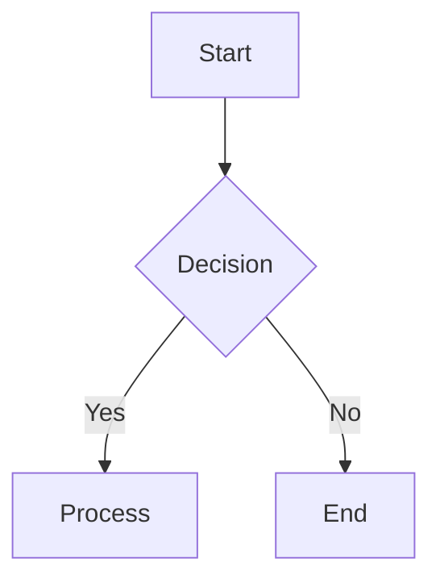

# Mermaid Diagram Guidelines

This document describes the standard workflow for creating and maintaining Mermaid diagrams in the Pathfinder project.

## Overview

Mermaid diagrams are used throughout our documentation to visualize system architecture, data flows, and processes. To ensure compatibility across all platforms and better user experience, we convert Mermaid source files to PNG images.

## Directory Structure

All Mermaid diagrams follow this structure:

```
docs/
├── [category]/
│   ├── [document].md         # Markdown file that references the diagram
│   └── assets/               # Assets folder for diagrams
│       ├── diagram.mmd       # Mermaid source file
│       └── diagram.png       # Generated PNG file
```

## Creating Diagrams

### 1. Write Mermaid Source

Create a `.mmd` file in the appropriate `assets/` folder:



### 2. Convert to PNG

Use one of the provided scripts to convert your Mermaid diagram to PNG:

```bash
# Option 1: Bash script (recommended)
./scripts/mermaid-to-png.sh docs/development/assets/diagram.mmd

# Option 2: Node.js script
node scripts/mermaid-converter.js docs/development/assets/diagram.mmd

# Option 3: npm script
npm run mermaid -- -i docs/development/assets/diagram.mmd -o docs/development/assets/diagram.png
```

### 3. Reference in Markdown

In your markdown document, reference the PNG file:

```markdown

```

## Best Practices

1. **Always keep source files**: Maintain both `.mmd` and `.png` files in version control
2. **Use descriptive names**: Name files based on their content (e.g., `user-authentication-flow.mmd`)
3. **Update both files**: When modifying a diagram, update both the `.mmd` source and regenerate the `.png`
4. **Consistent styling**: The conversion scripts use dark theme with transparent background by default
5. **Size considerations**: Default width is 2048px for high-quality rendering

## Script Features

Our Mermaid conversion scripts include:

- **Architecture detection**: Automatically uses system Chromium on ARM machines
- **Auto-setup**: First run automatically configures the environment
- **Error handling**: Clear error messages if conversion fails
- **Batch processing**: Can process multiple files (using shell wildcards)

## Troubleshooting

### Chrome/Chromium Not Found

If you encounter Chrome-related errors:

1. Run the setup script: `./scripts/setup-mermaid.sh`
2. Ensure Chromium is installed: `sudo apt install chromium-browser` (Linux) or `brew install chromium` (macOS)

### ARM Architecture Issues

The scripts automatically detect ARM architecture and use the system Chromium. No manual configuration needed.

### Permission Denied

Make scripts executable:
```bash
chmod +x scripts/mermaid-*.sh
```

## Examples

### System Architecture Diagram

```bash
# Create source file
cat > docs/development/assets/system-architecture.mmd << 'EOF'
graph TB
    subgraph Frontend
        UI[Web Interface]
    end
    
    subgraph Backend
        API[REST API]
        DB[(PostgreSQL)]
    end
    
    subgraph AI
        LLM[Language Model]
        MCP[MCP Server]
    end
    
    UI --> API
    API --> DB
    API --> LLM
    LLM --> MCP
EOF

# Convert to PNG
./scripts/mermaid-to-png.sh docs/development/assets/system-architecture.mmd

# Reference in markdown
echo '' >> docs/development/architecture.md
```

## Maintenance

- Review and update diagrams when system architecture changes
- Regenerate PNGs after updating Mermaid source files
- Keep diagram complexity manageable - split large diagrams into multiple focused ones